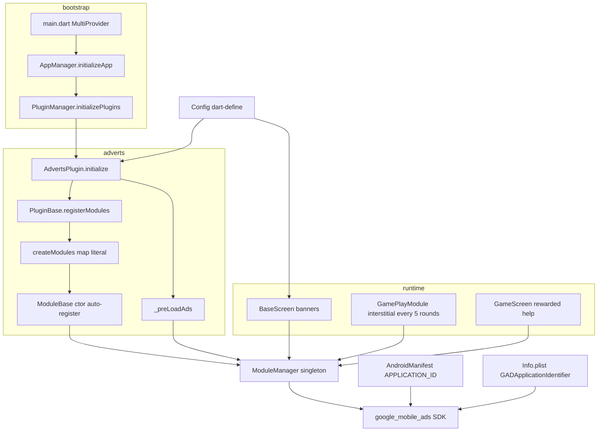

# Adverts module — architecture and wiring

This document describes how the ad system is wired in **`flutter_base`**, under `lib/plugins/adverts_plugin/`, including **config**, **Android**, and **iOS** setup. It reflects the active tree (`flutter_base/`), not copies under `!old/` or `!updated/`.

---

## 1. High-level architecture

The app uses three layers:

1. **Google Mobile Ads** — dependency `google_mobile_ads` in `pubspec.yaml`.
2. **`ModuleManager`** — registry of modules (including ad modules) keyed by `moduleKey` plus per-instance keys.
3. **`AdvertsPlugin`** — a `PluginBase` subclass intended to own banner, interstitial, and rewarded modules and preload ads.

Plugins start from **`PluginManager.initializePlugins`**, invoked after the first frame via **`AppManager.initializeApp`**.

**Registration order** (from `lib/core/managers/plugin_manager.dart`):

1. `MainPlugin`
2. `GamePlugin`
3. `AdvertsPlugin`

Each **`ModuleBase`** subclass **auto-registers** in the singleton `ModuleManager` inside its constructor (`lib/core/00_base/module_base.dart`). Any `BannerAdModule()` / `InterstitialAdModule()` / `RewardedAdModule()` triggers registration immediately, with default instance key `runtimeType.toString()` unless a key is supplied.

**`PluginBase.initialize`** calls **`registerModules`**, which uses **`createModules()`** and registers each module again with either the map’s key or `"${module.moduleKey}_${timestamp}"` when the map key is `null` (`lib/core/00_base/plugin_base.dart`).

---

## 2. Files in `adverts_plugin`

| File | Role |
|------|------|
| `adverts_plugin_main.dart` | `AdvertsPlugin`: reads unit IDs from `Config`, preloads, registers modules. |
| `modules/admobs/banner/banner_ad.dart` | `BannerAdModule`: map of preloaded `BannerAd`s by unit id; `getBannerWidget` builds another `BannerAd` + `AdWidget`. |
| `modules/admobs/interstitial/interstitial_ad.dart` | `InterstitialAdModule`: load/show, reload after dismiss or failed show. |
| `modules/admobs/rewarded/rewarded_ad.dart` | `RewardedAdModule`: load/show, callbacks, increments `rewarded_ad_views` in `SharedPrefManager`. |
| `consent_manager.dart` | UMP-style consent (`ConsentInformation`, `ConsentForm`). **Not referenced elsewhere in `flutter_base`** — unused in current wiring. |

---

## 3. Config (`lib/utils/consts/config.dart`)

Ad **unit** IDs are compile-time constants from **`String.fromEnvironment`**:

| Define | Config field |
|--------|----------------|
| `ADMOBS_TOP_BANNER01` | `admobsTopBanner` |
| `ADMOBS_BOTTOM_BANNER01` | `admobsBottomBanner` |
| `ADMOBS_INTERSTITIAL01` | `admobsInterstitial01` |
| `ADMOBS_REWARDED01` | `admobsRewarded01` |

Defaults are **empty strings**. Pass values at build time, for example:

```bash
flutter run --dart-define=ADMOBS_TOP_BANNER01=ca-app-pub-xxx/yyy ...
```

---

## 4. `AdvertsPlugin` behavior

**Flow (as written):**

1. **`initialize`** calls **`super.initialize(context)`**, which runs `PluginBase`’s `registerModules`, `registerHooks`, `registerStates`.
2. **`_preLoadAds`** looks up modules in `ModuleManager` and calls `loadBannerAd` / `loadAd`.
3. A second loop calls **`createModules()`** again and **`registerModule`** for each entry — redundant with step 1.

### Map literal / duplicate keys

`createModules()` returns a map with the **same key `null` three times** (banner, interstitial, rewarded). In Dart, **duplicate keys keep only the last entry**, but **all values are still evaluated**, so three constructors still run and each **`ModuleBase`** constructor still **auto-registers**.

Effects:

- **`PluginBase.registerModules`** only iterates **one** map entry (the surviving rewarded entry).
- Banner and interstitial instances still exist from evaluation order, registered via the constructor path.
- **`initialize`** calls **`createModules()` twice** (super path + manual loop), which can create **extra instances** and duplicate registrations.

**`getLatestModule<T>()`** returns the **first** matching module in the manager’s iteration order — ambiguous if multiple instances of the same type exist.

### SDK initialization

There is **no** `MobileAds.instance.initialize()` under `flutter_base/lib/`. The plugin may lazy-initialize, but the documented pattern is still to initialize early after `WidgetsFlutterBinding.ensureInitialized()`.

---

## 5. Where ads are used in the app

### Banners — `BaseScreen` (`lib/core/00_base/screen_base.dart`)

- Resolves `BannerAdModule` via `ModuleManager().getLatestModule<BannerAdModule>()`.
- In `initState`, calls `loadBannerAd` for top and bottom `Config` unit ids.
- In `build`, uses `getBannerWidget(context, Config.admobsTopBanner)` and the bottom equivalent.

**Note:** `getBannerWidget` allocates a **new** `BannerAd` and calls `load()` each time it runs; tying this directly to `build` can cause repeated allocations unless the widget subtree avoids unnecessary rebuilds.

### Interstitials — `GamePlayModule` (`lib/plugins/game_plugin/modules/game_play_module/game_play_module.dart`)

- On each round init, after incrementing `roundNumber`, if **`updatedNumber % 5 == 0`**, resolves `InterstitialAdModule` with `getLatestModule<InterstitialAdModule>()` and calls **`showAd(context)`**.
- Timer pause/resume around the ad is only partially implemented (comments / stub after dismissal).

### Rewarded — `GameScreen` (`lib/plugins/game_plugin/screens/game_screen/game_screen.dart`)

- Resolves `RewardedAdModule` with `getLatestModule<RewardedAdModule>()`.
- **`_useHelp`**: pauses `TickerTimer`, updates state for hint, calls **`showAd`** with `onUserEarnedReward` (fade incorrect name) and `onAdDismissed` (resume timer after a short delay).

Rewarded flow also increments **`rewarded_ad_views`** in shared preferences when the user earns the reward.

### Shared preferences guard

Interstitial and rewarded `showAd` require **`SharedPrefManager`** from `ServicesManager`; interstitial does not otherwise use it beyond the null check.

---

## 6. Android configuration

**`android/app/src/main/AndroidManifest.xml`**

- Permissions: `INTERNET`, `ACCESS_NETWORK_STATE`.
- AdMob **application** id (meta-data under `<application>`):

```xml
<meta-data
    android:name="com.google.android.gms.ads.APPLICATION_ID"
    android:value="ca-app-pub-3883219611722888~4477217543"/>
```

**`android/app/build.gradle`**

- `applicationId`, `minSdkVersion 21`, `multiDexEnabled true`, multidex dependency.
- Release: `minifyEnabled true` — ensure ProGuard / R8 rules cover Play Services / ads if you see shrinker issues.

---

## 7. iOS configuration

**`ios/Runner/Info.plist`**

- **`GADApplicationIdentifier`** — must be your iOS AdMob **app** id.
- Current repo value may be Google’s **sample** id (`ca-app-pub-3940256099942544~1458002511`); Android uses a different publisher/app id. **Align iOS and Android with your AdMob console per platform** for production.
- **`SKAdNetworkItems`** — large list typical for AdMob / mediation templates.

---

## 8. Consent and policy

- **`ConsentManager`** is not imported by `AdvertsPlugin`, `main.dart`, or game code — **no UMP consent flow is wired** at startup or before ads.
- Android manifest may include custom meta-data such as `privacy_policy_url` (only useful if the app reads it).

---

## 9. Wire diagram



---

## 10. Summary checklist

| Area | Status / note |
|------|----------------|
| Plugin order | Main → Game → Adverts |
| Unit IDs | `--dart-define` → `Config` |
| Android app id | `AndroidManifest.xml` `APPLICATION_ID` |
| iOS app id | `Info.plist` `GADApplicationIdentifier` |
| `MobileAds.initialize` | Not called explicitly in this tree |
| `ConsentManager` | Present file only; not integrated |
| `createModules` map | Duplicate `null` keys — fragile with `PluginBase` + `ModuleBase` auto-register |
| Banners | `BaseScreen` + `getBannerWidget` — watch rebuild / lifecycle |

---

*Generated for the `flush_me_im_famous` / `flutter_base` project.*
