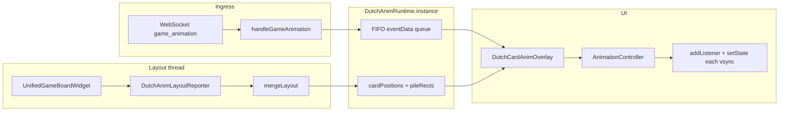

# Dutch game: card flight animation runtime (Flutter)

**Status**: In progress (draw / play_card / reposition implemented and hardened)  
**Created**: 2026-05-01  
**Last Updated**: 2026-05-03  

## Objective

Document the **current client-side Dutch card animation system**: how `game_animation` events become queued work, how **layout rects** are merged into a runtime that **does not** go through `StateManager`, how **`DutchCardAnimOverlay`** plays **linear flights** with **frozen geometry**, and how this interacts with **`game_state_updated`**. This is the reference for debugging “missing”, “reversed”, or “janky” motion.

**Related plan**: `dutch-game-initial-peek-state-and-card-animations.md` covers broader goals (peek, `game_animation` SSOT on the server, future jack/queen motion). **This** document focuses on the **implemented Flutter runtime + overlay**.

---

## High-level architecture

- **`game_animation`** payloads are **enqueued only** into `DutchAnimRuntime` (not copied into `dutch_game` module state for the queue).
- **Hand and pile rectangles** are captured from **`GlobalKey`**s after layout, converted to **coordinates relative to a stack anchor**, and merged into the same runtime.
- The **overlay** listens to the runtime to **schedule kicks** (start or stall-retry), drives a single **`AnimationController`** (420 ms, `AnimationBehavior.preserve`), and repaints the ghost on **each controller tick** via **`addListener` → conditional `setState`** so **`build`** lerps **`controller.value`** every vsync while the ghost is visible. **Completion** uses **`AnimationStatus.completed`**: **post-frame** clear frozen rects, **`dequeueHead()`**, then **`_kick()`** for the next job (no manual `Ticker` / `Stopwatch`). The ghost subtree is wrapped in **`TickerMode(enabled: true)`** and **`RepaintBoundary`**.

---

## Core component: `DutchAnimRuntime`

**Location**: `flutter_base_05/lib/modules/dutch_game/screens/game_play/utils/dutch_anim_runtime.dart`  
**Pattern**: singleton — `DutchAnimRuntime.instance` — extends `ChangeNotifier`.

### Responsibilities

| Responsibility | Detail |
|----------------|--------|
| **FIFO queue** | `_eventData` is a `List<Map<String, dynamic>>` of animation jobs, in arrival order. |
| **Monotonic sequence** | Each enqueue assigns `_seq` (stored as `_seq` on the entry) for logging and overlay bookkeeping. |
| **Layout cache** | `_cardPositions`: per `playerId`, a map of **string slot index** → `{ left, top, width, height }` in **anchor-relative** pixels. `_pileRects`: `draw` / `discard` (same shape). |
| **Deduped layout updates** | `mergeLayout` JSON-encodes merged geometry + piles and compares to `_lastLayoutSignature`; if unchanged, **no** `notifyListeners()` (avoids useless wakeups). |
| **Slot 4 carry-forward** | After play+draw the visible hand often has **four** slots (`0`–`3`), but **`reposition`** may still reference **`from_hand_index: 4`**. Incoming layout without key `"4"` **copies the previous snapshot’s `"4"` rect** for that player so `rectFor(owner, 4)` stays valid. |

### Snapshot shape (`snapshotForAnim()`)

Used by the overlay’s `_resolveFromTo`. Keys:

- `eventData` — copy of the queue (`List<Map<String, dynamic>>`).
- `cardPositions` — copy of per-player slot maps.
- `pileRects` — copy of pile map.
- `eventSeq`, `cardPositionsVersion` — diagnostics / future use.

### API summary

- **`enqueueGameAnimation(Map)`** — appends payload + `_seq` + `_receivedAt`; `notifyListeners()`.
- **`dequeueHead()`** — removes index `0` when a flight **completes** (or when skipping invalid/stalled jobs); `notifyListeners()`.
- **`reset()`** — clears queue, layout, seq, signature; `notifyListeners()`. Called on **leave game**, **clear state**, **switch to a different `currentGameId`** (see below), and **`wasNewGame`** when the games map first receives a game.

### Important: `reset()` vs `game_state_updated`

Anim queue must **not** be cleared when the UI is simply **binding** `currentGameId` from empty to the active room, or **`game_animation`** messages that arrived **before** the first state patch would be dropped.

**Current rule** (in `dutch_event_handler_callbacks.dart`): call `DutchAnimRuntime.instance.reset()` when switching games only if **`existingCurrentGameId.isNotEmpty && existingCurrentGameId != gameId`**. Going from `''` → `room_…` **does not** reset the anim runtime (the `wasNewGame` path still resets when a genuinely new game entry is added to the map, as needed).

---

## Layout pipeline

**Location**: `unified_game_board_widget.dart` + `dutch_anim_layout_reporter.dart`

### Anchor

The board builds a `Stack` with **`key: _animStackAnchorKey`**. All rects stored in `DutchAnimRuntime` are **relative to this stack’s top-left** so the overlay (a child of the same stack) can use **`Positioned(left:, top:)`** directly.

### When layout is reported

- Each rebuild of the unified board slice schedules **`_scheduleAnimLayoutReport`** → post-frame **`_flushAnimLayoutReport`**.
- **Slot keys**: `GlobalKey`s are registered per visible card: `my_hand_<userId>_<i>` and `opponent_<playerId>_<i>` for `i in 0 .. hand.length-1`.
- **Reporter** (`DutchAnimLayoutReporter`):
  - **`captureHandSlots`**: for each `"playerId|index"` path, `rectRelativeToAnchor(slotKey, anchorKey)` → writes `cardPositions[playerId][indexAsString]`.
  - **`capturePiles`**: draw and discard pile regions → `pileRects['draw']`, `pileRects['discard']`.

### `rectRelativeToAnchor`

Uses `RenderBox.localToGlobal` for slot and anchor, subtracts origins, reads `size`. Returns `null` if not laid out, no size, or detached — those slots are **missing** until a later frame.

---

## Overlay: `DutchCardAnimOverlay`

**Location**: `flutter_base_05/lib/modules/dutch_game/screens/game_play/widgets/dutch_card_anim_overlay.dart`  
**Placement**: `Positioned.fill` **above** the main board column in the same `Stack` as the anchor (`unified_game_board_widget.dart`).

### Listeners

- **`DutchAnimRuntime.instance.addListener(_onRuntime)`** — on enqueue, dequeue, layout merge, or reset, schedules **`_kick()`** on the next frame (does not assume sync layout).
- **`AnimationController.addListener(_onAnimTick)`** — on each tick, if **`_shouldPaintAnim()`**, calls **`setState(() {})`** so **`build`** runs with an updated **`controller.value`** (smooth **0 → 1** lerp). Runtime changes still reach **`_kick`** only via **`_onRuntime`**; the controller is **not** merged with `_runtime` in one listenable (see history below).
- **`AnimationController.addStatusListener`** — on **`AnimationStatus.completed`**, schedules a **post-frame** callback that clears frozen flight rects, calls **`dequeueHead()`**, clears **`_runningSeq`**, **`setState`**, then post-frame **`_kick()`** for the next head (so the last **`t = 1`** frame can paint before cleanup).
- **`AnimationController`** — duration **420 ms**, **`AnimationBehavior.preserve`**; linear lerp on **`controller.value`** 0→1.

### Why `addListener` + `setState` instead of `AnimatedBuilder` only

Historically, merging `_runtime` into `Listenable.merge([_controller, _runtime])` caused **every `mergeLayout` notify** to rebuild the flight subtree **during** a tween and made motion look **stepped**. **Later**, `AnimatedBuilder(animation: _controller)` alone was sufficient in theory, but in practice the overlay often sits under **`DutchSliceBuilder`**, which **does not rebuild** when `dutch_game` is unchanged—so relying only on **`AnimatedBuilder`** could yield **sparse** rebuilds and a **flash** or **one-frame** ghost instead of a continuous flight.

**Current behavior**: **`_controller.addListener(_onAnimTick)`** with **`setState`** when **`_shouldPaintAnim()`** is true guarantees the overlay **`State`’s `build`** runs **every vsync** for the duration of the tween. **`setState`** is also invoked **once** immediately after freezing rects and **before** **`forward(from: 0.0)`** so the first frame at **`t = 0`** is scheduled reliably. The painted stack uses **`TickerMode(enabled: true)`** (belt-and-suspenders with the board’s outer **`TickerMode`** around the overlay) and **`RepaintBoundary`** around the flight to confine repaints.

If profiling shows cost from rebuilding **`CardWidget`** every frame, a follow-up is to **`AnimatedBuilder` wrapping only the positioned `CardWidget`** (still controller-only listenable) or a lighter flight proxy—same tick cadence, smaller **`build`** subtree.

### Hand slot mask (avoid double card before tween ends)

When **`game_state_updated`** lands before a flight completes, the real hand can already show the card at the **destination** slot while the ghost still animates there.

- **`DutchAnimRuntime`** holds **`_animMaskedHandSlots`** (`playerId|handIndex`, same identity as layout slot paths). API: **`handSlotMaskKey`**, **`isAnimMaskedHandSlot`**, **`setAnimMaskedHandSlots`**, **`clearAnimMaskedHandSlots`**, **`handAnimMaskSignature`** (sorted join for cheap equality).
- **`DutchCardAnimOverlay`** sets slots from the queue head when a plan starts (**destination** hand for draw / collect / reposition; both **to** slots for jack; peek **target**), and clears via **`_clearAnimGeometry`** / completion / **`reset()`**.
- **`UnifiedGameBoardWidget`** listens to **`DutchAnimRuntime`** but **`setState` only when `handAnimMaskSignature` changes**, so normal **`mergeLayout`** notifies do **not** rebuild the whole board. Masked slots wrap the existing **`CardWidget`** (or collection stack) in **`IgnorePointer` + `Opacity(0)`** so **`GlobalKey`**s and layout are preserved.

### `_kick()` state machine (simplified)

1. If controller **`status`** is **`forward`** or **`reverse`** → return (do not start a second flight). This uses **status**, not **`isAnimating`**, so a muted ticker edge case does not leave a stuck “busy” guard.
2. If queue **empty** → clear `_runningSeq`, return.
3. If head is **not a Map** → dequeue, return.
4. If head’s `_seq` equals `_runningSeq` → return (guard against double-start).
5. Resolve geometry via **`_resolveAnimPlan`** into a small plan: **linear** (one card), **`jack_swap`** (two cards cross-lerp), or **`queen_peek`** (target rect only for a glow pulse).
6. If resolution **null**:
   - **Unsupported** action → dequeue immediately.
   - **`reposition`** with bad indices or rects → dequeue immediately (log `skip reposition` with `missing_from_index` vs `unresolved_rects`).
   - **`jack_swap`** with fewer than two **`cards`** entries → dequeue immediately.
   - Otherwise (rects not ready yet) → **stall**: increment `_stallFrames`, `setState` up to **`_maxStallFrames` (24)** then **stall skip** (dequeue + log warning).
7. On success: copy frozen rects/models from the plan into **`State`**, set **`_runningSeq`**, **`setState`**, then **`_controller.forward(from: 0.0)`** (avoids `reset()` inserting a blank frame).

### `build()` painting rules

- If **`_shouldPaintAnim()`** is false → **`SizedBox.shrink()`**.
- **Paint** while **`_runningSeq`** matches the queue head and the active plan has the needed rects, and either **`status`** is **`forward` / `reverse`**, or **`status == completed`** with **`value ≈ 1`** (one frame at end before post-frame clears and dequeues).
- **Linear / jack**: **`build`** reads **`_controller!.value`** as **`t`** and positions one or two **`CardWidget`**s. **`queen_peek`**: **`DecoratedBox`** border + **`BoxShadow`** on the target slot using **`AppColors.statusQueenPeek`** / **`AppColors.accentColor`** with **`sin(π·t)`** pulse (theme-compliant, no raw hex).
- Subtree: **`TickerMode` → `RepaintBoundary` → `IgnorePointer` → `Stack`**.
- Lerp uses **frozen** `from` / `to`; head **`_seq`** must still match **`_runningSeq`** so a new queue head never paints with stale frozen geometry.

### Supported `action_type` values (overlay)

| Action | From | To | Notes |
|--------|------|-----|------|
| **`draw`** | `pileRects['draw']` or `['discard']` if `source == 'discard'` | Hand slot `rectFor(owner, hand_index)` | Face placeholder unless `card` map present. |
| **`collect_from_discard`** | `pileRects['discard']` | Hand slot | Same geometry idea as draw-from-discard; dedicated **`action_type`** from the server. |
| **`play_card`** | Hand slot for played entry | `pileRects['discard']` | Picks the **`cards`** element that contains a **`card`** map when multiple entries exist. |
| **`same_rank_play`** | Same as **`play_card`** | `pileRects['discard']` | Same resolver branch as **`play_card`**. |
| **`reposition`** | `rectFor(owner, from_hand_index)` (also **`fromHandIndex`**) | `rectFor(owner, hand_index)` | Needs carry-forward **`"4"`** in runtime when hand UI has four slots. |
| **`jack_swap`** | Two **`cards`** entries: each **`owner_id` + `hand_index`** | Cross: card A’s slot → B’s slot, B’s slot → A’s slot | Two **face-down** placeholder ghosts (server **`card`** maps are ignored for the flight), same **`t`**, one controller run. |
| **`queen_peek`** | — | — | No card flight: **glow** on **`rectFor(owner, hand_index)`** for the peek target (`cards[0]`). |

Other **`action_type`** values are still **unsupported** until added to the overlay’s allowlist and resolver.

### Interpolation

- **Linear** in `left` and `top`: `from + (to - from) * t`.
- **Width/height** are taken from **`from`** only (no lerp to pile/hand size). If endpoints differ in size, the ghost keeps hand dimensions for the whole flight (minor visual difference vs a scaled card).

---

## Ingress: `handleGameAnimation`

**Location**: `dutch_event_handler_callbacks.dart`  

- Validator allows **`game_animation`** (see `dutch_event_listener_validator.dart`).
- Handler logs a one-line summary (`gameId`, `action_type`, `cards` count, hand indices) and calls **`DutchAnimRuntime.instance.enqueueGameAnimation(Map<String, dynamic>.from(data))`**.
- **Ordering**: server is expected to emit **`game_animation` before** the matching **`game_state_updated`** so the client can enqueue the flight **before** hand layout updates for the post-action state (frozen rects mitigate mid-flight drift anyway).

---

## Module registration (discovery only)

**Location**: `dutch_game_main.dart`  

- `dutch_game` default state includes **`'animRuntime': DutchAnimRuntime.instance`** for debugging / discovery.
- **Do not** replace this key in state patches with a new object; the overlay and handlers use **`DutchAnimRuntime.instance`** directly.

---

## Logging (when `LOGGING_SWITCH` is true)

| Source | Examples |
|--------|----------|
| `handleGameAnimation` | `🎬 game_animation RECV …` |
| `DutchAnimRuntime` | `enqueue seq=…`, `dequeueHead seq=…`, `mergeLayout applied version=…`, `reset (queue + layout cleared)` |
| `DutchCardAnimOverlay` | `start flight …`, `flight complete …`, `skip reposition …`, `stall skip …` (file default **`LOGGING_SWITCH` false**) |
| `unified_game_board_widget` (`DutchAnimLayout:`) | merge / skip-flush lines only when that file’s **`LOGGING_SWITCH`** is true |

Server-side Dart logs (routed into `python_base_04/tools/logger/server.log` in dev) include **`emitGameAnimation`** lines for correlation.

---

## Known limitations and follow-ups

1. **Action coverage**: **draw**, **collect_from_discard**, **play_card**, **same_rank_play**, **reposition**, **jack_swap**, and **queen_peek** are implemented; any new **`action_type`** from the server still needs an overlay branch and allowlist entry.
2. **Stall skip**: If keys are missing for **> ~24 post-frame retries**, the head job is dropped — can still happen on very slow layout or wrong `owner_id` / index.
3. **String indices**: `_parseHandIndex` accepts `int`, `num`, and **`String`** (via `int.tryParse`) for robustness.
4. **Performance**: Ghost uses **`CardWidget`** rebuilt each tick via **`setState`**; a **`RepaintBoundary`** already wraps the flight subtree. If profiles show jank, narrow rebuilds (e.g. **`AnimatedBuilder`** around only the card) or use a lighter flight proxy (`CustomPainter` / simplified decoration).
5. **Coordinate space**: All flights assume the overlay shares the **anchor stack**; refactors that move the overlay outside that stack would break alignment.

---

## Files (implementation map)

| File | Role |
|------|------|
| `flutter_base_05/.../utils/dutch_anim_runtime.dart` | Singleton queue + layout + merge + carry-forward slot `4` |
| `flutter_base_05/.../utils/dutch_anim_layout_reporter.dart` | Anchor-relative rect capture |
| `flutter_base_05/.../widgets/dutch_card_anim_overlay.dart` | Queue consumer, frozen flight, `AnimationController`, tick `addListener` + `setState`, `RepaintBoundary` |
| `flutter_base_05/.../widgets/unified_game_board_widget.dart` | Anchor `Stack`, keys, `mergeLayout` scheduling |
| `flutter_base_05/.../managers/dutch_event_handler_callbacks.dart` | `handleGameAnimation`, `handleGameStateUpdated` game-switch reset guard |
| `flutter_base_05/.../dutch_game_main.dart` | `animRuntime` reference in default state |
| `flutter_base_05/.../managers/dutch_event_listener_validator.dart` | `game_animation` schema |
| `dart_bkend_base_01/.../dutch_game_round.dart` (and related) | **`emitGameAnimation`** payloads (incl. collect / same_rank / jack / queen) |

---

## Next steps (optional product work)

1. Further **`action_type`** presets if the server adds more (id-based jack paths, multi-card payloads, etc.).
2. Align **`dutch-game-initial-peek-state-and-card-animations.md`** “Animation architecture” checkboxes with this overlay.
3. Add widget/integration tests: enqueue with fake rects, assert dequeue order and no reset on empty→same `gameId` bind.

---

## Changelog (this subsystem)

- **Hand slot mask**: **`DutchAnimRuntime`** + **`UnifiedGameBoardWidget`** hide destination hand **`CardWidget`**s while an overlay tween is active so early **`game_state_updated`** does not double-paint with the ghost.
- **Overlay `action_type`**: **`collect_from_discard`** (discard → hand), **`same_rank_play`** (same as play to discard), **`jack_swap`** (two simultaneous card flights), **`queen_peek`** (theme **`AppColors`** glow pulse on target slot, no flight).
- **Overlay driver**: single **`AnimationController`** + **`addListener` → `setState`** on each tick while the ghost paints + **`AnimationStatus.completed`** post-frame dequeue (replaced prior manual **`Ticker` / `Stopwatch` / flight session** driver that could desync and stall the queue; replaced **`AnimatedBuilder`-only** repaint path that could miss frames under a static **`DutchSliceBuilder`** parent).
- **Frozen `from`/`to`/model** at flight start so `mergeLayout` during a tween does not bend the path.
- **Carry-forward hand slot `"4"`** in `mergeLayout` for post-play **`reposition`**.
- **`forward(from: 0.0)`** instead of `reset()` + `forward()` to avoid a blank frame at tween start; **`setState`** immediately after freezing rects and before **`forward`** for a reliable **`t = 0`** frame.
- **Busy guard** on **`_kick`**: controller **`status`** is **`forward` / `reverse`** (not **`isAnimating`** alone). **Do not** attach **`DutchAnimRuntime`** to the same listenable as the tween repaints.
- **Subtree**: inner **`TickerMode(enabled: true)`** and **`RepaintBoundary`** around the flight **`Stack`**.
- **`game_state_updated`**: anim **`reset()`** only when **`currentGameId`** switches from one **non-empty** game id to another (prevents wiping queue on first bind).
- **`_parseHandIndex`**: supports **string** indices.
