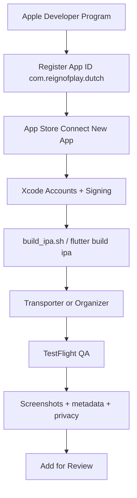

# iOS App Store release — end-to-end guide (Dutch Card Game)

This document records the **full process** used to take **Dutch Card Game** from Apple Developer setup through the first **production IPA** build, ready for TestFlight and App Store submission.

It complements the shorter operational checklist: [`Documentation/flutter_base_05/IOS_RELEASE_CHECKLIST.md`](../flutter_base_05/IOS_RELEASE_CHECKLIST.md).

**Project:** `flutter_base_05`  
**Last completed build:** version **2.0.20**, build **20020** (May 2026)

---

## Table of contents

1. [Identifiers — what is what](#1-identifiers--what-is-what)
2. [Prerequisites](#2-prerequisites)
3. [Apple Developer Program](#3-apple-developer-program)
4. [Register the App ID (bundle ID)](#4-register-the-app-id-bundle-id)
5. [App Store Connect — create the app](#5-app-store-connect--create-the-app)
6. [Repo and Xcode configuration](#6-repo-and-xcode-configuration)
7. [Xcode signing (one-time)](#7-xcode-signing-one-time)
8. [Build the IPA](#8-build-the-ipa)
9. [Upload to App Store Connect](#9-upload-to-app-store-connect)
10. [After upload — TestFlight and review](#10-after-upload--testflight-and-review)
11. [Android vs iOS release (same repo)](#11-android-vs-ios-release-same-repo)
12. [What automation exists in the repo](#12-what-automation-exists-in-the-repo)
13. [Troubleshooting](#13-troubleshooting)
14. [Official Apple references](#14-official-apple-references)

---

## 1. Identifiers — what is what

Do **not** mix these up. Each has a fixed role.

| Name | Dutch value | Used for |
|------|-------------|----------|
| **Dart package** (`pubspec.yaml` `name:`) | `dutch` | `import package:dutch/...` only |
| **Bundle ID** | `com.reignofplay.dutch` | Xcode signing, Firebase, App Store Connect app record |
| **SKU** | `dutch-card-game` | Internal App Store Connect ID (never shown to users) |
| **Team ID** | `D6J4Y6ZQGV` | Apple Developer team; Xcode `DEVELOPMENT_TEAM` |
| **Apple ID** (App Store listing) | `6772967073` | Public store URL: `https://apps.apple.com/app/id6772967073` |
| **Developer ID** (membership UUID) | e.g. `c1381110-d489-474c-800c-cbc551931895` | Account/membership only — **not** the store link |

**Rule:** Bundle ID ≠ Apple ID ≠ Team ID. Set `APP_STORE_URL` using the **numeric Apple ID** only.

---

## 2. Prerequisites

- **Mac** with **Xcode** (this project was built with **Xcode 15.2** on macOS Ventura).
- **Flutter** SDK and CocoaPods (`flutter doctor` shows Xcode OK).
- **Apple Developer Program** membership (paid, active).
- **App Store Connect** access on the same team (Account Holder or Admin for certificates; Developer can upload builds if permitted).
- Repo env files (not committed):
  - `.env.prod` — `APP_VERSION` and deploy-related vars
  - `.env.dart.defines.prod` — API URLs, AdMob, JWT, `APP_STORE_URL`, etc.

See also [`README.md`](README.md) for **iOS SDK pins** required on Xcode 15.2.

---

## 3. Apple Developer Program

1. Enroll at [Apple Developer Program](https://developer.apple.com/programs/) (individual or organization).
2. Complete enrollment and accept agreements in [App Store Connect](https://appstoreconnect.apple.com/) and the [Developer](https://developer.apple.com/account) portal.
3. Note your **Team ID** (e.g. **D6J4Y6ZQGV**) under **Membership details**.
4. Add your Apple ID in **Xcode → Settings → Accounts** so signing can create profiles and certificates.

**Roles (example):** Account Holder, Admin — can create distribution certificates and App IDs.

---

## 4. Register the App ID (bundle ID)

Before App Store Connect lists your bundle ID, register it in the developer portal.

1. Open [Certificates, Identifiers & Profiles → Identifiers](https://developer.apple.com/account/resources/identifiers/list).
2. **+** → **App IDs** → **App**.
3. **Description:** e.g. `Dutch card game`.
4. **Bundle ID:** **Explicit** → `com.reignofplay.dutch`.
5. **Capabilities:** leave unchecked unless you need them (Push, Sign in with Apple, etc.). Dutch initially used none; add later when the app requires them.
6. **Continue** → **Register**.

Official: [Register an App ID](https://developer.apple.com/help/account/manage-identifiers/register-an-app-id/).

**Alternative:** With **Automatically manage signing** in Xcode, opening the project and building can register the App ID for you — portal registration is still fine and makes the ID appear immediately in App Store Connect.

---

## 5. App Store Connect — create the app

1. [App Store Connect](https://appstoreconnect.apple.com/) → **Apps** → **+** → **New App**.
2. Fill in:

| Field | Value used |
|-------|------------|
| **Platforms** | iOS |
| **Name** | Dutch Card Game |
| **Primary Language** | English (U.S.) |
| **Bundle ID** | Dutch card game — `com.reignofplay.dutch` (only appears after App ID is registered) |
| **SKU** | `dutch-card-game` (unique, permanent, internal) |
| **User Access** | **Full Access** (typical for a small team; limits visibility for some roles only) |

3. **Create**.

### General Information (after creation)

| Field | Value |
|-------|--------|
| **Bundle ID** | `com.reignofplay.dutch` |
| **SKU** | `dutch-card-game` |
| **Apple ID** | `6772967073` |

Store link for share features and marketing:

`https://apps.apple.com/app/id6772967073`

Add to `.env.dart.defines.prod`:

```bash
APP_STORE_URL=https://apps.apple.com/app/id6772967073
```

Rebuild IPA if you need that URL baked into the app (celebration share on iOS). See [`Config` — `appStoreUrl`](../../flutter_base_05/lib/utils/consts/config.dart).

---

## 6. Repo and Xcode configuration

These were already correct or were set during release prep.

| Item | Location |
|------|----------|
| Bundle ID | `flutter_base_05/ios/Runner.xcodeproj` → `PRODUCT_BUNDLE_IDENTIFIER = com.reignofplay.dutch` |
| Display name | `ios/Runner/Info.plist` → `Dutch Card Game` |
| Team + automatic signing | `DEVELOPMENT_TEAM = D6J4Y6ZQGV`, `CODE_SIGN_STYLE = Automatic` on Runner (Debug / Release / Profile) |
| Firebase iOS | `ios/Runner/GoogleService-Info.plist` → `BUNDLE_ID` = `com.reignofplay.dutch` |
| AdMob | `ios/Flutter/Debug.xcconfig` / `Release.xcconfig` → `GAD_APPLICATION_ID` |
| Release build script | `playbooks/frontend/build_ipa.sh` |

Open the workspace (not the bare project):

`flutter_base_05/ios/Runner.xcworkspace`

---

## 7. Xcode signing (one-time)

1. **Xcode → Settings → Accounts** → add Apple ID for team **D6J4Y6ZQGV** (required; CLI build failed with *No Accounts* until this was done).
2. Open **Runner.xcworkspace** → target **Runner** → **Signing & Capabilities**.
3. Enable **Automatically manage signing**.
4. Select team **D6J4Y6ZQGV**.
5. Confirm **Bundle Identifier** = `com.reignofplay.dutch` and no red errors.

Xcode creates/updates development and distribution profiles. For App Store upload, distribution signing is used during archive/IPA export (often cloud-managed certificates in recent Xcode versions).

Official: [Preparing your app for distribution](https://developer.apple.com/documentation/xcode/preparing-your-app-for-distribution).

---

## 8. Build the IPA

### Script (recommended)

From repo root:

```bash
chmod +x playbooks/frontend/build_ipa.sh
./playbooks/frontend/build_ipa.sh
```

The script:

- Sources `.env.prod` and optional version bump prompt
- Disables `LOGGING_SWITCH` in Dart sources for release
- Sets production deck config (`testing_mode=false`, etc.)
- Builds `--dart-define-from-file` from `.env.dart.defines.prod`
- Runs `pod install` (with `LANG=en_US.UTF-8` for CocoaPods)
- Runs `flutter build ipa --release`

### Successful first production build (reference)

| Output | Path |
|--------|------|
| **IPA** | `flutter_base_05/build/ios/ipa/Dutch Card Game.ipa` |
| **Archive** | `flutter_base_05/build/ios/archive/Runner.xcarchive` |
| **Version** | 2.0.20 |
| **Build number** | 20020 (derived from `APP_VERSION` in `.env.prod`: `major*10000 + minor*100 + patch`) |

Validation at export:

- Display Name: Dutch Card Game  
- Bundle Identifier: com.reignofplay.dutch  
- Deployment Target: 13.0  

### Xcode GUI alternative

1. Destination: **Any iOS Device (arm64)**.
2. **Product → Archive**.
3. **Organizer → Distribute App → App Store Connect**.

### Rebuild rules

- Each App Store / TestFlight upload needs a **higher build number** than the previous upload.
- Bump `APP_VERSION` in `.env.prod` (script prompt) or `pubspec.yaml` `version:` before rebuilding.

---

## 9. Upload to App Store Connect

The repo does **not** auto-upload the IPA (unlike Android `build_apk.sh` VPS upload).

### Option A — Transporter

1. Install [Transporter](https://apps.apple.com/us/app/transporter/id1450874784) from the Mac App Store.
2. Drag `flutter_base_05/build/ios/ipa/Dutch Card Game.ipa` into Transporter.
3. Sign in with your App Store Connect Apple ID and deliver.

### Option B — Xcode Organizer

1. Open the `.xcarchive` or **Window → Organizer**.
2. **Distribute App** → **App Store Connect** → **Upload**.

### After upload

- App Store Connect → **TestFlight** → build status **Processing** (often 5–30+ minutes).
- Resolve any email about export compliance or missing metadata.

---

## 10. After upload — TestFlight and review

### TestFlight (recommended before public review)

1. App Store Connect → **TestFlight** → **Internal Testing**.
2. Add testers (your Apple ID).
3. Install **TestFlight** on iPhone and open the build.
4. Smoke-test: login, game flow, ads, network to production API.

### App Store version 1.0 (Distribution tab)

Complete before **Add for Review**:

| Section | Notes |
|---------|--------|
| **Screenshots** | iPhone 6.5" (e.g. 1284×2778); up to 10 |
| **Description / keywords / URLs** | Support URL, privacy policy |
| **App Privacy** | Data collection questionnaire |
| **Pricing and Availability** | Territories, price (e.g. free) |
| **Age Rating** | Questionnaire |
| **App Review Information** | Contact; demo account if login required |
| **Build** | Select processed build **20020** (or current) on version 1.0 |

Then **Save** → **Add for Review**.

---

## 11. Android vs iOS release (same repo)

| Aspect | Android | iOS |
|--------|---------|-----|
| **Store ID** | Package `com.reignofplay.dutch` (same string as bundle ID) | Bundle ID + separate **Apple ID** `6772967073` |
| **Build script** | `playbooks/frontend/build_apk.sh` | `playbooks/frontend/build_ipa.sh` |
| **Upload** | VPS + `mobile_release.json` (optional) | Transporter / Organizer → App Store Connect |
| **Signing** | Keystore / Play Console | Apple Developer + Xcode |
| **Share URL define** | `PLAY_STORE_URL` | `APP_STORE_URL` |

Android release docs: `playbooks/frontend/00_documentation.md` (§ `build_apk.sh`).

---

## 12. What automation exists in the repo

| Done in repo | Manual (you / Apple UI) |
|--------------|-------------------------|
| Bundle ID, team ID in `project.pbxproj` | Apple Developer enrollment |
| `build_ipa.sh`, `IOS_RELEASE_CHECKLIST.md` | Register App ID (or via Xcode) |
| `APP_STORE_URL` in `.env.dart.defines.prod` (local) | App Store Connect app + metadata |
| `flutter build ipa` when Xcode account present | Transporter upload |
| | Screenshots, privacy, review submission |
| | TestFlight on device |

**Not wired:** Fastlane for Dutch (template only under `assets/flutter-template-master/fastlane/`).

---

## 13. Troubleshooting

| Symptom | Fix |
|---------|-----|
| Bundle ID missing in **New App** dropdown | Register App ID in developer portal (§4) or build once in Xcode |
| **No Accounts** / **No profiles** on `flutter build ipa` | Xcode → Settings → Accounts → add Apple ID |
| CocoaPods `ASCII-8BIT` / UTF-8 error | `export LANG=en_US.UTF-8 LC_ALL=en_US.UTF-8` (included in `build_ipa.sh`) |
| Upload rejected — duplicate build | Increase build number in `.env.prod` and rebuild |
| Share link empty on iOS | Set `APP_STORE_URL` and rebuild IPA |
| Xcode 15.2 compile errors (Firebase, GMA, StoreKit) | See [`README.md`](README.md) dependency pins |

---

## 14. Official Apple references

- [Certificates overview](https://developer.apple.com/help/account/certificates/certificates-overview/)
- [Create an App Store provisioning profile](https://developer.apple.com/help/account/provisioning-profiles/create-an-app-store-provisioning-profile/) (manual signing; optional with automatic signing)
- [Preparing your app for distribution](https://developer.apple.com/documentation/xcode/preparing-your-app-for-distribution)
- [Distributing for beta testing and releases](https://developer.apple.com/documentation/xcode/distributing-your-app-for-beta-testing-and-releases)
- [Submitting to the App Store](https://developer.apple.com/app-store/submitting/)
- [Edit access to an app](https://developer.apple.com/help/app-store-connect/create-an-app-record/edit-access-to-an-app/)

---

## Process timeline (summary)



---

*Document created: 2026-05-25 — reflects Dutch Card Game iOS release work through first successful IPA 2.0.20 (20020).*
