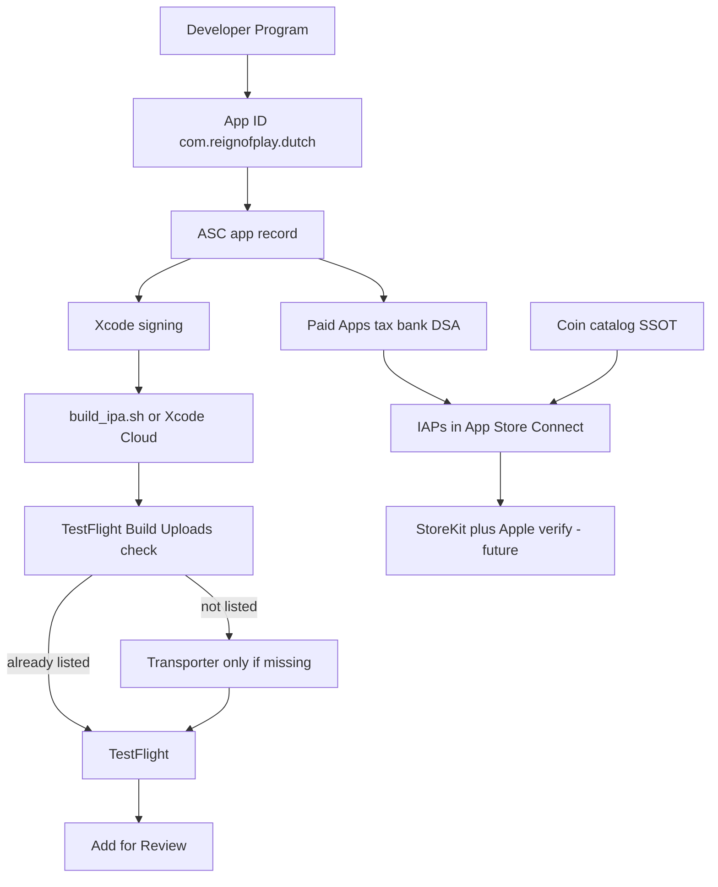

# iOS App Store release — end-to-end guide (Dutch Card Game)

Full path from Apple Developer enrollment through **production IPA**, **TestFlight**, **in-app purchases** (catalog SSOT), and App Store submission.

**Related docs (this folder):**

| Doc | Purpose |
|-----|---------|
| [IOS_RELEASE_CHECKLIST.md](../flutter_base_05/IOS_RELEASE_CHECKLIST.md) | Short operational checklist |
| [IOS_IN_APP_PURCHASES_SETUP.md](IOS_IN_APP_PURCHASES_SETUP.md) | Coin packs + Premium in App Store Connect |
| [COIN_CATALOG_SSOT.md](COIN_CATALOG_SSOT.md) | Product IDs shared with Android/backend |
| [README.md](README.md) | Xcode 15.2 SDK pins |

**Project:** `flutter_base_05`  
**Reference build:** version **2.0.20**, build **20020** (May 2026)

---

## Table of contents

1. [Identifiers](#1-identifiers--what-is-what)
2. [Prerequisites](#2-prerequisites)
3. [Apple Developer Program](#3-apple-developer-program)
4. [Register App ID](#4-register-the-app-id-bundle-id)
5. [App Store Connect — app record](#5-app-store-connect--create-the-app)
6. [Business — Paid Apps, tax, bank, DSA](#6-business--paid-apps-tax-bank-dsa)
7. [Coin catalog SSOT](#7-coin-catalog-ssot-product-ids)
8. [Repo and Xcode](#8-repo-and-xcode-configuration)
9. [Xcode signing](#9-xcode-signing-one-time)
10. [Build IPA](#10-build-the-ipa)
11. [Upload](#11-upload-to-app-store-connect)
12. [TestFlight and review](#12-after-upload--testflight-and-review)
13. [In-app purchases (next)](#13-in-app-purchases-after-paid-apps-is-active)
14. [Android vs iOS](#14-android-vs-ios-release-same-repo)
15. [Repo automation](#15-what-automation-exists-in-the-repo)
16. [Troubleshooting](#16-troubleshooting)
17. [Official Apple links](#17-official-apple-references)
18. [Timeline](#18-process-timeline)

---

## 1. Identifiers — what is what

| Name | Dutch value | Used for |
|------|-------------|----------|
| **Dart package** (`pubspec.yaml`) | `dutch` | Imports only |
| **Bundle ID** | `com.reignofplay.dutch` | Signing, Firebase, ASC |
| **SKU** | `dutch-card-game` | Internal ASC only |
| **Team ID** | `D6J4Y6ZQGV` | Xcode `DEVELOPMENT_TEAM` |
| **Apple ID** (listing) | `6772967073` | `https://apps.apple.com/app/id6772967073` |
| **Developer ID** (UUID) | membership UUID | Account only — **not** store URL |

**Rule:** Bundle ID ≠ Apple ID ≠ Team ID.  
`APP_STORE_URL=https://apps.apple.com/app/id6772967073` in `.env.dart.defines.prod`.

---

## 2. Prerequisites

- Mac + **Xcode 15.2** (see [README.md](README.md) for dependency pins)
- **Flutter** + CocoaPods (`flutter doctor`)
- **Apple Developer Program** (paid)
- Local env (not in git): `.env.prod`, `.env.dart.defines.prod`

---

## 3. Apple Developer Program

1. [Enroll](https://developer.apple.com/programs/)
2. [App Store Connect](https://appstoreconnect.apple.com/) + [Developer account](https://developer.apple.com/account)
3. Note **Team ID** `D6J4Y6ZQGV`
4. **Xcode → Settings → Accounts** → Apple ID

---

## 4. Register the App ID (bundle ID)

[Identifiers](https://developer.apple.com/account/resources/identifiers/list) → **+** → App → Explicit **`com.reignofplay.dutch`** → capabilities off unless needed.

[Register an App ID](https://developer.apple.com/help/account/manage-identifiers/register-an-app-id/)

---

## 5. App Store Connect — create the app

| Field | Value |
|-------|--------|
| Name | Dutch Card Game |
| Bundle ID | `com.reignofplay.dutch` |
| SKU | `dutch-card-game` |
| User Access | Full Access (typical) |

**General Information:** Apple ID **6772967073**.

---

## 6. Business — Paid Apps, tax, bank, DSA

Required before **Monetization → In-App Purchases** works.

### 6.1 Order of operations

1. **Edit Legal Entity** (if prompted)
2. **DSA trader** declaration — [EU trader requirements](https://developer.apple.com/help/app-store-connect/manage-compliance-information/manage-european-union-digital-services-act-trader-requirements/)  
   - Selling IAP + ads in EU → usually declare **trader** (contact info shown on EU store page)  
   - Not “trader” only if you truly qualify and accept EU consumer-law notice
3. **Paid Apps Agreement** — [Sign agreements](https://developer.apple.com/help/app-store-connect/manage-agreements/sign-and-update-agreements/) → **Business** → **View and Agree to Terms**
4. **Tax** — W-8BEN + Certificate of Foreign Status (Malta individual)
5. **Bank** — e.g. BOV Malta; status **Processing** ~24h

### 6.2 Status targets

| Item | Target |
|------|--------|
| Paid Apps Agreement | **Active** (not Processing / Pending User Info) |
| Tax forms | **Active** |
| Bank | Active (not Processing) |
| DSA compliance | Approved (not In Review) |

Until **Paid Apps = Active**, IAP creation in Connect may be blocked.

---

## 7. Coin catalog SSOT (product IDs)

**Do not invent IDs in App Store Connect** — copy from:

[`flutter_base_05/assets/dutch_coin_catalog.json`](../../flutter_base_05/assets/dutch_coin_catalog.json)

Full reference: [COIN_CATALOG_SSOT.md](COIN_CATALOG_SSOT.md)

### Consumables (App Store type: Consumable)

```
coins_100, coins_300, coin_500, coins_700, coins_1500, coins_3500
```

### Subscriptions (one group, two products)

Apple subscription **Product IDs cannot contain hyphens**. Use the SSOT values under `premium_subscription.apple_product_ids`:

```
premium_auto_renew_monthly   (1 month)
premium_auto_renew_yearly    (1 year)
```

Play also uses parent SKU `premium_subscription` (Android only).

### Code / backend

| Layer | Uses catalog? |
|-------|----------------|
| Flutter `CoinCatalog` | Yes — bundled JSON |
| Python `utils/coin_catalog.py` | Yes — same file path |
| Play verify | Yes — unknown `product_id` → 400 |
| iOS StoreKit in app | **Wired** — App Store coin packs + Premium via `in_app_purchase` |
| Apple server verify | **Implemented** — `apple_billing_module` (`/userauth/apple/*`) |

Setup in Connect: [IOS_IN_APP_PURCHASES_SETUP.md](IOS_IN_APP_PURCHASES_SETUP.md)

---

## 8. Repo and Xcode configuration

| Item | Location |
|------|----------|
| Bundle ID | `ios/Runner.xcodeproj` → `com.reignofplay.dutch` |
| Team + signing | `DEVELOPMENT_TEAM = D6J4Y6ZQGV`, automatic signing |
| Display name | `Info.plist` → Dutch Card Game |
| Firebase | `GoogleService-Info.plist` |
| AdMob | `Debug.xcconfig` / `Release.xcconfig` |
| Coin catalog | `assets/dutch_coin_catalog.json` |
| IPA script | `playbooks/frontend/build_ipa.sh` |
| Xcode Cloud | `ios/ci_scripts/ci_post_clone.sh`, `ci_pre_xcodebuild.sh` |

Open: `flutter_base_05/ios/Runner.xcworkspace`

### Xcode Cloud — prod env (same dart-defines as AAB)

Local `build_ipa.sh` / `build_appbundle.sh` read **`.env.dart.defines.prod`** (gitignored). Xcode Cloud runners do not — **`ci_pre_xcodebuild.sh`** decodes it from workflow secret **`DUTCH_DART_DEFINES_PROD_B64`** before compiling.

```bash
base64 -i .env.dart.defines.prod | pbcopy
```

App Store Connect → Xcode Cloud → workflow → **Environment** → add secret `DUTCH_DART_DEFINES_PROD_B64`. Optional: `DUTCH_ENV_PROD_B64` for `.env.prod`.

Pre-xcodebuild must log `API_URL validated: https://dutch.reignofplay.com`. If login hangs on device, the secret is missing or stale.

See [IOS_RELEASE_CHECKLIST.md](../flutter_base_05/IOS_RELEASE_CHECKLIST.md) (Xcode Cloud section).

---

## 9. Xcode signing (one-time)

1. **Settings → Accounts** → Apple ID (team D6J4Y6ZQGV)
2. Runner → **Signing & Capabilities** → automatic signing, no red errors

CLI `flutter build ipa` failed with *No Accounts* until step 1 was done.

---

## 10. Build the IPA

```bash
./playbooks/frontend/build_ipa.sh
```

- Version from `.env.prod` (e.g. `2.0.20` → build `20020`)
- Dart-defines from `.env.dart.defines.prod` (include `APP_STORE_URL`)
- Output: `flutter_base_05/build/ios/ipa/Dutch Card Game.ipa`

See `playbooks/frontend/00_documentation.md` (§ `build_ipa.sh`).

---

## 11. Upload to App Store Connect

### Check TestFlight first (required)

**Before** using Transporter or Organizer, open App Store Connect → **TestFlight** → **Build Uploads**.

| What you see | What to do |
|--------------|------------|
| Your build number already listed (**Complete** or **Processing**) | **Do not upload again.** Xcode Cloud (or an earlier Transporter run) already delivered it. Use that build for testing or **Distribution**. |
| Build number **not** listed | Upload once via Transporter or Organizer (see below). |

Duplicate uploads fail with `ENTITY_ERROR.ATTRIBUTE.INVALID.DUPLICATE` / `previousBundleVersion` — e.g. *“bundle version must be higher than the previously uploaded version: ‘20068’”* while you are uploading **20068** again.

**Xcode Cloud:** If the workflow includes **Distribute to App Store Connect** / TestFlight, builds appear in **Build Uploads** automatically. Skip Transporter for those builds.

### Upload manually (only when TestFlight does not already have the build)

- [Transporter](https://apps.apple.com/us/app/transporter/id1450874784) — drag IPA  
- Or **Organizer → Distribute App → App Store Connect**

Wait for **Processing** in TestFlight.

---

## 12. After upload — TestFlight and review

- Internal TestFlight → smoke-test (use the build already in **Build Uploads** if present)
- **Distribution → 1.0**: screenshots, privacy, description, attach build → **Add for Review**

---

## 13. In-app purchases (after Paid Apps is Active)

1. Follow [IOS_IN_APP_PURCHASES_SETUP.md](IOS_IN_APP_PURCHASES_SETUP.md)
2. Create six **consumables** + subscription group with monthly/yearly IDs from [§7](#7-coin-catalog-ssot-product-ids)
3. Later: enable StoreKit in Flutter + Apple verify API on backend (see IAP doc §8)

---

## 14. Android vs iOS release (same repo)

| | Android | iOS |
|--|---------|-----|
| Build | `build_apk.sh` | `build_ipa.sh` |
| Store IDs | Package = bundle ID | Bundle ID + Apple ID `6772967073` |
| IAP SSOT | `dutch_coin_catalog.json` | Same file |
| IAP live | Play + server verify | App Store IAP + `apple_billing_module` server verify |
| Upload | VPS optional | Transporter |

[GOOGLE_PLAY_BILLING.md](../python_base_04/GOOGLE_PLAY_BILLING.md)

---

## 15. What automation exists in the repo

| In repo | Manual |
|---------|--------|
| `build_ipa.sh`, signing in `pbxproj` | Business agreements, tax, bank, DSA |
| `dutch_coin_catalog.json` + loaders | Create IAPs in Connect (match JSON) |
| `APP_STORE_URL` in local `.env.dart.defines.prod` | TestFlight check, Transporter (if needed), metadata, review |
| `DUTCH_DART_DEFINES_PROD_B64` on Xcode Cloud workflow | Required for Cloud builds — mirrors `.env.dart.defines.prod` |
| `IOS_*` docs in `Documentation/Android_V_ios/` | TestFlight on device |

---

## 16. Troubleshooting

| Symptom | Fix |
|---------|-----|
| IAP **+** disabled | Wait for Paid Apps **Active** + tax + bank |
| No Accounts on `flutter build ipa` | Xcode → Accounts |
| CocoaPods UTF-8 | `LANG=en_US.UTF-8` in `build_ipa.sh` |
| Duplicate build / `previousBundleVersion` in Transporter | **TestFlight → Build Uploads** first — build may already be there from Xcode Cloud; only upload if missing, else bump and run a **new** Cloud/archive build |
| Share link empty | `APP_STORE_URL` + rebuild |
| SDK compile errors | [README.md](README.md) pins |
| Unknown product on Play verify | Add ID to `in_app_products` in catalog |

---

## 17. Official Apple references

- [Sign agreements (Paid Apps)](https://developer.apple.com/help/app-store-connect/manage-agreements/sign-and-update-agreements/)
- [DSA trader requirements](https://developer.apple.com/help/app-store-connect/manage-compliance-information/manage-european-union-digital-services-act-trader-requirements/)
- [Tax information](https://developer.apple.com/help/app-store-connect/manage-tax-information/provide-tax-information/)
- [Banking](https://developer.apple.com/help/app-store-connect/manage-banking-information/enter-banking-information/)
- [Configure IAP overview](https://developer.apple.com/help/app-store-connect/configure-in-app-purchase-settings/overview-for-configuring-in-app-purchases/)
- [Create consumable IAP](https://developer.apple.com/help/app-store-connect/manage-in-app-purchases/create-consumable-or-non-consumable-in-app-purchases/)
- [Auto-renewable subscriptions](https://developer.apple.com/help/app-store-connect/manage-subscriptions/offer-auto-renewable-subscriptions/)
- [Preparing for distribution](https://developer.apple.com/documentation/xcode/preparing-your-app-for-distribution)
- [Distributing / TestFlight](https://developer.apple.com/documentation/xcode/distributing-your-app-for-beta-testing-and-releases)

---

## 18. Process timeline



---

*Last updated: 2026-05-26 — includes Business/DSA workflow, catalog SSOT v3 (`store_recommended_packages`), IAP guide links, IPA 2.0.20 (20020), Apple ID 6772967073.*
