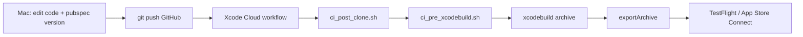
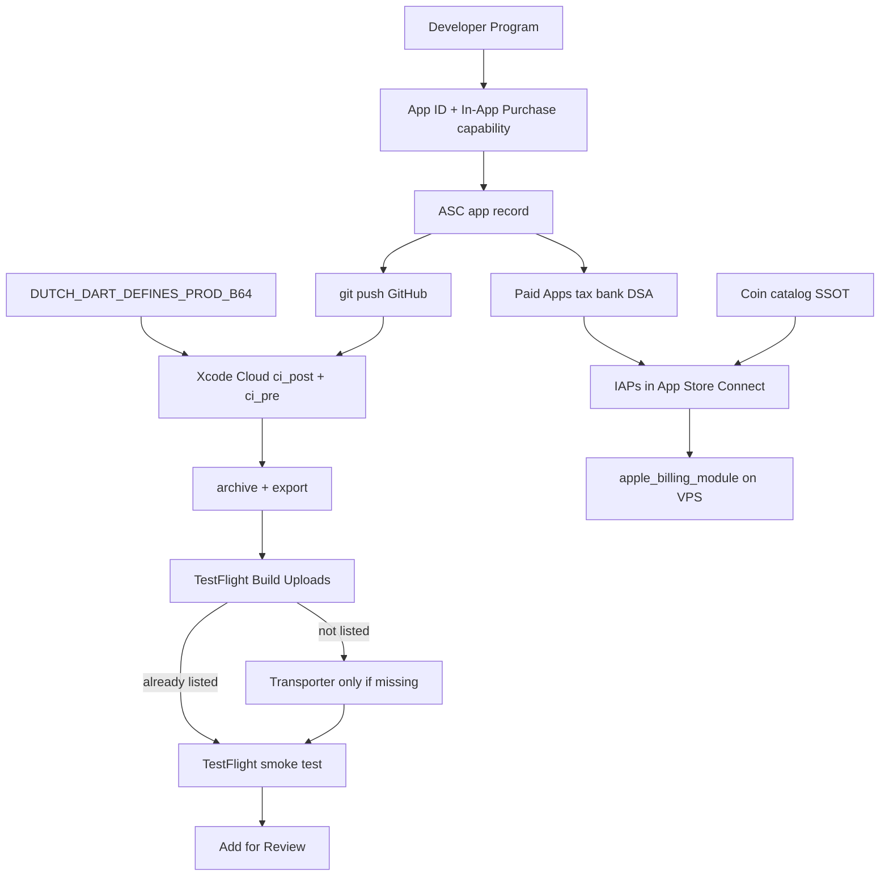

# iOS App Store release — end-to-end guide (Dutch Card Game)

Full path from Apple Developer enrollment through **production IPA**, **TestFlight**, **in-app purchases** (catalog SSOT), and App Store submission.

**Related docs (this folder):**

| Doc | Purpose |
|-----|---------|
| [IOS_RELEASE_CHECKLIST.md](../flutter_base_05/IOS_RELEASE_CHECKLIST.md) | Short operational checklist |
| [IOS_IN_APP_PURCHASES_SETUP.md](IOS_IN_APP_PURCHASES_SETUP.md) | Coin packs + Premium in App Store Connect |
| [COIN_CATALOG_SSOT.md](COIN_CATALOG_SSOT.md) | Product IDs shared with Android/backend |
| [README.md](README.md) | Xcode 15.2 SDK pins |

**Project:** `flutter_base_05`  
**Reference build:** version **2.0.20**, build **20020** (May 2026)

---

## Table of contents

1. [Identifiers](#1-identifiers--what-is-what)
2. [Prerequisites](#2-prerequisites)
3. [Apple Developer Program](#3-apple-developer-program)
4. [Register App ID](#4-register-the-app-id-bundle-id)
5. [App Store Connect — app record](#5-app-store-connect--create-the-app)
6. [Business — Paid Apps, tax, bank, DSA](#6-business--paid-apps-tax-bank-dsa)
7. [Coin catalog SSOT](#7-coin-catalog-ssot-product-ids)
8. [Repo and Xcode](#8-repo-and-xcode-configuration)
9. [Xcode signing](#9-xcode-signing-one-time)
10. [Build the IPA — local vs GitHub / Xcode Cloud](#10-build-the-ipa--local-vs-github--xcode-cloud)
11. [Upload](#11-upload-to-app-store-connect)
12. [TestFlight and review](#12-after-upload--testflight-and-review)
13. [In-app purchases](#13-in-app-purchases)
14. [Android vs iOS](#14-android-vs-ios-release-same-repo)
15. [What automation exists in the repo](#15-what-automation-exists-in-the-repo)
16. [Troubleshooting and issues we hit](#16-troubleshooting-and-issues-we-hit)
17. [Official Apple links](#17-official-apple-references)
18. [Process timeline](#18-process-timeline)

---

## 1. Identifiers — what is what

| Name | Dutch value | Used for |
|------|-------------|----------|
| **Dart package** (`pubspec.yaml`) | `dutch` | Imports only |
| **Bundle ID** | `com.reignofplay.dutch` | Signing, Firebase, ASC |
| **SKU** | `dutch-card-game` | Internal ASC only |
| **Team ID** | `D6J4Y6ZQGV` | Xcode `DEVELOPMENT_TEAM` |
| **Apple ID** (listing) | `6772967073` | `https://apps.apple.com/app/id6772967073` |
| **Developer ID** (UUID) | membership UUID | Account only — **not** store URL |

**Rule:** Bundle ID ≠ Apple ID ≠ Team ID.  
`APP_STORE_URL=https://apps.apple.com/app/id6772967073` in `.env.dart.defines.prod`.

---

## 2. Prerequisites

- Mac + **Xcode 15.2** (see [README.md](README.md) for dependency pins)
- **Flutter** + CocoaPods (`flutter doctor`)
- **Apple Developer Program** (paid)
- Local env (not in git): `.env.prod`, `.env.dart.defines.prod`

---

## 3. Apple Developer Program

1. [Enroll](https://developer.apple.com/programs/)
2. [App Store Connect](https://appstoreconnect.apple.com/) + [Developer account](https://developer.apple.com/account)
3. Note **Team ID** `D6J4Y6ZQGV`
4. **Xcode → Settings → Accounts** → Apple ID

---

## 4. Register the App ID (bundle ID)

[Identifiers](https://developer.apple.com/account/resources/identifiers/list) → **+** → App → Explicit **`com.reignofplay.dutch`**.

Enable **In-App Purchase** on this App ID (required for coin packs + Premium). Do **not** add a `Runner.entitlements` entry for `com.apple.developer.in-app-payments` — that key is **Apple Pay**, not StoreKit, and breaks Xcode Cloud export (see [§16.4](#164-export-archive-exit-code-70-after-archive-succeeds)).

[Register an App ID](https://developer.apple.com/help/account/manage-identifiers/register-an-app-id/)

---

## 5. App Store Connect — create the app

| Field | Value |
|-------|--------|
| Name | Dutch Card Game |
| Bundle ID | `com.reignofplay.dutch` |
| SKU | `dutch-card-game` |
| User Access | Full Access (typical) |

**General Information:** Apple ID **6772967073**.

---

## 6. Business — Paid Apps, tax, bank, DSA

Required before **Monetization → In-App Purchases** works.

### 6.1 Order of operations

1. **Edit Legal Entity** (if prompted)
2. **DSA trader** declaration — [EU trader requirements](https://developer.apple.com/help/app-store-connect/manage-compliance-information/manage-european-union-digital-services-act-trader-requirements/)  
   - Selling IAP + ads in EU → usually declare **trader** (contact info shown on EU store page)  
   - Not “trader” only if you truly qualify and accept EU consumer-law notice
3. **Paid Apps Agreement** — [Sign agreements](https://developer.apple.com/help/app-store-connect/manage-agreements/sign-and-update-agreements/) → **Business** → **View and Agree to Terms**
4. **Tax** — W-8BEN + Certificate of Foreign Status (Malta individual)
5. **Bank** — e.g. BOV Malta; status **Processing** ~24h

### 6.2 Status targets

| Item | Target |
|------|--------|
| Paid Apps Agreement | **Active** (not Processing / Pending User Info) |
| Tax forms | **Active** |
| Bank | Active (not Processing) |
| DSA compliance | Approved (not In Review) |

Until **Paid Apps = Active**, IAP creation in Connect may be blocked.

---

## 7. Coin catalog SSOT (product IDs)

**Do not invent IDs in App Store Connect** — copy from:

[`flutter_base_05/assets/dutch_coin_catalog.json`](../../flutter_base_05/assets/dutch_coin_catalog.json)

Full reference: [COIN_CATALOG_SSOT.md](COIN_CATALOG_SSOT.md)

### Consumables (App Store type: Consumable)

```
coins_100, coins_300, coin_500, coins_700, coins_1500, coins_3500
```

### Subscriptions (one group, two products)

Apple subscription **Product IDs cannot contain hyphens**. Use the SSOT values under `premium_subscription.apple_product_ids`:

```
premium_auto_renew_monthly   (1 month)
premium_auto_renew_yearly    (1 year)
```

Play also uses parent SKU `premium_subscription` (Android only).

### Code / backend

| Layer | Uses catalog? |
|-------|----------------|
| Flutter `CoinCatalog` | Yes — bundled JSON |
| Python `utils/coin_catalog.py` | Yes — same file path |
| Play verify | Yes — unknown `product_id` → 400 |
| iOS StoreKit in app | **Wired** — App Store coin packs + Premium via `in_app_purchase` |
| Apple server verify | **Implemented** — `apple_billing_module` (`/userauth/apple/*`) |

Setup in Connect: [IOS_IN_APP_PURCHASES_SETUP.md](IOS_IN_APP_PURCHASES_SETUP.md)

---

## 8. Repo and Xcode configuration

| Item | Location |
|------|----------|
| Bundle ID | `ios/Runner.xcodeproj` → `com.reignofplay.dutch` |
| Team + signing | `DEVELOPMENT_TEAM = D6J4Y6ZQGV`, automatic signing |
| Display name | `Info.plist` → Dutch Card Game |
| Firebase | `GoogleService-Info.plist` |
| AdMob app ID (native) | `ios/Flutter/Debug.xcconfig` / `Release.xcconfig` → `GAD_APPLICATION_ID` |
| AdMob unit IDs (Dart) | `.env.dart.defines.prod` + `playbooks/frontend/admob_test_ids.py` (iOS test override on Cloud) |
| Coin catalog | `assets/dutch_coin_catalog.json` |
| Local IPA script | `playbooks/frontend/build_ipa.sh` |
| Xcode Cloud CI | `ios/ci_scripts/ci_post_clone.sh`, `ci_pre_xcodebuild.sh` |
| Env materialize (Cloud) | `playbooks/frontend/xcode_cloud_materialize_env.sh` |

Open: `flutter_base_05/ios/Runner.xcworkspace`

**Gitignored locally (not on GitHub):** `.env.prod`, `.env.dart.defines.prod`, `secrets/apple-iap-key.p8`. Xcode Cloud recreates dart-defines from workflow secrets (below).

---

## 9. Xcode signing (one-time)

1. **Settings → Accounts** → Apple ID (team D6J4Y6ZQGV)
2. Runner → **Signing & Capabilities** → automatic signing, no red errors

CLI `flutter build ipa` failed with *No Accounts* until step 1 was done.

---

## 10. Build the IPA — local vs GitHub / Xcode Cloud

Two supported paths. **Production TestFlight builds use GitHub + Xcode Cloud** in practice: push to the tracked branch, Cloud archives, exports, and (when configured) uploads to App Store Connect.

### 10.1 GitHub + Xcode Cloud (recommended)

**Flow:** commit + push to GitHub → Xcode Cloud workflow on the linked repo → Apple-managed Mac runs CI scripts → archive → export → TestFlight.



| Step | Script / action | What it does |
|------|-----------------|--------------|
| 1 | **Push to GitHub** | Triggers Xcode Cloud (workflow linked in App Store Connect). `.env*` files are **not** in the repo. |
| 2 | `ci_post_clone.sh` | Install Flutter (if needed), `flutter pub get`, `precache --ios`, `pod install` under `ios/`. |
| 3 | `xcode_cloud_materialize_env.sh` | Decode workflow secret **`DUTCH_DART_DEFINES_PROD_B64`** → repo-root `.env.dart.defines.prod`. Optional **`DUTCH_ENV_PROD_B64`** → `.env.prod`. |
| 4 | `ci_pre_xcodebuild.sh` | Sync version from `pubspec.yaml`, release deck + `LOGGING_SWITCH` off, **AdMob iOS test IDs** (`DART_DEFINES_PLATFORM=ios`, `ios_admob_gad_app_id.sh`), `env_for_flutter_dart_defines.py` → JSON, validate `API_URL`, `flutter build ios --config-only --dart-define-from-file`. |
| 5 | Xcode Cloud | `xcodebuild archive` then `exportArchive` (app-store / ad-hoc / development). |
| 6 | Distribution | If workflow includes **Distribute to App Store Connect**, build appears under **TestFlight → Build Uploads** — no Transporter needed. |

**One-time: Xcode Cloud workflow secrets** (App Store Connect → **Xcode Cloud** → workflow → **Environment** — **not** GitHub Secrets):

| Secret | Required | Contents |
|--------|----------|----------|
| `DUTCH_DART_DEFINES_PROD_B64` | **Yes** | Base64 of repo-root `.env.dart.defines.prod` (`API_URL`, `WS_URL`, Firebase client keys, `APP_STORE_URL`, etc.) |
| `DUTCH_ENV_PROD_B64` | No | Base64 of `.env.prod` (version bump; can also use committed `pubspec.yaml`) |

Refresh after changing local dart-defines:

```bash
cd /path/to/app_dev
base64 -i .env.dart.defines.prod | pbcopy
# Paste into App Store Connect → Xcode Cloud → Environment → DUTCH_DART_DEFINES_PROD_B64
```

**Before each Cloud build:** bump `flutter_base_05/pubspec.yaml` `version:` (and optionally run `playbooks/frontend/sync_pubspec_version.sh` locally), commit, push.

**Verify in pre-xcodebuild logs:**

- `API_URL validated: https://dutch.reignofplay.com` (not `localhost` / `10.0.2.2`)
- `note: AdMob test ids applied for ios` (during App Review / TestFlight; see [§16.3](#163-admob-test-ids-on-ios-vs-android))
- `Generated.xcconfig includes API_URL`

**Apple IAP server keys** (`APPLE_IAP_*`, `.p8`) are **not** in dart-defines — they deploy to the VPS via Ansible (`playbooks/rop01/08_deploy_docker_compose.yml`), not Xcode Cloud.

See also [IOS_RELEASE_CHECKLIST.md](../flutter_base_05/IOS_RELEASE_CHECKLIST.md) (Xcode Cloud section) and `playbooks/frontend/00_documentation.md` (§ Xcode Cloud).

### 10.2 Local `build_ipa.sh` (optional)

On a Mac with Xcode and signing configured:

```bash
./playbooks/frontend/build_ipa.sh
```

- Version from `.env.prod` / prompt; dart-defines from `.env.dart.defines.prod`
- Same AdMob iOS platform override as Cloud (`DART_DEFINES_PLATFORM=ios`)
- Output: `flutter_base_05/build/ios/ipa/*.ipa`
- Upload manually via Transporter if not using Cloud distribution

CLI `flutter build ipa` failed with *No Accounts* until Xcode → **Settings → Accounts** had the Apple ID (see [§9](#9-xcode-signing-one-time)).

---

## 11. Upload to App Store Connect

### Check TestFlight first (required)

**Before** using Transporter or Organizer, open App Store Connect → **TestFlight** → **Build Uploads**.

| What you see | What to do |
|--------------|------------|
| Your build number already listed (**Complete** or **Processing**) | **Do not upload again.** Xcode Cloud (or an earlier Transporter run) already delivered it. Use that build for testing or **Distribution**. |
| Build number **not** listed | Upload once via Transporter or Organizer (see below). |

Duplicate uploads fail with `ENTITY_ERROR.ATTRIBUTE.INVALID.DUPLICATE` / `previousBundleVersion` — e.g. *“bundle version must be higher than the previously uploaded version: ‘20068’”* while you are uploading **20068** again.

**Xcode Cloud:** If the workflow includes **Distribute to App Store Connect** / TestFlight, builds appear in **Build Uploads** automatically. Skip Transporter for those builds.

### Upload manually (only when TestFlight does not already have the build)

- [Transporter](https://apps.apple.com/us/app/transporter/id1450874784) — drag IPA  
- Or **Organizer → Distribute App → App Store Connect**

Wait for **Processing** in TestFlight.

---

## 12. After upload — TestFlight and review

- Internal TestFlight → smoke-test (use the build already in **Build Uploads** if present)
- **Distribution → 1.0**: screenshots, privacy, description, attach build → **Add for Review**

---

## 13. In-app purchases

1. **App Store Connect** — follow [IOS_IN_APP_PURCHASES_SETUP.md](IOS_IN_APP_PURCHASES_SETUP.md): six **consumables** + subscription group (`premium_auto_renew_monthly` / `premium_auto_renew_yearly`) from [§7](#7-coin-catalog-ssot-product-ids).
2. **App ID** — **In-App Purchase** enabled on `com.reignofplay.dutch` in Developer Portal (no Apple Pay entitlements file).
3. **Flutter** — StoreKit via `in_app_purchase` (coins + Premium); no Stripe redirect on iOS.
4. **Backend** — `apple_billing_module` on Flask (`/userauth/apple/*`); secrets in `.env.prod` + VPS deploy.

Server setup: [APPLE_APP_STORE_BILLING.md](../python_base_04/APPLE_APP_STORE_BILLING.md)

**App Review:** Attach IAPs to the app version; note that digital coins and Premium are sold only via Apple IAP on iOS (rewarded ads optional).

---

## 14. Android vs iOS release (same repo)

| | Android | iOS |
|--|---------|-----|
| Build | `build_apk.sh` / `build_appbundle.sh` | **GitHub push → Xcode Cloud** (`ci_post_clone` + `ci_pre_xcodebuild`) or local `build_ipa.sh` |
| Store IDs | Package = bundle ID | Bundle ID + Apple ID `6772967073` |
| IAP SSOT | `dutch_coin_catalog.json` | Same file |
| IAP live | Play + server verify | App Store IAP + `apple_billing_module` server verify |
| Upload | VPS optional | Transporter |

[GOOGLE_PLAY_BILLING.md](../python_base_04/GOOGLE_PLAY_BILLING.md)

---

## 15. What automation exists in the repo

| In repo (GitHub) | Manual / secrets outside git |
|------------------|------------------------------|
| `ci_post_clone.sh`, `ci_pre_xcodebuild.sh` | Xcode Cloud workflow + Apple signing |
| `xcode_cloud_materialize_env.sh` | **`DUTCH_DART_DEFINES_PROD_B64`** in App Store Connect (not GitHub) |
| `build_ipa.sh`, `admob_test_ids.py`, `ios_admob_gad_app_id.sh` | Refresh base64 secret when dart-defines change |
| `env_for_flutter_dart_defines.py` | Local `.env.dart.defines.prod` authoring |
| `dutch_coin_catalog.json` + loaders | Create IAPs in Connect (match JSON) |
| `apple_billing_module` + deploy playbook | `APPLE_IAP_*` + `secrets/apple-iap-key.p8` on VPS |
| `APP_STORE_URL` in dart-defines template | Business agreements, tax, bank, DSA |
| `IOS_*` docs in `Documentation/Android_V_ios/` | TestFlight on device, metadata, **Add for Review** |

---

## 16. Troubleshooting and issues we hit

### 16.1 App Store rejection — “billing not enabled” / Stripe message

**Symptom:** Review showed *“App Store billing is not enabled in this build. Use the web app (Stripe)…”* on the coin screen.

**Cause:** iOS had Android Play + web Stripe only; StoreKit IAP was not wired after RevenueCat removal.

**Fix:** Flutter native store bootstrap for iOS, `apple_billing_module` server verify, remove Stripe stub UI. Resubmit with IAPs attached to the version and App Review notes explaining coins/Premium via Apple IAP only.

### 16.2 No `.env` files on GitHub — Cloud login / API failures

**Symptom:** TestFlight build archives but app cannot reach API, or login spins forever.

**Cause:** Xcode Cloud clone has no `.env.dart.defines.prod`; missing or stale **`DUTCH_DART_DEFINES_PROD_B64`**.

**Fix:**

1. Edit local `.env.dart.defines.prod` (`API_URL`, `WS_URL`, etc.).
2. `base64 -i .env.dart.defines.prod | pbcopy` → update secret in **App Store Connect → Xcode Cloud → Environment** (not GitHub repo settings).
3. Re-run workflow; confirm pre-xcodebuild log: `API_URL validated: https://dutch.reignofplay.com`.

### 16.3 AdMob test IDs on iOS vs Android

**Symptom:** Ads fail to load on iOS TestFlight, or wrong creatives during review.

**Cause:** iOS `GAD_APPLICATION_ID` lives in `ios/Flutter/*.xcconfig` (not Gradle). Android demo unit IDs (`ca-app-pub-3940256099942544/6300978111`, app id `~3347511713`) do **not** work on iOS — iOS uses different [Google demo IDs](https://developers.google.com/admob/ios/test-ads) (e.g. banner `/2934735716`, app id `~1458002511`).

**Fix (in repo):** `ci_pre_xcodebuild.sh` sets `DART_DEFINES_PLATFORM=ios` and applies `playbooks/frontend/admob_test_ids.py`. `ios_admob_gad_app_id.sh` syncs `GAD_APPLICATION_ID` from `ADMOB_IOS_USE_TEST_IDS` in dart-defines (default test). Optional in `.env.dart.defines.prod`: `ADMOB_IOS_USE_TEST_IDS=1` (set `0` when shipping real Dutch ad units).

Re-base64 the workflow secret only when non-AdMob keys in dart-defines change; test AdMob IDs are applied by committed scripts even if the secret still lists production `ADMOBS_*`.

### 16.4 Export archive exit code 70 (after archive succeeds)

**Symptom:** Xcode Cloud: **Run xcodebuild archive** ✅, then all three **Export archive** steps fail with **exit code 70** (ad-hoc, development, app-store).

**Cause (our case):** `Runner.entitlements` contained `com.apple.developer.in-app-payments` with an empty array — that is **Apple Pay**, not StoreKit IAP. Xcode Cloud managed provisioning profiles did not include it → export signing failed.

**Fix:**

1. Remove bogus `Runner.entitlements` (StoreKit IAP does not need an entitlements plist entry).
2. Enable **In-App Purchase** on the App ID in [Developer Portal](https://developer.apple.com/account/resources/identifiers/list) only.
3. Commit, push, re-run Cloud workflow.

**If still failing:** Download build artifact **`app-store-export-archive-logs/xcodebuild-export-archive.log`** and search `error: exportArchive`. Certificate issues: revoke stale **Xcode Cloud managed** distribution certificates in Developer Portal, then rebuild.

### 16.5 General troubleshooting

| Symptom | Fix |
|---------|-----|
| IAP **+** disabled in Connect | Wait for Paid Apps **Active** + tax + bank |
| No Accounts on `flutter build ipa` | Xcode → Settings → Accounts |
| CocoaPods UTF-8 | `LANG=en_US.UTF-8` in `build_ipa.sh` / Cloud scripts |
| Duplicate build / `previousBundleVersion` | **TestFlight → Build Uploads** first — Cloud may have uploaded already; bump build number for new bits |
| Share link empty | `APP_STORE_URL=https://apps.apple.com/app/id6772967073` in dart-defines + refresh secret |
| SDK compile errors | [README.md](README.md) pins |
| Unknown product on Play verify | Add ID to `in_app_products` in catalog |
| `Missing DUTCH_DART_DEFINES_PROD_B64` | Add workflow secret in App Store Connect |

---

## 17. Official Apple references

- [Sign agreements (Paid Apps)](https://developer.apple.com/help/app-store-connect/manage-agreements/sign-and-update-agreements/)
- [DSA trader requirements](https://developer.apple.com/help/app-store-connect/manage-compliance-information/manage-european-union-digital-services-act-trader-requirements/)
- [Tax information](https://developer.apple.com/help/app-store-connect/manage-tax-information/provide-tax-information/)
- [Banking](https://developer.apple.com/help/app-store-connect/manage-banking-information/enter-banking-information/)
- [Configure IAP overview](https://developer.apple.com/help/app-store-connect/configure-in-app-purchase-settings/overview-for-configuring-in-app-purchases/)
- [Create consumable IAP](https://developer.apple.com/help/app-store-connect/manage-in-app-purchases/create-consumable-or-non-consumable-in-app-purchases/)
- [Auto-renewable subscriptions](https://developer.apple.com/help/app-store-connect/manage-subscriptions/offer-auto-renewable-subscriptions/)
- [Preparing for distribution](https://developer.apple.com/documentation/xcode/preparing-your-app-for-distribution)
- [Distributing / TestFlight](https://developer.apple.com/documentation/xcode/distributing-your-app-for-beta-testing-and-releases)

---

## 18. Process timeline



---

*Last updated: 2026-06-22 — GitHub + Xcode Cloud pipeline, env secrets, AdMob iOS test IDs, export exit 70 / entitlements fix, StoreKit IAP + Apple server verify live.*
