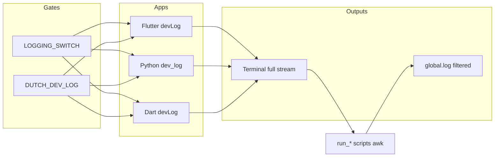

# Dutch app dev — logging, mirroring, and launch scripts

This document describes how **developer-facing logs** work across **Flutter**, **Python (Flask)**, and **Dart (WebSocket server)**, how they can be **mirrored into a single repo file** (`global.log`), how that relates to **shell launchers** and **VS Code**, and how **switches** interact with **production builds**.

For day-to-day agent guidance on where to look when debugging locally, see [`.cursor/rules/agent-debug-logs.mdc`](../../.cursor/rules/agent-debug-logs.mdc).

---

## 1. Concepts at a glance

| Concept | Role |
|--------|------|
| **`devLog` / `dev_log`** | Small, intentional **dev-only** messages with a stable **`[dev]`** prefix so scripts can filter them. |
| **`DUTCH_DEV_LOG`** | **Environment / compile-time gate**: when truthy, `devLog`/`dev_log` actually print; otherwise they are no-ops. |
| **`LOGGING_SWITCH`** | **Per-entrypoint compile-time (or file-level) toggle** around *whether to call* `devLog`/`dev_log` at all. Independent of `DUTCH_DEV_LOG`. |
| **`global.log`** | **Optional merged file** at the **repo root** (`app_dev/global.log`). Only **filtered** dev lines are appended; full process output stays on the **terminal**. |
| **`run_*_to_global_log.sh`** | Wrappers that run a stack process and **tee-filter** stdout/stderr into `global.log` while printing everything to the terminal. |
| **`launch_chrome.sh` / `launch_oneplus.sh`** | **Direct** `flutter run` launchers (no `global.log` mirroring). They pass **`--dart-define=DUTCH_DEV_LOG=1`** and may pipe through **`filter_logs`** (see below). |

There is **no separate `mlog` binary** in this repository. If you use “merged log” or “mirrored log” as a mental model, that file is **`global.log`**. Tail it from the repo root, for example:

```bash
tail -f /path/to/app_dev/global.log
```

---

## 2. The `[dev]` line format (contract for filtering)

All three stacks use the same **visible prefix** so shell filters stay simple:

- **Python:** `print(f"[dev] {message}", file=sys.stderr, …)` in `dev_log`.
- **Dart WS:** `stderr.writeln('[dev] $message')`.
- **Flutter:** `debugPrint('[dev] $message')` on VM; on Web, same via `debugPrint`.

**Filtering rule (Python / Dart wrappers):** only lines whose **full line** matches **`^\[dev\]`** (after any tooling prefix on the same line — see Flutter below) are copied to `global.log` by the Python and Dart scripts.

**Flutter nuance:** `flutter run` and **Android logcat** typically prefix lines with something like `I/flutter (12345): …`. The Flutter wrapper therefore appends to `global.log` when the line **contains** `I/flutter` or `I flutter` **and** contains the substring **`[dev]`**. Consecutive **identical** matching lines are **deduplicated** to reduce duplicate taps from tooling.

---

## 3. Gate: `DUTCH_DEV_LOG`

### 3.1 Truthy values

Across stacks, “on” is consistently:

- `1`, `true`, or `yes` (case-insensitive where applicable).

### 3.2 Flutter / Dart compile-time vs runtime

| Surface | How `DUTCH_DEV_LOG` is read |
|--------|----------------------------|
| **Flutter VM** (`dev_logger_io.dart`) | `String.fromEnvironment('DUTCH_DEV_LOG')` **first**; if empty, **`Platform.environment['DUTCH_DEV_LOG']`** (useful for desktop). |
| **Flutter Web** (`dev_logger_web.dart`) | `String.fromEnvironment('DUTCH_DEV_LOG')` **first**; if not set, falls back to **`kDebugMode`**. |
| **Dart WS** (`dart_bkend_base_01/lib/utils/dev_logger.dart`) | **`Platform.environment['DUTCH_DEV_LOG']` only** (no `--dart-define` unless you inject env when launching). |

Launch scripts that care about Flutter set:

```text
--dart-define=DUTCH_DEV_LOG=1
```

Shell wrappers also export:

```bash
export DUTCH_DEV_LOG="${DUTCH_DEV_LOG:-1}"
```

so Python and Dart child processes default to **on** unless you override.

### 3.3 Python

`python_base_04/tools/dev_logger.py` reads **`os.environ["DUTCH_DEV_LOG"]`** with the same truthy set as above.

---

## 4. API entry points (where to call from code)

| Stack | Import / module | Function | Output stream |
|-------|-----------------|----------|----------------|
| Flutter | `flutter_base_05/lib/utils/dev_logger.dart` | `devLog(String)` | `debugPrint` → device / `flutter run` |
| Dart WS | `dart_bkend_base_01/lib/utils/dev_logger.dart` | `devLog(String)` | `stderr` |
| Python | `python_base_04/tools/dev_logger.py` | `dev_log(str)` | `stderr` |

**Do not** reintroduce the removed legacy singleton `Logger` in `flutter_base_05` (per project rules). Prefer `devLog` / `dev_log` for lightweight diagnostics.

---

## 5. `LOGGING_SWITCH` (coarse, per file / entrypoint)

`LOGGING_SWITCH` is a **separate** knob from `DUTCH_DEV_LOG`:

- If **`LOGGING_SWITCH` is `false`**, the entrypoint **never calls** `devLog`/`dev_log` for that guarded block — even if `DUTCH_DEV_LOG` is on.
- If **`LOGGING_SWITCH` is `true`** but **`DUTCH_DEV_LOG` is off**, the call runs but **`devLog`/`dev_log` no-op**.

**Current entrypoints (examples):**

- Flutter: `flutter_base_05/lib/main.dart` — `LOGGING_SWITCH` then `devLog('main.dart entry')`.
- Python debug: `python_base_04/app.debug.py` — `LOGGING_SWITCH` then `dev_log("app.debug.py entry")`.
- Dart WS: `dart_bkend_base_01/app.debug.dart` — `LOGGING_SWITCH` then `devLog('app.debug.dart entry')`.
- Production Flask: `python_base_04/app.py` does **not** wire `dev_log` at startup (use `app.debug.py` for local dev with CORS and dev logging).

**Release / Docker tooling** may rewrite `LOGGING_SWITCH` to **`false`** in bulk (Flutter `build_*.sh`, Python Docker build helpers, Dart Docker build scripts). That is **independent** of `DUTCH_DEV_LOG`: production builds aim for quiet sources of truth in source, not only env.

---

## 6. `global.log` mirroring (merged dev log)

### 6.1 Location

- **Path:** `<repo_root>/global.log`
- **Git:** typically untracked or local-only; safe to delete; it is recreated on append.

### 6.2 What gets written

| Writer script | Process | Terminal | Appended to `global.log` |
|---------------|---------|----------|---------------------------|
| `playbooks/frontend/run_python_app_to_global_log.sh` | `python3 app.debug.py` | Full stdout/stderr | Lines matching **`^\[dev\]`** |
| `playbooks/frontend/run_dart_ws_to_global_log.sh` | `dart run app.debug.dart` | Full stdout/stderr | Lines matching **`^\[dev\]`** |
| `playbooks/frontend/run_flutter_app_to_global_log.sh` | `flutter run …` | Full stdout/stderr | Lines matching **`I/flutter` or `I flutter`** and containing **`[dev]`**; consecutive duplicates skipped |

Implementation uses **`awk`** (not `grep` in a process substitution) so:

- Every line is printed to the terminal.
- Matching lines are **`fflush`**’d to `global.log` promptly.
- **`PIPESTATUS[0]`** preserves the **real** exit code of `python` / `dart` / `flutter` (first pipeline stage).

**Banners** (script start markers) go to **stderr only** — they do **not** pollute `global.log`.

### 6.3 What does *not* go to `global.log`

- Normal Flask access logs, tracebacks, `custom_log`, etc. — unless you explicitly format them with a leading **`[dev]`** (not standard).
- Flutter engine noise, SVG warnings, VM service URLs — **unless** they contain **`[dev]`** in the same line as the Flutter log prefix (they usually do not).

### 6.4 Multiple processes

If you run **Python**, **Dart**, and **Flutter** at the same time, all may append to the **same** `global.log`. Lines are **interleaved** by time. There is no built-in per-process header on each line; use context (`[dev]` message text) or run one stack at a time if you need isolation.

---

## 7. Launch scripts: two families

### 7.1 `run_*_to_global_log.sh` — IDE / unified tail

| Script | Purpose |
|--------|---------|
| `run_flutter_app_to_global_log.sh android <serial>` | Android device; requires `adb`, `.env.dart.defines.local`, temp JSON from `env_for_flutter_dart_defines.py`. |
| `run_flutter_app_to_global_log.sh chrome` | Web on Chrome via Flutter device `chrome`. |
| `run_python_app_to_global_log.sh` | `cd python_base_04` → `python3 app.debug.py`. |
| `run_dart_ws_to_global_log.sh` | `cd dart_bkend_base_01` → `dart run app.debug.dart`. |

These are the scripts wired in **`.vscode/launch.json`** (`node-terminal` configurations) so **Cursor / VS Code** can start a process with **mirroring** to `global.log`.

### 7.2 `launch_chrome.sh` / `launch_oneplus.sh` — terminal-first

- Invoke **`flutter run`** directly with **`--dart-define=DUTCH_DEV_LOG=1`** and **`--dart-define-from-file=…`**.
- **`filter_logs`**: in `launch_chrome.sh` this is currently a **pass-through** (`while read; do printf`). `launch_oneplus.sh` pipes **`sed`** then **`filter_logs`** to normalize some noisy date-prefixed lines before display. **Neither path writes to `global.log`** unless you add that yourself.

Both scripts **source** `playbooks/frontend/agent_server_log_helpers.sh` for **`echo_and_server_log`** and **`ensure_server_log_dir_and_maybe_rotate`**. That helper is intended for **launcher / agent** diagnostics to a **server log dir** (separate from `global.log`). If the file is missing in a clone, those lines will fail at `source` time until the helper is restored.

---

## 8. VS Code / Cursor (`launch.json`)

Configurations under **`.vscode/launch.json`** run **`/bin/bash`** on:

- `playbooks/frontend/run_flutter_app_to_global_log.sh` (Chrome or a **fixed** Android serial per configuration).
- `playbooks/frontend/run_dart_ws_to_global_log.sh`
- `playbooks/frontend/run_python_app_to_global_log.sh`

**Compound:** “Dart WS + Python Flask” starts both; **`stopAll`** stops both.

**Note:** Android serials in `launch.json` are **machine-specific**; adjust for your `adb devices` output.

---

## 9. Production and CI vs dev logging

| Mechanism | Dev | Production / release builds |
|-----------|-----|-------------------------------|
| `DUTCH_DEV_LOG` | Set by scripts / env | Usually **unset** or `0` |
| `devLog` / `dev_log` | Emits `[dev] …` | No-op when gate off |
| `LOGGING_SWITCH` | Often `true` in debug entrypoints | Build scripts may force **`false`** across many files |
| `global.log` | Optional local merge | Not used on servers by default |

Python **`custom_log`** (and similar) is the broader application logging path and is **not** the same subsystem as **`dev_log`**; it is governed by module-level switches and server configuration, not by `DUTCH_DEV_LOG`.

---

## 10. Troubleshooting

| Symptom | Things to check |
|---------|------------------|
| Nothing in `global.log` from Flutter | `DUTCH_DEV_LOG` compile flag (`--dart-define`), `LOGGING_SWITCH`, and that you use **`run_flutter_app_to_global_log.sh`** (not plain `launch_oneplus.sh` alone). |
| Nothing from Python/Dart | `export DUTCH_DEV_LOG=1`; messages must start the **visible** line with **`[dev]`** (stderr for both). |
| `global.log` empty but terminal shows `[dev]` | Confirm you launched via the **`run_*_to_global_log.sh`** wrapper, not a raw `flutter run`. |
| Flutter Web: no `devLog` | Without `--dart-define`, Web falls back to **`kDebugMode`** only — use launch scripts or add the define. |
| Duplicate lines in `global.log` | Multiple terminals writing the same stack; or old content — truncate `global.log` before a session. Flutter script already dedupes **consecutive** identical lines. |

---

## 11. File index (quick navigation)

| Path | Notes |
|------|------|
| `flutter_base_05/lib/utils/dev_logger.dart` | Conditional export to IO vs Web impl. |
| `flutter_base_05/lib/utils/dev_logger_io.dart` | VM: define + `Platform.environment`. |
| `flutter_base_05/lib/utils/dev_logger_web.dart` | Web: define + `kDebugMode`. |
| `dart_bkend_base_01/lib/utils/dev_logger.dart` | Env-only gate. |
| `python_base_04/tools/dev_logger.py` | Env gate, stderr `[dev]`. |
| `playbooks/frontend/run_flutter_app_to_global_log.sh` | Flutter → terminal + filtered `global.log`. |
| `playbooks/frontend/run_python_app_to_global_log.sh` | Flask debug → terminal + `[dev]` → `global.log`. |
| `playbooks/frontend/run_dart_ws_to_global_log.sh` | Dart WS → terminal + `[dev]` → `global.log`. |
| `playbooks/frontend/launch_chrome.sh` | Chrome `flutter run`, `filter_logs`, no `global.log`. |
| `playbooks/frontend/launch_oneplus.sh` | Android `flutter run`, `sed` + `filter_logs`, no `global.log`. |
| `.vscode/launch.json` | Uses `run_*_to_global_log.sh`. |
| `.cursor/rules/agent-debug-logs.mdc` | Prefer terminals / app errors for local debug. |

---

## 12. Optional diagram (data flow)



This ends the logging system reference for the Dutch `app_dev` workspace.
