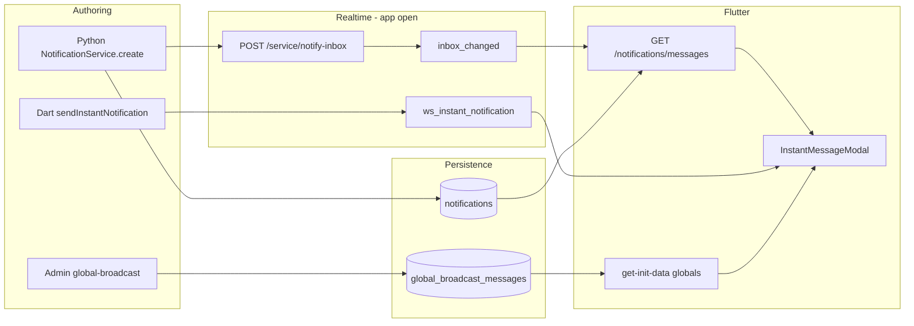
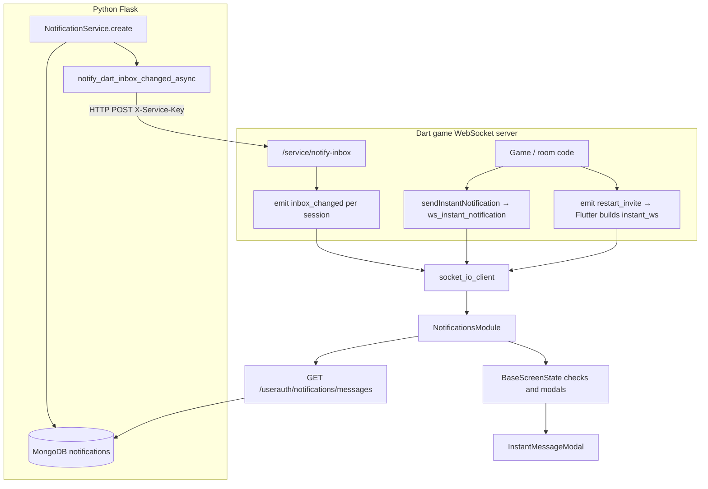

# Notification system — end-to-end flow (current)

This document describes the **notification and inbox system as implemented today**: Python persistence and REST, Dart WebSocket relay, Flutter fetch/modals/hooks, types (`type` / `subtype`), and optional modal chrome (URL background). It is the single reference for how to create messages and how the client shows them.

**Index:** [README.md](./README.md) (quick “how do we push?” answer).

**Related:** global rank-targeted broadcasts are attached to **`GET /userauth/dutch/get-init-data`** (JWT). **`GET /userauth/dutch/get-user-stats`** is a **deprecated alias** for the same handler.

> ## ⚠️ IMPORTANT — you must sync global broadcasts after updating the seed JSON
>
> The repo file **`playbooks/00_local/files/global_broadcast_messages.json`** is only the **source of truth in git**. The running app loads campaigns from the MongoDB collection **`global_broadcast_messages`**, not from that file directly.
>
> **Whenever you change** the seed JSON (copy, `target_version`, `title`, `body`, `data`, `is_active`, `_id`, or add/remove rows), you **must** run the sync playbook or your changes **will not apply** — Flask does not need a restart, but Mongo must be updated.
>
> ```bash
> # Local (from repo root)
> ansible-playbook -i localhost, -c local playbooks/00_local/sync_global_broadcast_messages.yml
>
> # Production rop01 (from repo root, after source .env.prod)
> set -a && source .env.prod && set +a
> ansible-playbook -i playbooks/rop01/inventory.ini playbooks/rop01/sync_global_broadcast_messages.yml -e vm_name=rop01
> ```
>
> **Typical failure:** `target_version` is lowered in JSON (e.g. to `2.0.19`) but Mongo still has `2.0.21` → users on `2.0.20` keep seeing the “Update available” modal until sync runs. Verify with `mongosh` or `GET /userauth/dutch/get-init-data` and check `data.target_version` on `global_app_update_v1`.

---

## 0. How notifications reach users

### 0.1 Terminology: “system notifications” in this repo

| Meaning | Supported today? |
|---------|------------------|
| **In-app inbox + modals** — messages in Mongo, REST API, `InstantMessageModal`, notifications screen | **Yes** (this document) |
| **Real-time while the app is open** — WebSocket events from the Dart game server | **Yes** (`inbox_changed`, `ws_instant_notification`, `restart_invite`) |
| **OS / device push** — iOS notification center, Android tray, FCM/APNs when app is backgrounded or killed | **No** — not wired; see [§8](#8-os-device-push-not-implemented) |

When product or ops say “push a notification,” they usually mean **create an inbox row in Python** (and optionally rely on WebSocket so an **online** user sees a modal immediately). That is **not** the same as Apple/Google push.

### 0.2 Delivery channels (what actually happens)



| Channel | Trigger | User must be | Effect |
|---------|---------|--------------|--------|
| **A. Mongo + REST** | `NotificationService.create()` (or module helpers e.g. `dutch_notifications.create_notification`) | Logged in; any screen extending `BaseScreen` runs inbox check | Row in `notifications`; list on **Notifications** screen; `type: instant` unread → app-wide modal when fetched |
| **B. `inbox_changed` WebSocket** | After successful insert, `notify_dart_inbox_changed_async(user_id)` → Dart `POST /service/notify-inbox` → `notifyInboxChangedForUser` | Connected to **Dart game WebSocket** with that `user_id` | Clears 15s fetch throttle; `GET /userauth/notifications/messages` + modal queue (same as A, faster for online users) |
| **C. `ws_instant_notification`** | Dart `sendInstantNotification(sessionId, payload)` | That **session** on WS | Ephemeral modal (`instant_ws`); **not** inserted into `notifications` by this path alone |
| **D. `restart_invite`** | Game layer rematch flow | WS session | Flutter synthesizes `instant_ws` (Accept/Decline) |
| **E. Global broadcast** | Seed sync or `POST …/admin/global-broadcast` | Logged in; **`get-init-data`** (or `NotificationsModule.fetchAndApplyGlobalBroadcasts`) | `instant` globals merged **before** API list for modals. **Welcome-style:** unread only; dismiss → `global-mark-read`. **App-update (`data.target_version`):** modal while installed version &lt; target; read ignored; dismiss does **not** mark read (see §11.5). |
| **F. Frontend-only** | `InstantMessageModal.showFrontendOnlyInstant` | N/A | Modal only; nothing stored |

**Offline / app killed:** channels B–D do nothing until the user opens the app again. Channel **A** (and **E** on next stats fetch) still apply — messages wait in Mongo (or global collections) until REST/stats runs.

There is **no periodic poll timer** on `BaseScreen` for inbox checks. Fetches run on **first frame after screen mount**, on **`inbox_changed`**, when **pending WS instants** are queued, and when the **15s** `lastFetchedAt` throttle allows a refetch during another `_checkAndShowInstantMessages()` call (e.g. navigating to a new screen).

### 0.3 Step-by-step: push an inbox notification to one user (backend)

1. Obtain `NotificationService` from `notification_module` (or use a module helper).
2. Call **`create(user_id, source, type, title, body, …)`** with `type` in `instant` | `admin` | `advert` (see [§2.2](#22-predefined-type-values-enforced)).
3. Python inserts into Mongo **`notifications`** and returns document id.
4. A background thread **`notify_dart_inbox_changed_async(user_id)`** POSTs to Dart (requires `Config.DART_BACKEND_NOTIFY_URL` and `DART_BACKEND_SERVICE_KEY`).
5. If the user has one or more WS sessions, Dart emits **`inbox_changed`** to each; Flutter refetches and may show **`InstantMessageModal`** for unread `instant` rows.
6. If the user is offline, step 5 is skipped; they see the message on next app open when any `BaseScreen` runs `_checkAndShowInstantMessages()` (or when they open the notifications list).

**Minimal Python example:**

```python
svc = app_manager.module_manager.get_module("notification_module").get_notification_service()
svc.create(
    user_id=target_user_id,
    source="my_module",
    type="instant",
    title="Hello",
    body="You have a new message.",
    subtype="my_module_announcement",
)
```

**Config required for realtime (B):** `DART_BACKEND_NOTIFY_URL`, `DART_BACKEND_SERVICE_KEY` on Python; Dart `Config.pythonServiceKey` must match.

### 0.4 Step-by-step: ephemeral popup to a connected game session

Use when the payload does not need to live in the inbox (or you already created a DB row separately):

1. Dart game code calls **`WebSocketServer.sendInstantNotification(sessionId, payload)`**.
2. Payload should include at least `title`, `body`; optional `data`, `responses`, `id`, `subtype`.
3. Flutter `WSEventHandler.handleWsInstantNotification` → `NotificationsModule.addPendingWsInstant` → modal on next inbox check.

### 0.5 Step-by-step: rank-wide “system” announcement

1. **Author** via admin JWT **`POST /userauth/notifications/admin/global-broadcast`**, or edit **`playbooks/00_local/files/global_broadcast_messages.json`** and **⚠️ run `sync_global_broadcast_messages.yml`** (mandatory — see [§11.0](#110-seed-json-vs-mongo--sync-is-mandatory)).
2. One document per campaign in **`global_broadcast_messages`**; no per-user row in `notifications`.
3. Each eligible user receives rows on **`GET /userauth/dutch/get-init-data`** → `global_broadcast_messages` → **`NotificationsModule.applyGlobalBroadcastsFromStats`** (also called from `dutch_game_helpers.getInitData()` and on login via **`fetchAndApplyGlobalBroadcasts`**).
4. **`BaseScreen`** merges globals into the instant-modal inbox, then **`filterInstantModalMessages`** applies read rules and optional **`target_version`** (§11.5).
5. **Welcome / campaigns without `target_version`:** dismiss → **`POST /userauth/notifications/global-mark-read`** so the modal does not repeat on next launch.
6. **App update with `target_version`:** modal repeats on each app launch while outdated; dismiss does **not** call `global-mark-read` (user may still mark read from the notifications screen if exposed).

### 0.6 What is *not* a delivery path

- **Email, SMS, Telegram** — out of scope for `notification_module`.
- **FCM / APNs / `flutter_local_notifications`** — not in repo; `notifications.push` on the user document is unused on the client.
- **Python → Flutter direct** — always Mongo and/or Dart WS; Flutter talks to Python only via REST (`ConnectionsApiModule`).

---

## 1. Architecture overview



| Path | Purpose |
|------|---------|
| **DB + REST** | Authoritative inbox: insert in Mongo → client lists and marks read via JWT APIs. |
| **Python → Dart HTTP** | After each successful insert, `notify_dart_inbox_changed_async(user_id)` POSTs to Dart `POST /service/notify-inbox` so **connected** clients get WebSocket `inbox_changed` and refresh from REST without waiting for a poll. |
| **Dart `ws_instant_notification`** | Ephemeral payload to a **session** (not stored in `notifications` by this path alone). Flutter queues it as `instant_ws` and shows the same modal widget. |
| **Dart `restart_invite`** | Flutter synthesizes an `instant_ws` row (rematch invite) in `WSEventHandler.handleRestartInvite`. |

---

## 2. Python: core module and storage

### 2.1 Module and service

- **Package:** `python_base_04/core/modules/notification_module/`
- **Class:** `NotificationMain` — registers Flask blueprint, holds `NotificationService`, exposes `get_notification_service()` and `register_response_handler(source, handler)`.
- **Collection:** `notifications` (constant `NOTIFICATIONS_COLLECTION`).

### 2.2 Predefined `type` values (enforced)

Defined in `notification_service.py`. **`create()` rejects unknown types** (empty string defaults to `instant`).

| `type` | Constant | Meaning |
|--------|----------|---------|
| `instant` | `NOTIFICATION_TYPE_INSTANT` | Inbox row (or global broadcast row) that the Flutter app may show as an **app-wide modal** when rules in §6.2 pass. Globals still use `type: instant`; **`data.target_version`** switches to version-only rules (§11.5). |
| `admin` | `NOTIFICATION_TYPE_ADMIN` | Inbox row; **no** app-wide auto-modal from API polling — **list + tap-to-modal** only. |
| `advert` | `NOTIFICATION_TYPE_ADVERT` | Same as `admin` for modal behaviour: **list + tap-to-modal** only. |

There is **no** fourth predefined type for “show regardless of read.” Version-gated globals achieve that behaviour via **`data.target_version`** on the client, not via a separate Mongo `type`.

### 2.3 `subtype`, `source`, `msg_id`

| Field | Required | Role |
|-------|----------|------|
| **source** | Effectively yes for responses | Identifies which module registered `register_response_handler(source, ...)`. Use `"core"` for built-in close/delete. |
| **subtype** | No | Free-form module label (e.g. `dutch_match_invite`). Shown on Flutter **notifications list** as secondary text. **Does not** switch modal layout — same `InstantMessageModal` for all. |
| **msg_id** | No (but needed for multi-action dispatch) | Logical id; module dispatcher maps **`msg_id` + `action_identifier`** to Python handlers. Distinct from Mongo **`_id`** (returned as `id` to the client as `message_id` in POST body). |

### 2.4 `data` dict (optional)

Opaque JSON object stored and returned to the client. Used for:

- Game context: `match_id`, `room_id`, etc.
- **Modal backdrop (Flutter only):** if you want an optional image behind the dialog:
  - `modal_background_enabled` (bool, or string `"true"` / `"1"` / `"yes"`; legacy key `modal_background_image` also accepted)
  - `modal_background_url` or `background_image_url` — HTTPS URL, `CachedNetworkImage`

Default: **no** backdrop unless `modal_background_enabled` is true **and** a URL is present.

### 2.5 `responses` (optional)

List of `{"label": "...", "action_identifier": "..."}` (or `"action"` instead of `action_identifier`). Rendered as modal buttons. Client POSTs **`action_identifier` in lowercase** (`notification_routes.handle_response`).

### 2.6 After insert

On successful insert, **`notify_dart_inbox_changed_async(user_id)`** runs in a daemon thread: `POST` to `Config.DART_BACKEND_NOTIFY_URL` + `/service/notify-inbox`, JSON `{"user_id": "<id>"}`, header `X-Service-Key: Config.DART_BACKEND_SERVICE_KEY`.

---

## 3. Python: HTTP API (JWT)

| Method | Path | Body / query | Role |
|--------|------|----------------|------|
| GET | `/userauth/notifications/messages` | `limit` (≤100), `offset`, `unread_only` | List rows for current user. |
| POST | `/userauth/notifications/mark-read` | `{ "message_ids": ["..."] }` | Mark read (cap 100 ids). |
| POST | `/userauth/notifications/response` | `{ "message_id", "action_identifier" }` | Run core or module handler; on `success: true`, marks read. |
| POST | `/userauth/notifications/global-mark-read` | `{ "global_message_ids": ["glob_<hex>", ...] }` (max 50) | Upsert per-user ack in `global_broadcast_reads` (not `notifications`). |
| POST | `/userauth/notifications/admin/global-broadcast` | JSON body (admin JWT) | Insert one row into `global_broadcast_messages` (see §11). |

**Core built-in:** `source == "core"` and `action_identifier == "close"` → delete document, no module handler.

---

## 4. Python: examples by `type` and `subtype`

### 4.1 `type: instant` — match invite (`dutch_game`)

Constants in `dutch_notifications.py`:

- `DUTCH_GAME_SOURCE = "dutch_game"`
- `SUBTYPE_MATCH_INVITE = "dutch_match_invite"`
- `MSG_ID_MATCH_INVITE = "dutch_game_invite_to_match_001"`
- `MATCH_INVITE_RESPONSES` → Join / Decline → `join`, `decline`

**Create (preferred helper):**

```python
from core.modules.dutch_game import dutch_notifications

nid = dutch_notifications.create_notification(
    app_manager,
    user_id=user_id,
    subtype=dutch_notifications.SUBTYPE_MATCH_INVITE,
    title="Match invite",
    body="You're invited to a match.",
    msg_id=dutch_notifications.MSG_ID_MATCH_INVITE,
    data={"match_id": match_id, "room_id": room_id},
    responses=dutch_notifications.MATCH_INVITE_RESPONSES,
    notification_type="instant",  # default
)
```

**Register handlers** (once at Dutch init — `api_endpoints.register_notification_handlers`):

- `register_message_handlers(MSG_ID_MATCH_INVITE, {"accept": ..., "decline": ..., "join": ...})`
- `notification_module.register_response_handler("dutch_game", _dutch_dispatch)`

**Note:** Buttons use `join` / `decline`; `accept` is registered for the same `msg_id` if you add a button with `action_identifier` `accept`. All keys are matched **after** the API lowercases the client’s `action_identifier`.

### 4.2 `type: instant` — with optional modal background image

```python
notif_service.create(
    user_id=user_id,
    source="my_module",
    type="instant",
    title="Season launch",
    body="Tap below to open the hub.",
    data={
        "modal_background_enabled": True,
        "modal_background_url": "https://cdn.example.com/promo/season_2.webp",
        "deeplink": "/shop",
    },
    responses=[{"label": "Open", "action_identifier": "open_hub"}],
    subtype="season_launch",
)
```

Your module must **`register_response_handler("my_module", dispatch)`** and handle `action_identifier` `open_hub`.

### 4.3 `type: admin` — list-first, optional modal on tap

```python
notif_service.create(
    user_id=user_id,
    source="core",  # or your module if you implement handlers
    type="admin",
    title="Maintenance",
    body="Servers restart at 02:00 UTC.",
    subtype="ops_maintenance",
    responses=[{"label": "Close", "action_identifier": "close"}],  # only valid if source is "core" for close
)
```

If `source` is not `"core"`, use your module’s `action_identifier` values and register a handler. **Auto app-wide modal** does **not** run for `admin` from the API list filter (see §6).

### 4.4 `type: advert` — same client rules as `admin`

```python
notif_service.create(
    user_id=user_id,
    source="dutch_game",
    type="advert",
    title="New deck skins",
    body="Browse the shop for limited skins.",
    subtype="shop_promo_deck",
    data={"sku": "deck_gold"},
    responses=[],  # OK-only modal when opened from list
)
```

### 4.5 `source: core` — dismiss deletes row

```python
notif_service.create(
    user_id=user_id,
    source="core",
    type="admin",
    title="Tip",
    body="You can change sound in Settings.",
    responses=[{"label": "Close", "action_identifier": "close"}],
)
```

User taps Close → core deletes the document (no `register_response_handler` needed for that action).

### 4.6 Raw `NotificationService.create` (any module)

```python
notification_module = app_manager.module_manager.get_module("notification_module")
svc = notification_module.get_notification_service()
svc.create(
    user_id=target_user_id,
    source="tournaments",
    type="instant",
    title="Bracket ready",
    body="Your next match is scheduled.",
    msg_id="tournament_bracket_v1",
    subtype="bracket_ready",
    data={"bracket_id": "b42"},
    responses=[{"label": "View", "action_identifier": "view"}],
)
```

Then **`register_response_handler("tournaments", my_dispatch)`** and in `my_dispatch` branch on `doc["msg_id"]` and `action_identifier`.

### 4.7 `subtype` naming

There is **no central enum** of subtypes except Dutch helpers (`SUBTYPE_MATCH_INVITE`, …). **Convention:** `snake_case`, module-scoped prefix (e.g. `dutch_match_invite`, `shop_promo_deck`). Subtypes are for **display**, **analytics**, and **your** dispatch logic — not for Flutter modal skins.

---

## 5. Dart WebSocket server

| Event | Origin | Client expectation |
|-------|--------|--------------------|
| `inbox_changed` | `notifyInboxChangedForUser` after Python HTTP notify | Flutter should **refresh inbox** from REST (see §6). |
| `ws_instant_notification` | `WebSocketServer.sendInstantNotification(sessionId, payload)` | Payload map: e.g. `title`, `body`, `data`, `responses`, optional `id`, `subtype`. Client sets `type` to `instant_ws` and shows modal. |
| `restart_invite` | Game layer | Flutter **`handleRestartInvite`** builds a synthetic `instant_ws` message (rematch Accept/Decline) and queues it like WS instants. |

---

## 6. Flutter: client types and one modal

### 6.1 Single modal widget

**`InstantMessageModal`** (`lib/core/widgets/instant_message_modal.dart`) is the only modal UI for these flows: title, body, optional response buttons, optional **URL background** (§6.4).

**Flutter-side type strings:**

| Value | Constant | Origin |
|-------|----------|--------|
| `instant` | `kNotificationTypeInstant` | Mongo / GET messages |
| `instant_ws` | `kNotificationTypeInstantWs` | Dart WS (`ws_instant_notification` or synthesized e.g. rematch) |
| `instant_frontend_only` | `kNotificationTypeInstantFrontendOnly` | `showFrontendOnlyInstant` only |

### 6.2 Who shows what (summary)

| Source | App-wide auto-queue | Notifications list | Dismiss / mark-read |
|--------|---------------------|--------------------|---------------------|
| `instant` (DB), unread | Yes | Yes | `POST …/mark-read` |
| `instant_ws`, unread | Yes | Only if in fetched list | Usually no DB row |
| `admin`, `advert` | **No** (list tap only) | Yes | Per-user mark-read |
| `instant_frontend_only` | **No** | **No** | N/A |
| Global `instant`, **no** `target_version` (e.g. welcome) | Yes if **unread** | Not in list API | Dismiss → `global-mark-read` |
| Global `instant` + **`data.target_version`** (app update) | Yes while **installed &lt; target** (read ignored) | Not in list API | Dismiss **does not** `global-mark-read`; repeats next cold start until upgraded |

**Modal pipeline (globals + inbox):**

1. **`includeGlobalInInstantModalMerge`** — which global rows enter the merge (version-gated: always; others: unread only).
2. **`mergeGlobalAndApiInstantInbox`** — globals first, then `GET …/messages`, deduped by `msg_id` / `global_id` / `id`.
3. **`filterInstantModalMessages`** → **`shouldShowInstantModalMessage`** — read/`read_at` unless version-gated; version compare via **`AppVersionHelper`** / PackageInfo.
4. **`InstantMessageModal.showUnreadInstantModals`** — session dedupe via **`instantModalSessionKey`** (`_shownIds`); same process lifetime only.

Implementation: `flutter_base_05/lib/modules/notifications_module/utils/global_broadcast_modal_filter.dart`.

### 6.3 When inbox is fetched and checked

**Per-user inbox**

- **`NotificationsModule.fetchMessages`** → `GET /userauth/notifications/messages`.

**Global broadcasts (independent of inbox fetch)**

- **`NotificationsModule.fetchAndApplyGlobalBroadcasts`** — `GET /userauth/dutch/get-init-data`, applies `global_broadcast_messages` (module init + **`auth_login_success`** hook).
- **`dutch_game_helpers.getInitData()`** — same endpoint for Dutch bootstrap; also calls **`applyGlobalBroadcastsFromStats`**.
- **`applyGlobalBroadcastsFromStats`** — stores `globalBroadcasts`, then **`notifyInboxRefreshRequested`** (or sets **`_pendingInboxModalCheck`** if no `BaseScreen` listener yet). A **~900ms delayed** second notify covers splash → first route after init-data completes early.

**`BaseScreenState`** (`lib/core/00_base/screen_base.dart`):

- After first frame: registers listeners, **`consumePendingInboxModalCheck()`** (flushes deferred global modal pass), **`_checkAndShowInstantMessages()`**.
- **`inbox_changed`**: clears `notifications.lastFetchedAt` and runs **`_checkAndShowInstantMessages()`** (bypasses **15s** throttle).
- **`_instantModalContext()`**: prefers **`NavigationManager().navigatorKey`** root context so modals survive route disposal during async fetch.
- **`_checkAndShowInstantMessages`**: drain WS pending → fetch inbox (throttled) → **`_mergeInstantModalInbox`** (`includeGlobalInInstantModalMerge`) → **`filterInstantModalMessages`** → **`showUnreadInstantModals`**.
- **`onMarkAsRead`**: skips **`global-mark-read`** when **`isVersionGatedInstantModal`**; otherwise `glob_*` → **`markGlobalBroadcastsRead`**, else per-user **`markAsRead`**.
- **`onSendResponse`**: globals use **`tryHandleNotificationMessageCta`** (`data.deeplink`); version-gated globals do not auto-mark read on CTA success.

**Rematch / coin modals:** `_pendingWsOnSendResponse` routes `data.respond_via == rematch_ws` to **`submitRematchInviteResponse`**.

### 6.4 Optional modal background (URL)

Read from **`message['data']`** unless overridden by widget/`show()` parameters:

- Enable: `modal_background_enabled` or legacy `modal_background_image` (see `modalBackgroundEnabledFromMessage` in `instant_message_modal.dart`).
- URL: `modal_background_url` or `background_image_url` (`modalBackgroundUrlFromMessage`).

**Frontend-only example:**

```dart
await InstantMessageModal.showFrontendOnlyInstant(
  context,
  title: 'Bonus',
  body: 'You unlocked a cosmetic.',
  modalBackgroundEnabled: true,
  modalBackgroundUrl: 'https://cdn.example.com/bg.webp',
);
```

**Or** pass the same keys inside `data` when building a message manually.

### 6.5 REST response + hook

**`submitInstantNotificationResponse`** (`instant_notification_response.dart`) POSTs `/userauth/notifications/response`, then **`HooksManager.triggerHookWithData('instant_message_response_success', { context, msg_id, response, message })`**. Dutch and other modules listen and branch on **`msg_id`**.

---

## 7. Flutter: API surface (reference)

| API | Role |
|-----|------|
| `NotificationsModule.fetchMessages` | GET messages; updates `StateManager` `notifications` (`messages`, `unreadCount`, `lastFetchedAt`). |
| `NotificationsModule.fetchAndApplyGlobalBroadcasts` | GET `get-init-data`; applies `global_broadcast_messages`. |
| `NotificationsModule.applyGlobalBroadcastsFromStats` | Replace `globalBroadcasts`; may defer modal check until `BaseScreen` registers. |
| `NotificationsModule.consumePendingInboxModalCheck` | One-shot flush after first screen listener (early init-data). |
| `NotificationsModule.markGlobalBroadcastsRead` | POST `global-mark-read`; patches local `globalBroadcasts`. |
| `filterInstantModalMessages` / `shouldShowInstantModalMessage` | Version + read gating before modals. |
| `includeGlobalInInstantModalMerge` | Which cached globals are merged into modal inbox. |
| `NotificationsModule.markAsRead` | POST mark-read (per-user inbox only). |
| `NotificationsModule.addPendingWsInstant` / `takePendingWsInstants` | WS / synthetic instant queue. |
| `InstantMessageModal.show` | Single modal from a full `message` map. |
| `InstantMessageModal.showUnreadInstantModals` | Queue unread `instant` / `instant_ws` modals. |
| `InstantMessageModal.showFrontendOnlyInstant` | Local-only instant. |
| `submitInstantNotificationResponse` | POST response + hook. |
| `submitRematchInviteResponse` | WS rematch accept/decline path. |

**List UI:** `NotificationsScreen` — shows `subtype` under title; tap opens **`InstantMessageModal.show`** for any row.

---

## 8. OS / device push (not implemented)

User documents may include **`notifications.push`** (default `True` in several registration paths in `user_management_module`, e.g. registration body `notifications_push`).

| Piece | Status |
|-------|--------|
| Preference stored on user | Yes (`notifications.push`) |
| Flutter reads preference | No |
| FCM/APNs token registration | No |
| Backend sends to FCM | No |
| `firebase_messaging` / local notifications packages | Not in `flutter_base_05` |

**Implication:** you cannot reach users who are not running the app (or not connected to the Dart game WebSocket for channel B) except by waiting until they open the app and REST/stats runs.

**Future work (outline only):** register device tokens, respect `notifications.push`, send from Python (or a worker) on `NotificationService.create` when user is offline, deep-link into the same `data.deeplink` shapes as globals ([§11.4](#114-flutter-behaviour-summary)). Until then, treat **Mongo + optional `inbox_changed`** as the only production path.

---

## 9. File reference (canonical paths)

| Layer | Path | Role |
|-------|------|------|
| Python | `python_base_04/core/modules/notification_module/notification_service.py` | `create`, type constants. |
| Python | `python_base_04/core/modules/notification_module/notification_routes.py` | REST + `register_response_handler`. |
| Python | `python_base_04/core/modules/notification_module/dart_inbox_notify.py` | `notify_dart_inbox_changed_async`. |
| Python | `python_base_04/core/modules/dutch_game/dutch_notifications.py` | Dutch `create_notification` helper + subtype/msg_id constants. |
| Python | `python_base_04/core/modules/dutch_game/api_endpoints.py` | `_dutch_dispatch`, `get_init_data` / deprecated `get_user_stats`, attaches `global_broadcast_messages`. |
| Python | `python_base_04/core/modules/notification_module/global_broadcast_service.py` | Mongo globals + reads, rank filter, serialize; **`_db_ref()`** for PyMongo-safe DB access. |
| Dart | `dart_bkend_base_01/lib/server/http_notify_handler.py` | `POST /service/notify-inbox`. |
| Dart | `dart_bkend_base_01/lib/server/websocket_server.dart` | `sendInstantNotification`, `notifyInboxChangedForUser`. |
| Flutter | `flutter_base_05/lib/modules/notifications_module/notifications_module.dart` | Fetch, state, WS pending queue. |
| Flutter | `flutter_base_05/lib/core/widgets/instant_message_modal.dart` | Modal UI + types + optional URL background helpers. |
| Flutter | `flutter_base_05/lib/core/widgets/instant_notification_response.dart` | POST response + rematch WS helpers. |
| Flutter | `flutter_base_05/lib/core/00_base/screen_base.dart` | Inbox refresh listeners, `_checkAndShowInstantMessages`, modal wiring. |
| Flutter | `flutter_base_05/lib/core/managers/websockets/ws_event_listener.dart` | Registers `ws_instant_notification`, `inbox_changed`, `restart_invite`. |
| Flutter | `flutter_base_05/lib/core/managers/websockets/ws_event_handler.dart` | Handlers → `NotificationsModule`. |
| Flutter | `flutter_base_05/lib/screens/notifications_screen/notifications_screen.dart` | Full list (`unread_only: false`), subtype line, tap → modal. |
| Flutter | `flutter_base_05/lib/modules/notifications_module/utils/notification_message_cta.dart` | `store_link` deeplink, in-app paths, external URLs. |
| Flutter | `flutter_base_05/lib/modules/notifications_module/utils/global_broadcast_modal_filter.dart` | `target_version`, read vs version gating, `filterInstantModalMessages`. |
| Flutter | `flutter_base_05/lib/modules/notifications_module/utils/notification_inbox_merge.dart` | `mergeGlobalAndApiInstantInbox`, `msg_id` dedupe. |
| Flutter | `flutter_base_05/lib/modules/dutch_game/utils/dutch_game_helpers.dart` | `getInitData()` applies `global_broadcast_messages`. |
| Flutter | `flutter_base_05/test/unit/global_broadcast_modal_filter_test.dart` | Version gate + merge inclusion tests. |
| Flutter | `flutter_base_05/lib/modules/dutch_game/managers/dutch_event_manager.dart` | `instant_message_response_success` routing (by `msg_id`). |

---

## 10. Quick decision table

| I want… | Use |
|---------|-----|
| Stored message + list + maybe app-wide popup | `NotificationService.create`, `type: instant`, optional `subtype` / `data` / `responses`. |
| Stored message, no auto-popup | `type: admin` or `advert`. |
| Ephemeral popup to connected game client | Dart `sendInstantNotification` → `instant_ws`. |
| Local-only popup | `InstantMessageModal.showFrontendOnlyInstant`. |
| Button actions hitting Python | `responses` + `register_response_handler` + matching `source` / `msg_id` / `action_identifier`. |
| Dismiss and delete without module code | `source: core`, `action_identifier: close`. |
| Optional image behind modal | `data.modal_background_enabled` + `data.modal_background_url` (or Flutter-only params on `showFrontendOnlyInstant`). |
| Same-user rank announcement, one Mongo doc, no per-user inbox row | Seed sync or `POST .../admin/global-broadcast`; payload on **`GET /userauth/dutch/get-init-data`**. |
| One-time global modal (welcome) | `instant` global **without** `target_version`; user dismiss → `global-mark-read`. |
| “Update available” until store version caught up | `instant` global with `data.target_version` + `deeplink: store_link`; **no** read gate on modal (§11.5). |
| Ack a global without touching `notifications` | `POST /userauth/notifications/global-mark-read` (welcome dismiss; optional on notifications screen). |
| Notify user when app is closed (OS tray) | **Not available** — see [§8](#8-os-device-push-not-implemented). |

This matches the **current** notification system in the repo end-to-end.

---

## 11. Global broadcast messages (rank-targeted, init-data envelope)

These are **not** rows in `notifications`. One document per campaign in **`global_broadcast_messages`**; per-user read state only in **`global_broadcast_reads`** (`user_id`, `global_message_id`, `read_at`, unique compound index).

### 11.0 Seed JSON vs Mongo — sync is mandatory

| Step | What happens |
|------|----------------|
| 1. Edit seed | `playbooks/00_local/files/global_broadcast_messages.json` (committed to git) |
| 2. **Run sync (required)** | `playbooks/00_local/sync_global_broadcast_messages.yml` (local) or `playbooks/rop01/sync_global_broadcast_messages.yml` (VPS) — **upserts** each `_id` from JSON into Mongo and **deletes** orphan campaigns |
| 3. App reads Mongo | `GET /userauth/dutch/get-init-data` → `global_broadcast_messages` |

**Skipping step 2** leaves stale Mongo documents. The Flutter client and API will keep serving the **old** payload until sync runs. No amount of editing JSON or hot-restarting the app fixes that.

**Admin API alternative:** `POST /userauth/notifications/admin/global-broadcast` inserts **one new** row without using the seed file; production campaigns that live in the seed file should still go through **edit JSON → sync**.

### 11.1 Delivery and shape

- **`GET /userauth/dutch/get-init-data`** (JWT) includes **`global_broadcast_messages`**: an array of objects shaped like list-message rows plus **`origin: "global"`**, **`global_id`** (24-char hex), **`user_read`**, and client **`id`** = `glob_<global_id>` so ids never collide with per-user `message_id` values.
- **`GET /userauth/dutch/get-user-stats`** is a **deprecated alias** — same Python handler (`get_init_data`).
- Flutter may load globals twice in one session: **`NotificationsModule.fetchAndApplyGlobalBroadcasts`** (login / module init) and **`dutch_game_helpers.getInitData()`** (Dutch bootstrap). Both call **`applyGlobalBroadcastsFromStats`**; dedupe is by stable **`msg_id`** in state.
- Server filters by the user’s Dutch rank (same normalization as `tier_rank_level_matcher`): `target_ranks` may include **`"all"`** or a list of rank strings; documents respect **`is_active`** and optional **`starts_at`** / **`ends_at`**.
- **Seed sync:** `playbooks/00_local/files/global_broadcast_messages.json` is the repo source of truth. Keep **stable `_id`** per row; changing `_id` without re-sync leaves orphan Mongo docs (duplicate Welcome modals). Re-sync **deletes** messages not in the seed unless `prune_reads=false`.

### 11.2 Admin create (JSON body)

`POST /userauth/notifications/admin/global-broadcast` — caller’s JWT must resolve to a `users` document with **`role: "admin"`**. Body fields (see `insert_global_broadcast`):

| Field | Notes |
|-------|--------|
| `title`, `body` | Required strings. |
| `type` | Optional; must be a predefined notification type or defaults to `instant`. |
| `subtype`, `source`, `msg_id` | Optional. |
| `data` | Object (e.g. `deeplink`, modal background keys). |
| `responses` | List of `{ "label", "action_identifier" }` — **v1:** Flutter does not POST `.../response` for globals; use for labels and map actions client-side (e.g. `data.deeplink`). |
| `target_ranks` | List: `["all"]` or specific normalized ranks. |
| `is_active` | Default `true`. |
| `starts_at`, `ends_at` | Optional `datetime` when inserting from Python. |

Example (replace `TOKEN`):

```bash
curl -sS -X POST 'https://<host>/userauth/notifications/admin/global-broadcast' \
  -H 'Authorization: Bearer TOKEN' \
  -H 'Content-Type: application/json' \
  -d '{
    "title": "Patch 1.2",
    "body": "Balance changes are live.",
    "type": "instant",
    "subtype": "patch_notes",
    "target_ranks": ["all"],
    "data": { "deeplink": "/news" }
  }'
```

**Local dev (replace collection from repo JSON, no extra Python deps):**

1. Edit **`playbooks/00_local/files/global_broadcast_messages.json`** (examples in `Documentation/Notification_Sys/examples/global_broadcast_messages.examples.json`).
2. **⚠️ Run sync (mandatory after every edit)** from repo root:

```bash
ansible-playbook -i localhost, -c local playbooks/00_local/sync_global_broadcast_messages.yml
```

3. Optional: confirm Mongo matches JSON, e.g. `data.target_version` on `global_app_update_v1` via `mongosh` or `get-init-data`.

**Production VPS (rop01):** same seed file and mongosh template; from repo root:

```bash
set -a && source .env.prod && set +a
ansible-playbook -i playbooks/rop01/inventory.ini playbooks/rop01/sync_global_broadcast_messages.yml -e vm_name=rop01
```

The playbook renders a `mongosh` script into the `dutch_external_app_mongodb` container (same pattern as `add_two_tournaments.yml`). Use `-e prune_reads=false` to keep orphan read rows; `-e allow_empty=true` wipes all global message docs (dangerous). **No Flask restart** after sync.

### 11.3 Mark read

`POST /userauth/notifications/global-mark-read` with `{ "global_message_ids": ["glob_<hex>", ...] }` — **at most 50** ids per request. Idempotent upserts into **`global_broadcast_reads`**.

### 11.4 Flutter behaviour (summary)

See §6.3 for fetch timing, root navigator context, and deferred modal checks.

- **`applyGlobalBroadcastsFromStats`** updates `StateManager` `notifications.globalBroadcasts`.
- **`BaseScreenState`** merges globals via **`includeGlobalInInstantModalMerge`**, then **`filterInstantModalMessages`**.
- Modal buttons on globals run **`data.deeplink`** only (no `POST …/response` for globals in v1) — **`notification_message_cta.dart`**.

**`data.deeplink` shapes (in-app):**

| Shape | Example |
|-------|--------|
| **Store listing (OS-aware)** | `"store_link"` — client opens `Config.playStoreUrl` (Android) or `Config.appStoreUrl` (iOS). Same sentinel allowed on `deeplink_path`. |
| String path | `"/dutch/leaderboard"` |
| String path + query | `"/dutch/lobby?section=join_random&table=city"` |
| Map | `{"path": "/dutch/lobby", "section": "join_random", "table": "city"}` |
| Flat | `deeplink_path` + optional `deeplink_query` map |

String **`https://...`** opens in the external browser.

### 11.5 Version-gated app update vs read-gated welcome

Both use **`type: "instant"`** in Mongo. Client behaviour splits on **`data.target_version`** (non-empty string):

| Field / campaign | Modal when | Read / `global_broadcast_reads` | Dismiss modal |
|------------------|------------|----------------------------------|---------------|
| **Welcome** (`subtype: welcome`, no `target_version`) | Unread only | Required to suppress; dismiss → **`global-mark-read`** | Marks read |
| **App update** (`subtype: app_update`, `target_version` set) | Installed version **&lt;** `target_version` (semantic compare) | **Ignored** for modal; may still be marked read from notifications UI | **Does not** `global-mark-read` |

**Version compare:** `AppVersionHelper` / PackageInfo `version` vs `data.target_version` (`compareSemanticVersions` in `app_version_helper.dart`). If installed **≥** target, the update modal never shows (even if unread in Mongo).

**Operational note:** set `target_version` to the **minimum store build** you want users on (e.g. `"2.0.21"`). Users on `2.0.20` see the modal; users on `2.0.21` do not.

**⚠️ After changing `target_version` (or any field) in seed JSON, you must run `sync_global_broadcast_messages.yml`** — see [§11.0](#110-seed-json-vs-mongo--sync-is-mandatory). Editing JSON alone does not update Mongo.

**App update nudge (matches production seed):**

```json
{
  "title": "Update available",
  "body": "A new version of Dutch is on the store with fixes and improvements. Tap Update to open your app store listing.",
  "type": "instant",
  "subtype": "app_update",
  "msg_id": "global_app_update_v1",
  "target_ranks": ["all"],
  "data": { "deeplink": "store_link", "target_version": "2.0.19" },
  "responses": [{ "label": "Update", "action_identifier": "open_store" }]
}
```

**Welcome (read-gated) example:**

```json
{
  "title": "Welcome to Dutch",
  "type": "instant",
  "subtype": "welcome",
  "msg_id": "global_welcome_v1",
  "target_ranks": ["all"],
  "data": { "deeplink": { "path": "/dutch/demo" } },
  "responses": [{ "label": "Learn how", "action_identifier": "open_learn" }]
}
```

### 11.6 Troubleshooting empty `global_broadcast_messages`

**Symptom:** Mongo has active rows in `global_broadcast_messages`, but API returns `"global_broadcast_messages": []` and Flutter logs `count=0`.

**Cause (fixed in repo):** `global_broadcast_service` previously used `if not getattr(db_manager, "db", None)`. PyMongo **`Database`** objects must not be used in boolean context (`NotImplementedError`). `get_init_data` caught the exception and returned an empty list.

**Fix:** `_db_ref(db_manager)` and explicit `db is None` checks everywhere the service touches Mongo.

**Verify:**

1. `curl -H "Authorization: Bearer …" 'http://<host>/userauth/dutch/get-init-data'` → non-empty array.
2. With **`DUTCH_DEV_LOG=1`** on Python: `customlog` lines `get_init_data: global_broadcast_messages count=N` and no `… failed NotImplementedError`.
3. Flutter launch via **`playbooks/frontend/run_*_to_global_log.sh`**; with **`DUTCH_DEV_LOG=1`**, `InstantModalFilter: installed=…` and `NotificationsModule: apply globals count=…`.

**Still no modal?**

- Installed version **≥** `target_version` (update row hidden by design).
- Welcome already in **`global_broadcast_reads`** for that user.
- Same session: **`InstantMessageModal._shownIds`** already showed that `msg_id` (restart app to retry in one session).
- Not logged in when `BaseScreen` runs inbox check.

**Learn How (`/dutch/demo`):** drawer “Learn How” screen (interactive tutorial). Example global: `"data": { "deeplink": { "path": "/dutch/demo" } }` with `"responses": [{ "label": "Learn how", "action_identifier": "open_learn" }]`.

**Lobby (`/dutch/lobby`) query keys:** `section` expands accordion — `join_random`, `join-random`, `quick_join` → Join Random; `practice` → Practice; `create`, `create_new`, `create-new` → Create New. **`table`** / **`carousel`** / **`game_table`** — hint for Quick Join carousel (fuzzy match on declarative tier **title** or event **id**/title; numeric string matches **`game_level`**). **`game_level`** — explicit tier id. **`event`** / **`event_id`** — special-event carousel row.

**Customize (`/dutch-customize`) query keys:** **`tab`** or **`section`** — opens an accordion: `consumables`, `card_covers` / `card_backs`, `table`, `my_packs` (see `customize_shop_route_hints.dart`). **`item_id`** (preferred) or **`item`**, **`highlight`**, **`consumable`** — selects a catalog row, expands the matching accordion, scrolls into view. Example global deeplink map: `{ "path": "/dutch-customize", "tab": "card_covers", "item_id": "card_back_ember" }` (`consumables_catalog.json`).
