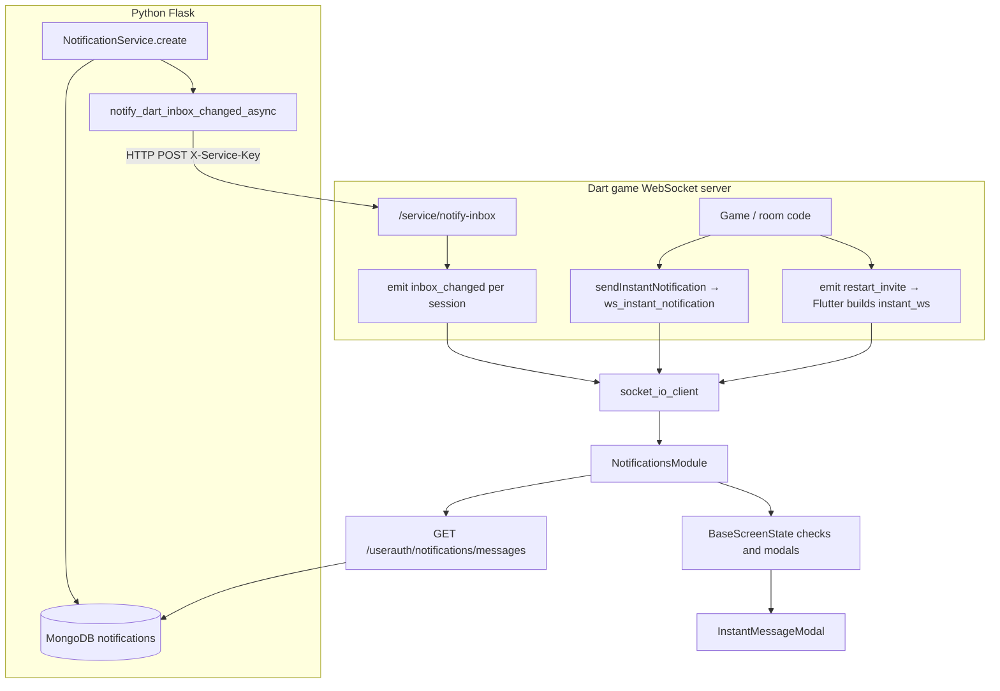

# Notification system — end-to-end flow (current)

This document describes the **notification and inbox system as implemented today**: Python persistence and REST, Dart WebSocket relay, Flutter fetch/modals/hooks, types (`type` / `subtype`), and optional modal chrome (URL background). It is the single reference for how to create messages and how the client shows them.

**Related:** global rank-targeted broadcasts ride on **`GET /userauth/dutch/get-user-stats`** — see [Documentation/00_Active_plans/global-broadcast-user-stats.md](../00_Active_plans/global-broadcast-user-stats.md).

---

## 1. Architecture overview



| Path | Purpose |
|------|---------|
| **DB + REST** | Authoritative inbox: insert in Mongo → client lists and marks read via JWT APIs. |
| **Python → Dart HTTP** | After each successful insert, `notify_dart_inbox_changed_async(user_id)` POSTs to Dart `POST /service/notify-inbox` so **connected** clients get WebSocket `inbox_changed` and refresh from REST without waiting for a poll. |
| **Dart `ws_instant_notification`** | Ephemeral payload to a **session** (not stored in `notifications` by this path alone). Flutter queues it as `instant_ws` and shows the same modal widget. |
| **Dart `restart_invite`** | Flutter synthesizes an `instant_ws` row (rematch invite) in `WSEventHandler.handleRestartInvite`. |

---

## 2. Python: core module and storage

### 2.1 Module and service

- **Package:** `python_base_04/core/modules/notification_module/`
- **Class:** `NotificationMain` — registers Flask blueprint, holds `NotificationService`, exposes `get_notification_service()` and `register_response_handler(source, handler)`.
- **Collection:** `notifications` (constant `NOTIFICATIONS_COLLECTION`).

### 2.2 Predefined `type` values (enforced)

Defined in `notification_service.py`. **`create()` rejects unknown types** (empty string defaults to `instant`).

| `type` | Constant | Meaning |
|--------|----------|---------|
| `instant` | `NOTIFICATION_TYPE_INSTANT` | Inbox row that the Flutter app may show as an **app-wide modal** when unread (see §6). |
| `admin` | `NOTIFICATION_TYPE_ADMIN` | Inbox row; **no** app-wide auto-modal from API polling — **list + tap-to-modal** only. |
| `advert` | `NOTIFICATION_TYPE_ADVERT` | Same as `admin` for modal behaviour: **list + tap-to-modal** only. |

### 2.3 `subtype`, `source`, `msg_id`

| Field | Required | Role |
|-------|----------|------|
| **source** | Effectively yes for responses | Identifies which module registered `register_response_handler(source, ...)`. Use `"core"` for built-in close/delete. |
| **subtype** | No | Free-form module label (e.g. `dutch_match_invite`). Shown on Flutter **notifications list** as secondary text. **Does not** switch modal layout — same `InstantMessageModal` for all. |
| **msg_id** | No (but needed for multi-action dispatch) | Logical id; module dispatcher maps **`msg_id` + `action_identifier`** to Python handlers. Distinct from Mongo **`_id`** (returned as `id` to the client as `message_id` in POST body). |

### 2.4 `data` dict (optional)

Opaque JSON object stored and returned to the client. Used for:

- Game context: `match_id`, `room_id`, etc.
- **Modal backdrop (Flutter only):** if you want an optional image behind the dialog:
  - `modal_background_enabled` (bool, or string `"true"` / `"1"` / `"yes"`; legacy key `modal_background_image` also accepted)
  - `modal_background_url` or `background_image_url` — HTTPS URL, `CachedNetworkImage`

Default: **no** backdrop unless `modal_background_enabled` is true **and** a URL is present.

### 2.5 `responses` (optional)

List of `{"label": "...", "action_identifier": "..."}` (or `"action"` instead of `action_identifier`). Rendered as modal buttons. Client POSTs **`action_identifier` in lowercase** (`notification_routes.handle_response`).

### 2.6 After insert

On successful insert, **`notify_dart_inbox_changed_async(user_id)`** runs in a daemon thread: `POST` to `Config.DART_BACKEND_NOTIFY_URL` + `/service/notify-inbox`, JSON `{"user_id": "<id>"}`, header `X-Service-Key: Config.DART_BACKEND_SERVICE_KEY`.

---

## 3. Python: HTTP API (JWT)

| Method | Path | Body / query | Role |
|--------|------|----------------|------|
| GET | `/userauth/notifications/messages` | `limit` (≤100), `offset`, `unread_only` | List rows for current user. |
| POST | `/userauth/notifications/mark-read` | `{ "message_ids": ["..."] }` | Mark read (cap 100 ids). |
| POST | `/userauth/notifications/response` | `{ "message_id", "action_identifier" }` | Run core or module handler; on `success: true`, marks read. |
| POST | `/userauth/notifications/global-mark-read` | `{ "global_message_ids": ["glob_<hex>", ...] }` (max 50) | Upsert per-user ack in `global_broadcast_reads` (not `notifications`). |
| POST | `/userauth/notifications/admin/global-broadcast` | JSON body (admin JWT) | Insert one row into `global_broadcast_messages` (see §11). |

**Core built-in:** `source == "core"` and `action_identifier == "close"` → delete document, no module handler.

---

## 4. Python: examples by `type` and `subtype`

### 4.1 `type: instant` — match invite (`dutch_game`)

Constants in `dutch_notifications.py`:

- `DUTCH_GAME_SOURCE = "dutch_game"`
- `SUBTYPE_MATCH_INVITE = "dutch_match_invite"`
- `MSG_ID_MATCH_INVITE = "dutch_game_invite_to_match_001"`
- `MATCH_INVITE_RESPONSES` → Join / Decline → `join`, `decline`

**Create (preferred helper):**

```python
from core.modules.dutch_game import dutch_notifications

nid = dutch_notifications.create_notification(
    app_manager,
    user_id=user_id,
    subtype=dutch_notifications.SUBTYPE_MATCH_INVITE,
    title="Match invite",
    body="You're invited to a match.",
    msg_id=dutch_notifications.MSG_ID_MATCH_INVITE,
    data={"match_id": match_id, "room_id": room_id},
    responses=dutch_notifications.MATCH_INVITE_RESPONSES,
    notification_type="instant",  # default
)
```

**Register handlers** (once at Dutch init — `api_endpoints.register_notification_handlers`):

- `register_message_handlers(MSG_ID_MATCH_INVITE, {"accept": ..., "decline": ..., "join": ...})`
- `notification_module.register_response_handler("dutch_game", _dutch_dispatch)`

**Note:** Buttons use `join` / `decline`; `accept` is registered for the same `msg_id` if you add a button with `action_identifier` `accept`. All keys are matched **after** the API lowercases the client’s `action_identifier`.

### 4.2 `type: instant` — with optional modal background image

```python
notif_service.create(
    user_id=user_id,
    source="my_module",
    type="instant",
    title="Season launch",
    body="Tap below to open the hub.",
    data={
        "modal_background_enabled": True,
        "modal_background_url": "https://cdn.example.com/promo/season_2.webp",
        "deeplink": "/shop",
    },
    responses=[{"label": "Open", "action_identifier": "open_hub"}],
    subtype="season_launch",
)
```

Your module must **`register_response_handler("my_module", dispatch)`** and handle `action_identifier` `open_hub`.

### 4.3 `type: admin` — list-first, optional modal on tap

```python
notif_service.create(
    user_id=user_id,
    source="core",  # or your module if you implement handlers
    type="admin",
    title="Maintenance",
    body="Servers restart at 02:00 UTC.",
    subtype="ops_maintenance",
    responses=[{"label": "Close", "action_identifier": "close"}],  # only valid if source is "core" for close
)
```

If `source` is not `"core"`, use your module’s `action_identifier` values and register a handler. **Auto app-wide modal** does **not** run for `admin` from the API list filter (see §6).

### 4.4 `type: advert` — same client rules as `admin`

```python
notif_service.create(
    user_id=user_id,
    source="dutch_game",
    type="advert",
    title="New deck skins",
    body="Browse the shop for limited skins.",
    subtype="shop_promo_deck",
    data={"sku": "deck_gold"},
    responses=[],  # OK-only modal when opened from list
)
```

### 4.5 `source: core` — dismiss deletes row

```python
notif_service.create(
    user_id=user_id,
    source="core",
    type="admin",
    title="Tip",
    body="You can change sound in Settings.",
    responses=[{"label": "Close", "action_identifier": "close"}],
)
```

User taps Close → core deletes the document (no `register_response_handler` needed for that action).

### 4.6 Raw `NotificationService.create` (any module)

```python
notification_module = app_manager.module_manager.get_module("notification_module")
svc = notification_module.get_notification_service()
svc.create(
    user_id=target_user_id,
    source="tournaments",
    type="instant",
    title="Bracket ready",
    body="Your next match is scheduled.",
    msg_id="tournament_bracket_v1",
    subtype="bracket_ready",
    data={"bracket_id": "b42"},
    responses=[{"label": "View", "action_identifier": "view"}],
)
```

Then **`register_response_handler("tournaments", my_dispatch)`** and in `my_dispatch` branch on `doc["msg_id"]` and `action_identifier`.

### 4.7 `subtype` naming

There is **no central enum** of subtypes except Dutch helpers (`SUBTYPE_MATCH_INVITE`, …). **Convention:** `snake_case`, module-scoped prefix (e.g. `dutch_match_invite`, `shop_promo_deck`). Subtypes are for **display**, **analytics**, and **your** dispatch logic — not for Flutter modal skins.

---

## 5. Dart WebSocket server

| Event | Origin | Client expectation |
|-------|--------|--------------------|
| `inbox_changed` | `notifyInboxChangedForUser` after Python HTTP notify | Flutter should **refresh inbox** from REST (see §6). |
| `ws_instant_notification` | `WebSocketServer.sendInstantNotification(sessionId, payload)` | Payload map: e.g. `title`, `body`, `data`, `responses`, optional `id`, `subtype`. Client sets `type` to `instant_ws` and shows modal. |
| `restart_invite` | Game layer | Flutter **`handleRestartInvite`** builds a synthetic `instant_ws` message (rematch Accept/Decline) and queues it like WS instants. |

---

## 6. Flutter: client types and one modal

### 6.1 Single modal widget

**`InstantMessageModal`** (`lib/core/widgets/instant_message_modal.dart`) is the only modal UI for these flows: title, body, optional response buttons, optional **URL background** (§6.4).

**Flutter-side type strings:**

| Value | Constant | Origin |
|-------|----------|--------|
| `instant` | `kNotificationTypeInstant` | Mongo / GET messages |
| `instant_ws` | `kNotificationTypeInstantWs` | Dart WS (`ws_instant_notification` or synthesized e.g. rematch) |
| `instant_frontend_only` | `kNotificationTypeInstantFrontendOnly` | `showFrontendOnlyInstant` only |

### 6.2 Who shows what (summary)

| Source | App-wide auto-queue (`showUnreadInstantModals`) | Notifications list | Tap row → modal |
|--------|--------------------------------------------------|--------------------|-----------------|
| `instant` (DB), unread | Yes | Yes | Yes (`InstantMessageModal.show`) |
| `instant_ws`, unread | Yes | Only if present in fetched list (WS-only may not be in DB) | N/A if not in list |
| `admin`, `advert` | **No** | Yes | Yes |
| `instant_frontend_only` | **No** (not from API) | **No** | N/A |
| **`instant` + `origin: global`** (from stats, not GET messages) | **Yes** (merged ahead of API list) | Optional product choice (not in list API) | Same modal; dismiss → global mark-read |

**Auto-queue filter** (`showUnreadInstantModals`): `type` is `instant` or `instant_ws`, unread (`read_at` empty or `instant_ws`), and not already in `_shownIds`.

### 6.3 When inbox is fetched and checked

- **`NotificationsModule.fetchMessages`** → `GET /userauth/notifications/messages`.
- **`BaseScreenState`** (`lib/core/00_base/screen_base.dart`):
  - After first frame: registers `addPendingWsInstantListener`, `addInboxRefreshListener`, calls **`_checkAndShowInstantMessages()`**.
  - **`inbox_changed`**: clears `notifications.lastFetchedAt` and calls **`_checkAndShowInstantMessages()`** so the next check **always** refetches (bypasses **15s** throttle between fetches).
  - **`_checkAndShowInstantMessages`**: drains **`takePendingWsInstants()`** (WS / synthetic) → **`InstantMessageModal.show`**; then if throttle allows, **`fetchMessages()`** (default unread-only) → **`showUnreadInstantModals`** on **`_mergeInstantModalInbox`** (unread globals from stats first, then API list). **`onMarkAsRead`**: ids starting with `glob_` → **`NotificationsModule.markGlobalBroadcastsRead`**; otherwise per-user **`markAsRead`**. **`onSendResponse`**: if `origin == global`, client handles **`data.deeplink`** only (no `POST .../response` for globals in v1); else **`submitInstantNotificationResponse`**.
- **Rematch / coin modals:** `_pendingWsOnSendResponse` routes `data.respond_via == rematch_ws` to **`submitRematchInviteResponse`** (WebSocket emit, not REST response endpoint).

### 6.4 Optional modal background (URL)

Read from **`message['data']`** unless overridden by widget/`show()` parameters:

- Enable: `modal_background_enabled` or legacy `modal_background_image` (see `modalBackgroundEnabledFromMessage` in `instant_message_modal.dart`).
- URL: `modal_background_url` or `background_image_url` (`modalBackgroundUrlFromMessage`).

**Frontend-only example:**

```dart
await InstantMessageModal.showFrontendOnlyInstant(
  context,
  title: 'Bonus',
  body: 'You unlocked a cosmetic.',
  modalBackgroundEnabled: true,
  modalBackgroundUrl: 'https://cdn.example.com/bg.webp',
);
```

**Or** pass the same keys inside `data` when building a message manually.

### 6.5 REST response + hook

**`submitInstantNotificationResponse`** (`instant_notification_response.dart`) POSTs `/userauth/notifications/response`, then **`HooksManager.triggerHookWithData('instant_message_response_success', { context, msg_id, response, message })`**. Dutch and other modules listen and branch on **`msg_id`**.

---

## 7. Flutter: API surface (reference)

| API | Role |
|-----|------|
| `NotificationsModule.fetchMessages` | GET messages; updates `StateManager` `notifications` (`messages`, `unreadCount`, `lastFetchedAt`). |
| `NotificationsModule.applyGlobalBroadcastsFromStats` | Replace `globalBroadcasts` from `get-user-stats` `global_broadcast_messages`. |
| `NotificationsModule.markGlobalBroadcastsRead` | POST `global-mark-read`; patches local `globalBroadcasts`. |
| `NotificationsModule.markAsRead` | POST mark-read (per-user inbox only). |
| `NotificationsModule.addPendingWsInstant` / `takePendingWsInstants` | WS / synthetic instant queue. |
| `InstantMessageModal.show` | Single modal from a full `message` map. |
| `InstantMessageModal.showUnreadInstantModals` | Queue unread `instant` / `instant_ws` modals. |
| `InstantMessageModal.showFrontendOnlyInstant` | Local-only instant. |
| `submitInstantNotificationResponse` | POST response + hook. |
| `submitRematchInviteResponse` | WS rematch accept/decline path. |

**List UI:** `NotificationsScreen` — shows `subtype` under title; tap opens **`InstantMessageModal.show`** for any row.

---

## 8. User preference (push, not wired to FCM yet)

User documents may include **`notifications.push`** (default `True` in several registration paths in `user_management_module`). **No Flutter FCM consumer** uses it today; reserved for future push work ([Documentation/00_Active_plans/mobile-push-notifications-implementation.md](00_Active_plans/mobile-push-notifications-implementation.md)).

---

## 9. File reference (canonical paths)

| Layer | Path | Role |
|-------|------|------|
| Python | `python_base_04/core/modules/notification_module/notification_service.py` | `create`, type constants. |
| Python | `python_base_04/core/modules/notification_module/notification_routes.py` | REST + `register_response_handler`. |
| Python | `python_base_04/core/modules/notification_module/dart_inbox_notify.py` | `notify_dart_inbox_changed_async`. |
| Python | `python_base_04/core/modules/dutch_game/dutch_notifications.py` | Dutch `create_notification` helper + subtype/msg_id constants. |
| Python | `python_base_04/core/modules/dutch_game/api_endpoints.py` | `_dutch_dispatch`, `register_notification_handlers`, `invite_players_to_match`, attaches `global_broadcast_messages` on get-user-stats. |
| Python | `python_base_04/core/modules/notification_module/global_broadcast_service.py` | Mongo globals + reads, rank filter, serialize for client. |
| Dart | `dart_bkend_base_01/lib/server/http_notify_handler.py` | `POST /service/notify-inbox`. |
| Dart | `dart_bkend_base_01/lib/server/websocket_server.dart` | `sendInstantNotification`, `notifyInboxChangedForUser`. |
| Flutter | `flutter_base_05/lib/modules/notifications_module/notifications_module.dart` | Fetch, state, WS pending queue. |
| Flutter | `flutter_base_05/lib/core/widgets/instant_message_modal.dart` | Modal UI + types + optional URL background helpers. |
| Flutter | `flutter_base_05/lib/core/widgets/instant_notification_response.dart` | POST response + rematch WS helpers. |
| Flutter | `flutter_base_05/lib/core/00_base/screen_base.dart` | Inbox refresh listeners, `_checkAndShowInstantMessages`, modal wiring. |
| Flutter | `flutter_base_05/lib/core/managers/websockets/ws_event_listener.dart` | Registers `ws_instant_notification`, `inbox_changed`, `restart_invite`. |
| Flutter | `flutter_base_05/lib/core/managers/websockets/ws_event_handler.dart` | Handlers → `NotificationsModule`. |
| Flutter | `flutter_base_05/lib/screens/notifications_screen/notifications_screen.dart` | Full list (`unread_only: false`), subtype line, tap → modal. |
| Flutter | `flutter_base_05/lib/modules/dutch_game/utils/dutch_game_helpers.dart` | After user stats, applies `global_broadcast_messages` into `NotificationsModule`. |
| Flutter | `flutter_base_05/lib/modules/dutch_game/managers/dutch_event_manager.dart` | `instant_message_response_success` routing (by `msg_id`). |

---

## 10. Quick decision table

| I want… | Use |
|---------|-----|
| Stored message + list + maybe app-wide popup | `NotificationService.create`, `type: instant`, optional `subtype` / `data` / `responses`. |
| Stored message, no auto-popup | `type: admin` or `advert`. |
| Ephemeral popup to connected game client | Dart `sendInstantNotification` → `instant_ws`. |
| Local-only popup | `InstantMessageModal.showFrontendOnlyInstant`. |
| Button actions hitting Python | `responses` + `register_response_handler` + matching `source` / `msg_id` / `action_identifier`. |
| Dismiss and delete without module code | `source: core`, `action_identifier: close`. |
| Optional image behind modal | `data.modal_background_enabled` + `data.modal_background_url` (or Flutter-only params on `showFrontendOnlyInstant`). |
| Same-user rank announcement, one Mongo doc, no per-user inbox row | `global_broadcast_messages` + `POST .../admin/global-broadcast`; payload on **`GET /userauth/dutch/get-user-stats`** as `global_broadcast_messages`. |
| Ack a global without touching `notifications` | `POST /userauth/notifications/global-mark-read` (or dismiss modal — client calls same). |

This matches the **current** notification system in the repo end-to-end.

---

## 11. Global broadcast messages (rank-targeted, stats envelope)

These are **not** rows in `notifications`. One document per campaign in **`global_broadcast_messages`**; per-user read state only in **`global_broadcast_reads`** (`user_id`, `global_message_id`, `read_at`, unique compound index).

### 11.1 Delivery and shape

- **`GET /userauth/dutch/get-user-stats`** adds **`global_broadcast_messages`**: an array of objects shaped like list-message rows plus **`origin: "global"`**, **`global_id`** (24-char hex), **`user_read`**, and client **`id`** = `glob_<global_id>` so ids never collide with per-user `message_id` values.
- Server filters by the user’s Dutch rank (same normalization as `tier_rank_level_matcher`): `target_ranks` may include **`"all"`** or a list of rank strings; documents respect **`is_active`** and optional **`starts_at`** / **`ends_at`**.

### 11.2 Admin create (JSON body)

`POST /userauth/notifications/admin/global-broadcast` — caller’s JWT must resolve to a `users` document with **`role: "admin"`**. Body fields (see `insert_global_broadcast`):

| Field | Notes |
|-------|--------|
| `title`, `body` | Required strings. |
| `type` | Optional; must be a predefined notification type or defaults to `instant`. |
| `subtype`, `source`, `msg_id` | Optional. |
| `data` | Object (e.g. `deeplink`, modal background keys). |
| `responses` | List of `{ "label", "action_identifier" }` — **v1:** Flutter does not POST `.../response` for globals; use for labels and map actions client-side (e.g. `data.deeplink`). |
| `target_ranks` | List: `["all"]` or specific normalized ranks. |
| `is_active` | Default `true`. |
| `starts_at`, `ends_at` | Optional `datetime` when inserting from Python. |

Example (replace `TOKEN`):

```bash
curl -sS -X POST 'https://<host>/userauth/notifications/admin/global-broadcast' \
  -H 'Authorization: Bearer TOKEN' \
  -H 'Content-Type: application/json' \
  -d '{
    "title": "Patch 1.2",
    "body": "Balance changes are live.",
    "type": "instant",
    "subtype": "patch_notes",
    "target_ranks": ["all"],
    "data": { "deeplink": "/news" }
  }'
```

**Local dev (replace collection from repo JSON, no extra Python deps):** edit `playbooks/00_local/files/global_broadcast_messages.json`, then from repo root run:

```bash
ansible-playbook -i localhost, -c local playbooks/00_local/sync_global_broadcast_messages.yml
```

The playbook renders a `mongosh` script into the `dutch_external_app_mongodb` container (same pattern as `add_two_tournaments.yml`). Use `-e prune_reads=false` to keep orphan read rows; `-e allow_empty=true` wipes all global message docs (dangerous).

### 11.3 Mark read

`POST /userauth/notifications/global-mark-read` with `{ "global_message_ids": ["glob_<hex>", ...] }` — **at most 50** ids per request. Idempotent upserts into **`global_broadcast_reads`**.

### 11.4 Flutter behaviour (summary)

`dutch_game_helpers` calls **`NotificationsModule.applyGlobalBroadcastsFromStats`** when stats return. **`BaseScreenState`** merges unread global **`instant`** rows **before** API messages for **`showUnreadInstantModals`**; dismiss uses **`markGlobalBroadcastsRead`** for `glob_*` ids; modal buttons on globals run **`data.deeplink`** handling only (no Python response handler for globals in v1).

**`data.deeplink` shapes (in-app):**

| Shape | Example |
|-------|--------|
| String path | `"/dutch/leaderboard"` |
| String path + query | `"/dutch/lobby?section=join_random&table=city"` |
| Map | `{"path": "/dutch/lobby", "section": "join_random", "table": "city"}` (keys other than `path`/`route` → query) |
| Flat | `deeplink_path` + optional `deeplink_query` map |

String **`https://...`** still opens in the external browser (not merged with map/query rules above).

**Lobby (`/dutch/lobby`) query keys:** `section` expands accordion — `join_random`, `join-random`, `quick_join` → Join Random; `practice` → Practice; `create`, `create_new`, `create-new` → Create New. **`table`** / **`carousel`** / **`game_table`** — hint for Quick Join carousel (fuzzy match on declarative tier **title** or event **id**/title; numeric string matches **`game_level`**). **`game_level`** — explicit tier id. **`event`** / **`event_id`** — special-event carousel row.

**Customize (`/dutch-customize`) query keys:** **`item_id`** (preferred) or **`item`**, **`highlight`**, **`consumable`** — selects the matching shop row (same border as a tap), expands Buy/Use actions, and scrolls it into view. If the value is not a raw catalog id, the client resolves by **slug match** on **`display_name`** (declarative consumables / cosmetics catalog). Example: `"/dutch-customize?item_id=skin_gold_felt"` or `"/dutch-customize?highlight=gold pack"`.
