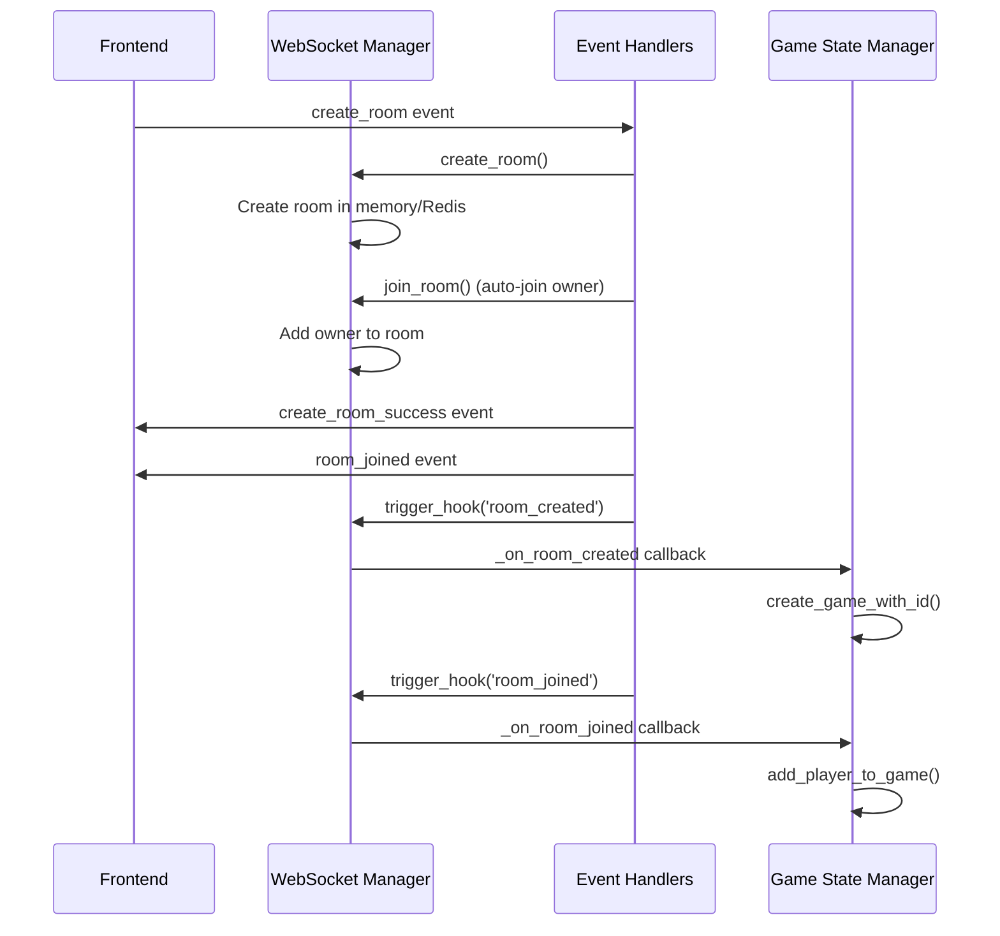
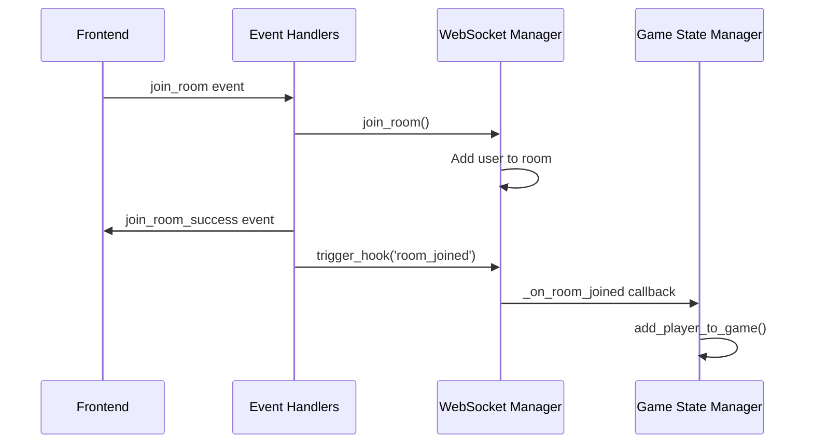
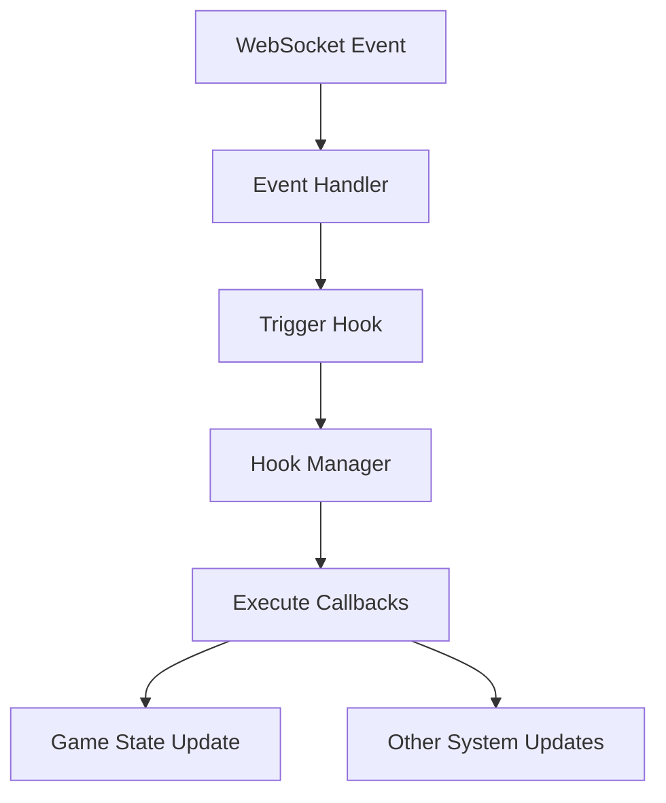
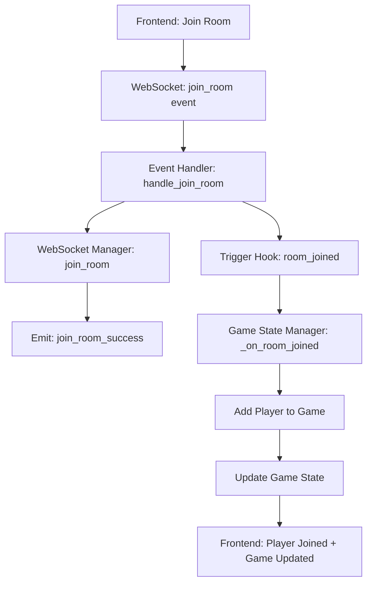

# WebSocket-Recall Module Architecture Documentation

## Overview

This document provides a comprehensive guide to the WebSocket-Recall module architecture, explaining how rooms are created and managed, how games are automatically created, and how the hook system enables decoupled communication between components.

## Table of Contents

1. [Architecture Overview](#architecture-overview)
2. [Core Components](#core-components)
3. [Room Management Flow](#room-management-flow)
4. [Game Management Flow](#game-management-flow)
5. [Hook System](#hook-system)
6. [Data Flow Diagrams](#data-flow-diagrams)
7. [Event Flow](#event-flow)
8. [User Joined Rooms Event](#user-joined-rooms-event)
9. [State Management](#state-management)
10. [Frontend Integration](#frontend-integration)
11. [Room Cleanup Behavior](#room-cleanup-behavior)
12. [Game Phase Management](#game-phase-management)
13. [Troubleshooting](#troubleshooting)

## Architecture Overview

The WebSocket-Recall module follows a **manager-based architecture** with **event-driven communication** through a custom hook system. The architecture ensures:

- **Separation of Concerns**: Room management, game management, and WebSocket handling are separate
- **Decoupled Communication**: Components communicate via hooks rather than direct dependencies
- **Automatic Game Creation**: Games are created automatically when rooms are created
- **State Synchronization**: Game state stays synchronized with room membership
- **Real-time Updates**: Frontend receives real-time updates via WebSocket events

### High-Level Architecture

```
┌─────────────────┐    ┌──────────────────┐    ┌─────────────────┐
│   Frontend      │    │   WebSocket      │    │   Game State    │
│   (Flutter)     │◄──►│   Manager        │◄──►│   Manager       │
└─────────────────┘    └──────────────────┘    └─────────────────┘
                                │
                                ▼
                       ┌──────────────────┐
                       │   Hook System    │
                       │   (Event Bus)    │
                       └──────────────────┘
```

## Core Components

### 1. WebSocket Manager (`websocket_manager.py`)

**Purpose**: Manages WebSocket connections, rooms, and sessions

**Key Responsibilities**:
- WebSocket connection management
- Room creation and management
- Session management
- Room TTL (Time To Live) management
- Hook triggering capabilities

**Key Methods**:
```python
def create_room(self, room_id: str, permission: str, owner_id: str) -> bool
def join_room(self, room_id: str, session_id: str, user_id: str) -> bool
def leave_room(self, room_id: str, session_id: str) -> bool
def trigger_hook(self, hook_name: str, data: dict) -> None
```

### 2. WebSocket Event Handlers (`ws_event_handlers.py`)

**Purpose**: Handles incoming WebSocket events and triggers appropriate hooks

**Key Responsibilities**:
- Process WebSocket events from frontend
- Validate event data
- Trigger appropriate hooks
- Emit response events to frontend

**Key Methods**:
```python
def handle_create_room(self, session_id: str, data: dict) -> bool
def handle_join_room(self, session_id: str, data: dict) -> bool
def handle_leave_room(self, session_id: str, data: dict) -> bool
```

### 3. Game State Manager (`game_state.py`)

**Purpose**: Manages game instances and their state

**Key Responsibilities**:
- Automatic game creation via hooks
- Player management within games
- Game state transitions
- Hook callback registration

**Key Methods**:
```python
def _on_room_created(self, room_data: dict) -> None
def _on_room_joined(self, room_data: dict) -> None
def _on_room_closed(self, room_data: dict) -> None
def _on_leave_room(self, room_data: dict) -> None
```

### 4. Hook Manager (`hooks_manager.py`)

**Purpose**: Manages the event/hook system for decoupled communication

**Key Responsibilities**:
- Hook registration and management
- Callback execution
- Priority-based execution
- Automatic hook creation

**Key Methods**:
```python
def register_hook_callback(self, hook_name: str, callback: callable, priority: int) -> None
def trigger_hook(self, hook_name: str, data: dict, context: dict) -> None
```

## Room Management Flow

### Room Creation Process



**Step-by-Step Breakdown**:

1. **Frontend Request**: User creates room via `create_room` WebSocket event
2. **Room Creation**: `handle_create_room` creates room via `websocket_manager.create_room()`
3. **Auto-Join**: Owner is automatically joined to the room via `websocket_manager.join_room()`
4. **Frontend Events**: `create_room_success` and `room_joined` events are emitted
5. **Game Creation Hook**: `room_created` hook triggers game creation
6. **Player Addition Hook**: `room_joined` hook adds owner to the game

**Key Code Sections**:
```python
# Room creation and auto-join
success = self.websocket_manager.create_room(room_id, permission, owner_id=user_id)
if success:
    join_success = self.websocket_manager.join_room(room_id, session_id, user_id)
    
    # Trigger game creation hook
    self.websocket_manager.trigger_hook('room_created', room_data)
    
    # Trigger player addition hook
    self.websocket_manager.trigger_hook('room_joined', join_room_data)
```

### Room Join Process



**Step-by-Step Breakdown**:

1. **Frontend Request**: User joins room via `join_room` WebSocket event
2. **Room Join**: `handle_join_room` adds user to room via `websocket_manager.join_room()`
3. **Frontend Event**: `join_room_success` event is emitted
4. **Player Addition Hook**: `room_joined` hook adds player to the game

**Key Code Sections**:
```python
# Manual room join
success = self.websocket_manager.join_room(room_id, session_id, user_id)
if success:
    # Trigger player addition hook
    self.websocket_manager.trigger_hook('room_joined', room_data)
```

## Game Management Flow

### Automatic Game Creation

Games are created automatically when rooms are created, ensuring that every room has a corresponding game instance.

**Game Creation Hook Callback**:
```python
def _on_room_created(self, room_data: Dict[str, Any]):
    """Callback for room_created hook - automatically create game"""
    try:
        room_id = room_data.get('room_id')
        max_players = room_data.get('max_players', 4)
        min_players = room_data.get('min_players', 2)
        
        custom_log(f"🎮 [HOOK] Room created: {room_id}, creating game automatically")
        
        # Create game with room_id as game_id
        game_id = self.create_game_with_id(room_id, max_players=max_players, min_players=min_players)
        
        # Initialize game state (waiting for players)
        game = self.get_game(game_id)
        if game:
            game.phase = GamePhase.WAITING_FOR_PLAYERS
            custom_log(f"✅ Game {game_id} created and initialized for room {room_id}")
            
    except Exception as e:
        custom_log(f"❌ Error in _on_room_created callback: {e}", level="ERROR")
```

**Key Points**:
- **Game ID = Room ID**: Ensures consistent identification across the stack
- **Automatic Creation**: No manual game creation needed
- **State Initialization**: Game starts in `WAITING_FOR_PLAYERS` phase
- **Player Limits**: Uses room's `max_players` and `min_players` settings

### Player Management

Players are automatically added to games when they join rooms.

**Player Addition Hook Callback**:
```python
def _on_room_joined(self, room_data: Dict[str, Any]):
    """Callback for room_joined hook - handle player joining existing game"""
    try:
        room_id = room_data.get('room_id')
        user_id = room_data.get('user_id')
        current_size = room_data.get('current_size', 1)
        
        custom_log(f"🎮 [HOOK] Player {user_id} joined room {room_id}, current size: {current_size}")
        
        # Check if game exists for this room
        game = self.get_game(room_id)
        if not game:
            custom_log(f"⚠️ No game found for room {room_id}, this shouldn't happen")
            return
        
        # Add player to the game if they don't exist
        if user_id not in game.players:
            from ..models.player import HumanPlayer
            player = HumanPlayer(user_id, f"Player_{user_id[:8]}")
            game.add_player(player)
            custom_log(f"✅ Added player {user_id} to game {room_id}")
        else:
            custom_log(f"ℹ️ Player {user_id} already exists in game {room_id}")
            
    except Exception as e:
        custom_log(f"❌ Error in _on_room_joined callback: {e}", level="ERROR")
```

**Key Points**:
- **Automatic Addition**: Players are added to games automatically
- **Duplicate Prevention**: Checks if player already exists
- **Game Validation**: Ensures game exists before adding players
- **Player Creation**: Creates `HumanPlayer` instances automatically

## Hook System

### Overview

The hook system enables **decoupled communication** between components. Instead of direct method calls, components register callbacks for specific events and trigger hooks when those events occur.

### Hook Registration

Components register callbacks for specific hooks during initialization:

```python
def _register_hook_callbacks(self):
    """Register hook callbacks for automatic game creation"""
    try:
        # Register callback for room_created hook
        self.app_manager.register_hook_callback('room_created', self._on_room_created)
        custom_log("🎣 [HOOK] Registered room_created callback in GameStateManager")
        
        # Register callback for room_joined hook
        self.app_manager.register_hook_callback('room_joined', self._on_room_joined)
        custom_log("🎣 [HOOK] Registered room_joined callback in GameStateManager")
        
        # Register callback for room_closed hook
        self.app_manager.register_hook_callback('room_closed', self._on_room_closed)
        custom_log("🎣 [HOOK] Registered room_closed callback in GameStateManager")
        
        # Register callback for leave_room hook
        self.app_manager.register_hook_callback('leave_room', self._on_leave_room)
        custom_log("🎣 [HOOK] Registered leave_room callback in GameStateManager")
        
    except Exception as e:
        custom_log(f"❌ Error registering hook callbacks: {e}", level="ERROR")
```

### Hook Triggering

Hooks are triggered when specific events occur:

```python
# Trigger room_created hook for game creation logic
room_data = {
    'room_id': room_id,
    'owner_id': owner_id,
    'permission': permission,
    'max_players': data.get('max_players') or Config.WS_ROOM_SIZE_LIMIT,
    'min_players': data.get('min_players') or 2,
    'game_type': data.get('game_type', 'classic'),
    'turn_time_limit': data.get('turn_time_limit', 30),
    'auto_start': data.get('auto_start', True),
    'created_at': datetime.now().isoformat(),
    'current_size': 1
}
self.websocket_manager.trigger_hook('room_created', room_data)
```

### Available Hooks

| Hook Name | Triggered When | Purpose | Data Structure |
|------------|----------------|---------|----------------|
| `room_created` | Room is created | Create game automatically | Room metadata, player limits |
| `room_joined` | User joins room | Add player to game | User info, room info |
| `room_closed` | Room is closed | Clean up game state | Room ID, closure reason |
| `leave_room` | User leaves room | Remove player from game | Room ID, session ID |

### Hook Data Flow



### Private Room Password Handling

**Password Storage**:
- Passwords are stored in both Redis and in-memory when rooms are created
- Private room permissions are enforced during join operations
- Password validation happens in the backend before allowing access

**Implementation**:
```python
# In WebSocketManager.create_room()
def create_room(self, room_id: str, permission: str, owner_id: str, password: Optional[str] = None) -> bool:
    room_data = {
        'room_id': room_id,
        'permission': permission,
        'owner_id': owner_id,
        'password': password,  # Store password for private rooms
        'created_at': datetime.now().isoformat(),
        # ... other fields
    }
    
    # Store in Redis and memory
    self.redis_manager.set(room_key, room_data, expire=Config.WS_ROOM_TTL)
    self.room_data[room_id] = room_data.copy()
```

**Password Validation**:
```python
# In WSEventHandlers.handle_join_room()
def handle_join_room(self, session_id: str, data: dict) -> bool:
    room_id = data.get('room_id')
    password = data.get('password')
    
    # Get room info including password requirement
    room_info = self.websocket_manager.get_room_info(room_id)
    if room_info and room_info.get('permission') == 'private':
        stored_password = room_info.get('password')
        if not stored_password or password != stored_password:
            # Emit error to frontend
            emit('join_room_error', {'error': 'Invalid password for private room'})
            return False
```

**Security Features**:
- **Password Storage**: Encrypted in Redis with TTL expiration
- **Validation**: Backend-only validation prevents frontend bypass
- **Error Handling**: Clear error messages for invalid passwords
- **Session Management**: Secure session handling for authenticated users

## Data Flow Diagrams

### Complete Room Creation and Game Setup Flow

```mermaid
flowchart TD
    A[Frontend: Create Room] --> B[WebSocket: create_room event]
    B --> C[Event Handler: handle_create_room]
    C --> D[WebSocket Manager: create_room]
    D --> E[WebSocket Manager: join_room (auto-join)]
    E --> F[Emit: create_room_success]
    E --> G[Emit: room_joined]
    C --> H[Trigger Hook: room_created]
    H --> I[Game State Manager: _on_room_created]
    I --> J[Create Game Instance]
    J --> K[Set Game Phase: WAITING_FOR_PLAYERS]
    C --> L[Trigger Hook: room_joined]
    L --> M[Game State Manager: _on_room_joined]
    M --> N[Add Owner to Game]
    N --> O[Update Game State]
    O --> P[Frontend: Room Created + Game Ready]
```

### Room Join Flow



## Event Flow

### WebSocket Events from Frontend

| Event | Purpose | Data Structure | Handler |
|-------|---------|----------------|---------|
| `create_room` | Create new room | Room settings, player limits | `handle_create_room` |
| `join_room` | Join existing room | Room ID | `handle_join_room` |
| `leave_room` | Leave current room | Room ID | `handle_leave_room` |

### Custom Event Registration System

The Recall module uses a **custom event registration system** that integrates with the core WebSocket infrastructure while maintaining module-specific event handling.

#### Architecture Overview

```
┌─────────────────┐    ┌──────────────────┐    ┌─────────────────┐
│   Backend       │    │   Core WebSocket  │    │   Recall Module │
│   (Python)      │───►│   Event Manager   │───►│   Event Handler │
└─────────────────┘    └──────────────────┘    └─────────────────┘
                                │
                                ▼
                       ┌──────────────────┐
                       │   State Manager  │
                       │   (Flutter)      │
                       └──────────────────┘
```

#### Backend Event Emission

**Recall-Specific Events**:
```python
# In game_state.py - _send_recall_player_joined_events()
def _send_recall_player_joined_events(self, room_id: str, user_id: str, session_id: str, game):
    # 1. Send new_player_joined event to the room
    room_payload = {
        'event_type': 'recall_new_player_joined',
        'room_id': room_id,
        'joined_player': {
            'user_id': user_id,
            'session_id': session_id,
            'name': f"Player_{user_id[:8]}",
            'joined_at': datetime.now().isoformat()
        },
        'game_state': game_state,
        'timestamp': datetime.now().isoformat()
    }
    
    # Send as recall_game_event to the room
    self.websocket_manager.socketio.emit('recall_game_event', room_payload, room=room_id)
    
    # 2. Send joined_games event to the joined user
    user_payload = {
        'event_type': 'recall_joined_games',
        'user_id': user_id,
        'session_id': session_id,
        'games': user_games,
        'total_games': len(user_games),
        'timestamp': datetime.now().isoformat()
    }
    
    # Send as recall_game_event to the specific user's session
    self.websocket_manager.send_to_session(session_id, 'recall_game_event', user_payload)
```

**Event Structure**:
- **Wrapper Event**: `recall_game_event` (single Socket.IO event)
- **Event Type**: `event_type` field determines specific event type
- **Event Types**: `recall_new_player_joined`, `recall_joined_games`
- **Data**: Event-specific payload with game state information

#### Frontend Custom Event Registration

**Core WebSocket Integration**:
```dart
// In recall_event_listener_validator.dart
class RecallGameEventListenerValidator {
  static final RecallGameEventListenerValidator _instance = RecallGameEventListenerValidator._internal();
  static RecallGameEventListenerValidator get instance => _instance;
  
  // Register with core WebSocket system
  void _registerSocketIOListener() {
    final wsManager = WebSocketManager.instance;
    
    // Use the core WebSocket system's connection logic
    if (wsManager.isConnected && wsManager.eventListener != null) {
      _registerListenerNow();
    } else {
      // Wait for WebSocket to connect
      wsManager.connectionStatus.listen((event) {
        if (event.status == ConnectionStatus.connected && !_socketIOListenerRegistered) {
          _registerListenerNow();
        }
      });
    }
  }
  
  // Register the actual Socket.IO listener
  void _registerListenerNow() {
    final wsManager = WebSocketManager.instance;
    
    // Use the core WebSocket system's event listener
    wsManager.eventListener!.registerCustomListener('recall_game_event', (data) {
      _handleRecallGameEvent(data);
    });
  }
}
```

**Event Validation and Routing**:
```dart
// Event schema validation
static const Map<String, Set<String>> _eventSchema = {
  'recall_new_player_joined': {
    'event_type', 'room_id', 'joined_player', 'game_state', 'timestamp',
  },
  'recall_joined_games': {
    'event_type', 'user_id', 'session_id', 'games', 'total_games', 'timestamp',
  },
};

// Event handling and routing
void _handleRecallGameEvent(Map<String, dynamic> data) {
  final eventType = data['event_type'] as String?;
  
  // Validate event type against schema
  if (!_eventSchema.containsKey(eventType)) {
    _log.error('❌ Unknown recall game event type: $eventType');
    return;
  }
  
  // Route to appropriate callback
  final callback = _callbacks[eventType];
  if (callback != null) {
    callback(data);
  }
}
```

#### State Management Integration

**Event-Driven State Updates**:
```dart
// In recall_event_manager.dart
void _registerRecallEventListeners() {
  // Register recall_joined_games event listener
  RecallGameEventListenerValidator.instance.addListener('recall_joined_games', (data) {
    final games = data['games'] as List<dynamic>? ?? [];
    final totalGames = data['total_games'] ?? 0;
    
    // Update recall game state with joined games information
    RecallGameHelpers.updateUIState({
      'joinedGames': games.cast<Map<String, dynamic>>(),
      'totalJoinedGames': totalGames,
      'joinedGamesTimestamp': DateTime.now().toIso8601String(),
      'lastUpdated': DateTime.now().toIso8601String(),
    });
  });
}
```

**State Schema Validation**:
```dart
// In validated_state_updater.dart
static const Map<String, RecallStateFieldSpec> _stateSchema = {
  // ... existing fields ...
  
  // 🎯 NEW: Joined Games Tracking
  'joinedGames': RecallStateFieldSpec(
    type: List,
    defaultValue: [],
    description: 'List of games the user is currently in',
  ),
  'totalJoinedGames': RecallStateFieldSpec(
    type: int,
    defaultValue: 0,
    description: 'Total number of games the user is currently in',
  ),
  'joinedGamesTimestamp': RecallStateFieldSpec(
    type: String,
    required: false,
    description: 'Timestamp of last joined games update',
  ),
};
```

#### Widget State Subscription

**State-Driven UI Updates**:
```dart
// In current_room_widget.dart
Widget build(BuildContext context) {
  return ListenableBuilder(
    listenable: StateManager(),
    builder: (context, child) {
      // Get recall game state for joined games
      final recallGameState = StateManager().getModuleState<Map<String, dynamic>>('recall_game') ?? {};
      
      // Extract joined games from recall game state
      final joinedGames = recallGameState['joinedGames'] as List<dynamic>? ?? [];
      final totalJoinedGames = recallGameState['totalJoinedGames'] ?? 0;
      
      // Display games using state data
      return _buildJoinedGamesList(context, joinedGames: joinedGames, totalJoinedGames: totalJoinedGames);
    },
  );
}
```

#### Benefits of Custom Event System

1. **Module Isolation**: Recall-specific events don't interfere with core WebSocket events
2. **Centralized Registration**: Uses core WebSocket system for connection management
3. **Schema Validation**: Ensures event data integrity
4. **State Integration**: Seamlessly updates Flutter state management
5. **Extensible Design**: Easy to add new recall-specific events
6. **Connection Reliability**: Leverages core WebSocket connection monitoring

### WebSocket Events to Frontend

| Event | Purpose | Data Structure | Triggered When |
|-------|---------|----------------|----------------|
| `create_room_success` | Room creation successful | Room ID, owner ID, settings | Room created successfully |
| `create_room_error` | Room creation failed | Error message | Room creation failed |
| `join_room_success` | Room join successful | Room info, player count | User joined room |
| `join_room_error` | Room join failed | Error message | Room join failed |
| `room_joined` | User joined room | Room info, user info | User joins room |
| `leave_room_success` | Room leave successful | Room ID | User left room |
| `user_joined_rooms` | All user's joined rooms | Complete room list, count, timestamp | After room join/leave/creation |

### Recall-Specific Events

| Event | Purpose | Data Structure | Triggered When |
|-------|---------|----------------|----------------|
| `recall_game_event` | Wrapper for all recall events | `{event_type, ...event_data}` | Various recall game events |
| `recall_new_player_joined` | New player joined game | Player info, game state | Player joins room/game |
| `recall_joined_games` | User's joined games updated | User's game list | User joins/leaves games |

**Recall Event Structure**:
```json
{
  "event_type": "recall_joined_games",
  "user_id": "user_123",
  "session_id": "session_456",
  "games": [
    {
      "game_id": "room_789",
      "room_id": "room_789",
      "game_state": {
        "gameId": "room_789",
        "gameName": "Recall Game room_789",
        "players": [...],
        "playerCount": 1,
        "maxPlayers": 6,
        "minPlayers": 2,
        "phase": "waiting",
        "status": "inactive",
        "permission": "public"
      },
      "joined_at": "2025-08-25T14:21:53.009561"
    }
  ],
  "total_games": 1,
  "timestamp": "2025-08-25T14:21:53.009803"
}
```

### Hook Events

| Hook | Purpose | Data Structure | Callback |
|------|---------|----------------|----------|
| `room_created` | Room creation notification | Room metadata | `_on_room_created` |
| `room_joined` | User join notification | User and room info | `_on_room_joined` |
| `room_closed` | Room closure notification | Room ID, reason | `_on_room_closed` |
| `leave_room` | User leave notification | Room ID, session ID | `_on_leave_room` |

## User Joined Rooms Event

### Purpose
The `user_joined_rooms` event provides comprehensive room membership tracking by emitting all rooms a user is currently in whenever their room membership changes.

### Event Structure
```json
{
  "session_id": "session_123",
  "rooms": [
    {
      "room_id": "room_abc",
      "creator_id": "user_456",
      "permission": "public",
      "created_at": "2025-08-24T14:30:00",
      "size": 2,
      "max_size": 6,
      "min_players": 2,
      "members": ["session_123", "session_789"],
      "allowed_users": [],
      "allowed_roles": []
    }
  ],
  "total_rooms": 1,
  "timestamp": "2025-08-24T14:30:00"
}
```

### Trigger Points
The event is emitted in three scenarios:

1. **Room Creation (Auto-join)**: After owner is automatically joined to created room
2. **Manual Room Join**: After user successfully joins a room
3. **Room Leave**: After user leaves a room

### Backend Implementation
```python
def _emit_user_joined_rooms(self, session_id: str):
    """Emit user_joined_rooms event with all rooms the user is currently in."""
    try:
        # Get all rooms for this session
        user_rooms = self.websocket_manager.get_rooms_for_session(session_id)
        
        # Get detailed room info for each room
        rooms_info = []
        for room_id in user_rooms:
            room_info = self.websocket_manager.get_room_info(room_id)
            if room_info:
                rooms_info.append(room_info)
        
        # Emit the event to the client
        self.socketio.emit('user_joined_rooms', {
            'session_id': session_id,
            'rooms': rooms_info,
            'total_rooms': len(rooms_info),
            'timestamp': datetime.now().isoformat()
        })
        
        custom_log(f"📡 [EMIT] user_joined_rooms event sent to session {session_id} with {len(rooms_info)} rooms")
        
    except Exception as e:
        custom_log(f"❌ Error emitting user_joined_rooms event: {str(e)}")
```

### Frontend Integration
The frontend `CurrentRoomWidget` now subscribes to the `websocket` state slice to display all joined rooms:

```dart
// Get websocket state for joined rooms
final websocketState = StateManager().getModuleState<Map<String, dynamic>>('websocket') ?? {};

// Extract joined rooms from WebSocket state
final joinedRooms = websocketState['joinedRooms'] as List<dynamic>? ?? [];
final totalJoinedRooms = websocketState['totalJoinedRooms'] ?? 0;
final joinedRoomsTimestamp = websocketState['joinedRoomsTimestamp']?.toString() ?? '';

// Display all joined rooms
return _buildJoinedRoomsList(
  context,
  joinedRooms: joinedRooms.cast<Map<String, dynamic>>(),
  totalJoinedRooms: totalJoinedRooms,
  timestamp: joinedRoomsTimestamp,
);
```

### Benefits
- **Multiple Room Support**: User can be in several rooms simultaneously
- **Real-time Updates**: Frontend gets notified of all room membership changes
- **Complete Room Info**: Detailed information about each joined room
- **Accurate State**: Frontend always knows exactly which rooms user is in

## State Management

### Room State

Rooms maintain state in both memory and Redis:

**Memory State**:
```python
self.rooms = {
    'room_id': set(['session_id_1', 'session_id_2'])
}

self.room_data = {
    'room_id': {
        'creator_id': 'user_id',
        'permission': 'public',
        'created_at': 'timestamp',
        'size': 2,
        'allowed_users': set(),
        'allowed_roles': set()
    }
}
```

**Redis State**:
```python
room_data = {
    'room_id': 'room_123',
    'permission': 'public',
    'owner_id': 'user_456',
    'allowed_users': [],
    'allowed_roles': [],
    'created_at': 'timestamp',
    'size': 2
}
```

### Game State

Games maintain state in memory:

```python
self.active_games = {
    'game_id': GameState(
        game_id='room_123',
        max_players=6,
        min_players=2,
        phase=GamePhase.WAITING_FOR_PLAYERS,
        players={},
        current_player_id=None
    )
}
```

### State Synchronization

State is synchronized through the hook system:

1. **Room State Changes** → Trigger hooks
2. **Hook Callbacks** → Update game state
3. **Game State Changes** → Available via API endpoints

### WebSocket State Structure

The `websocket` state slice now includes comprehensive room membership tracking:

```dart
{
  'isConnected': bool,
  'currentRoomId': String?,
  'currentRoomInfo': Map<String, dynamic>?,
  'sessionData': Map<String, dynamic>?,
  'joinedRooms': List<Map<String, dynamic>>,  // All rooms user is in
  'totalJoinedRooms': int,                     // Count of joined rooms
  'joinedRoomsTimestamp': String?,             // Last update timestamp
  'joinedRoomsSessionId': String?,             // Session ID for the data
  'lastUpdated': String
}
```

**Key Fields**:
- `joinedRooms`: Array of complete room information for all rooms user is in
- `totalJoinedRooms`: Total count of rooms user is currently in
- `joinedRoomsTimestamp`: ISO timestamp of last room membership update
- `joinedRoomsSessionId`: Session ID that the room data belongs to

## Frontend Integration

### State Subscription

Frontend widgets subscribe to specific state slices:

```dart
// CurrentRoomWidget subscribes to recall_game state for joined games
final recallGameState = StateManager().getModuleState<Map<String, dynamic>>('recall_game') ?? {};
final joinedGames = recallGameState['joinedGames'] as List<dynamic>? ?? [];
final totalJoinedGames = recallGameState['totalJoinedGames'] ?? 0;
final joinedGamesTimestamp = recallGameState['joinedGamesTimestamp']?.toString() ?? '';

// AvailableGamesWidget subscribes to games state
final recallState = StateManager().getModuleState<Map<String, dynamic>>('recall_game') ?? {};
final availableGames = recallState['availableGames'] as List<dynamic>? ?? [];
```

**State-Driven Architecture**:
- **Widgets read from state**: No direct event handling in widgets
- **Events update state**: Custom events update state via validated state updater
- **State validation**: All state updates go through schema validation
- **Real-time updates**: Widgets automatically rebuild when state changes

### WebSocket Event Handling

Frontend handles WebSocket events via `WSEventManager`:

```dart
// WebSocket events update state automatically
// No manual state management needed in widgets
```

### API Integration

Frontend fetches available games and room information via HTTP API:

**Available Games API**:
```dart
final result = await RecallGameHelpers.fetchAvailableGames();
if (result['success'] == true) {
    final games = result['games'] ?? [];
    RecallGameHelpers.updateUIState({
        'availableGames': games,
        'lastUpdated': DateTime.now().toIso8601String(),
    });
}
```

**Find Room API** (New):
```dart
final result = await RecallGameHelpers.findRoom(roomId);
if (result['success'] == true) {
    final game = result['game'];
    // Extract game details: phase, permission, password requirement
    final isPrivate = game['permission'] == 'private';
    final passwordRequired = bool(game['password_required']);
}
```

**API Endpoints**:
- `GET /userauth/recall/get-available-games` - Fetch all available public games
- `POST /userauth/recall/find-room` - Find specific game by room ID
- `POST /userauth/recall/create-room` - Create new game room

### Updated CurrentRoomWidget

The `CurrentRoomWidget` has been completely refactored to support **state-driven game display**:

**New Features**:
- **Game Display**: Shows all games the user is currently in
- **Real-time Updates**: Automatically updates when game state changes
- **Game Count Header**: Displays total number of joined games
- **Timestamp Display**: Shows when game list was last updated
- **Individual Game Cards**: Each game displays as a separate card with full details
- **State-Driven**: Reads from validated state instead of direct event handling

**State Subscription**:
```dart
// Subscribes to recall_game state for joined games
final recallGameState = StateManager().getModuleState<Map<String, dynamic>>('recall_game') ?? {};
final joinedGames = recallGameState['joinedGames'] as List<dynamic>? ?? [];
final totalJoinedGames = recallGameState['totalJoinedGames'] ?? 0;
final joinedGamesTimestamp = recallGameState['joinedGamesTimestamp']?.toString() ?? '';
```

**Game Data Extraction**:
```dart
// Extract game information from the state data (which comes from the event)
final gameId = gameData['game_id']?.toString() ?? '';
final roomId = gameData['room_id']?.toString() ?? gameId;

// Get game state from the nested game_state object (this is the actual game data from backend)
final gameState = gameData['game_state'] as Map<String, dynamic>? ?? {};

// Extract data from the game_state object (this is what the backend sends)
final roomName = gameState['gameName']?.toString() ?? 'Game $gameId';
final currentSize = gameState['playerCount'] ?? 0;
final maxSize = gameState['maxPlayers'] ?? 4;
final minSize = gameState['minPlayers'] ?? 2;
final permission = gameState['permission']?.toString() ?? 'public';
final gamePhase = gameState['phase']?.toString() ?? 'waiting';
final gameStatus = gameState['status']?.toString() ?? 'inactive';
```

**Widget Structure**:
```dart
Widget _buildJoinedRoomsList(...) {
  return Card(
    child: Column(
      children: [
        // Header with room count and timestamp
        Row(children: [
          Text('Joined Rooms ($totalJoinedRooms)'),
          Text('Updated: ${_formatTimestamp(timestamp)}'),
        ]),
        
        // List of all joined rooms
        ...joinedRooms.map((roomData) => _buildRoomCard(context, roomData: roomData)),
      ],
    ),
  );
}
```

**Room Card Actions**:
```dart
Widget _buildRoomCard(BuildContext context, {required Map<String, dynamic> roomData}) {
  return Card(
    child: Column(
      children: [
        // Room information
        Text('Room: ${roomData['room_id']}'),
        Text('Size: ${roomData['current_size']}/${roomData['max_size']}'),
        
        // Action buttons
        Row(
          children: [
            Expanded(
              child: ElevatedButton.icon(
                onPressed: () => _joinRoom(roomData['room_id']),
                icon: const Icon(Icons.games),
                label: const Text('Game Room'),
              ),
            ),
            const SizedBox(width: 8),
            Expanded(
              child: ElevatedButton.icon(
                onPressed: () => _leaveRoom(roomData['room_id']),
                icon: const Icon(Icons.exit_to_app),
                label: const Text('Leave'),
                style: ElevatedButton.styleFrom(
                  backgroundColor: Colors.red,
                  foregroundColor: Colors.white,
                ),
              ),
            ),
          ],
        ),
      ],
    ),
  );
}
```

**Leave Room Functionality**:
```dart
void _leaveRoom(String roomId) {
  try {
    _log.info('🚪 [CurrentRoomWidget] Leaving room: $roomId');
    
    // Use the core WebSocket event manager
    final wsEventManager = WSEventManager.instance;
    
    // Leave room using the proper method
    wsEventManager.leaveRoom(roomId).then((result) {
      if (result['pending'] != null) {
        _log.info('🚪 [CurrentRoomWidget] Leave room request sent, waiting for server response');
      } else if (result['success'] != null) {
        _log.info('✅ [CurrentRoomWidget] Left room successfully');
      } else {
        _log.error('❌ [CurrentRoomWidget] Failed to leave room: ${result['error']}');
      }
    }).catchError((e) {
      _log.error('❌ [CurrentRoomWidget] Error leaving room: $e');
    });
    
  } catch (e) {
    _log.error('❌ [CurrentRoomWidget] Error leaving room: $e');
  }
}
```

**Core WebSocket Integration**:
- **Uses `WSEventManager`**: Proper method call instead of direct Socket.IO emission
- **Error Handling**: Comprehensive error handling and logging
- **State Updates**: Automatic state updates via core WebSocket system
- **Connection Management**: Leverages core WebSocket connection monitoring

**Benefits**:
- **Accurate Room Tracking**: Always shows current room memberships
- **Better UX**: Users can see all their active rooms at once
- **Real-time Sync**: Updates automatically via WebSocket events
- **Scalable**: Handles any number of joined rooms

### New JoinRoomWidget

The `JoinRoomWidget` provides functionality for users to join existing rooms by ID:

**Features**:
- **Room ID Input**: Text field for entering room ID
- **Password Support**: Conditional password field for private rooms
- **Find Room Button**: API call to get room details before joining
- **Join Room Button**: WebSocket event to join the room
- **Real-time Validation**: Checks room permissions and password requirements

**State Management**:
```dart
class _JoinRoomWidgetState extends State<JoinRoomWidget> {
  final _roomIdController = TextEditingController();
  final _passwordController = TextEditingController();
  bool _isLoading = false;
  bool _isFinding = false;
  bool _isPrivateRoom = false;
}
```

**Find Room Functionality**:
```dart
Future<void> _findRoom() async {
  final roomId = _roomIdController.text.trim();
  if (roomId.isEmpty) return;
  
  setState(() => _isFinding = true);
  
  try {
    final result = await RecallGameHelpers.findRoom(roomId);
    if (result['success'] == true) {
      final game = result['game'];
      setState(() {
        _isPrivateRoom = game['permission'] == 'private';
      });
      // Show game details to user
    }
  } catch (e) {
    // Handle error
  } finally {
    setState(() => _isFinding = false);
  }
}
```

**Join Room Functionality**:
```dart
Future<void> _joinRoom() async {
  final roomId = _roomIdController.text.trim();
  final password = _passwordController.text.trim();
  
  if (roomId.isEmpty) return;
  
  setState(() => _isLoading = true);
  
  try {
    final joinData = {
      'room_id': roomId,
      'password': password.isNotEmpty ? password : null,
    };
    joinData.removeWhere((key, value) => value == null);
    
    // Emit join room event (backend validates password for private rooms)
    wsManager.socket?.emit('join_room', joinData);
  } catch (e) {
    // Handle error
  }
}
```

**WebSocket Event Handling**:
```dart
void _setupWebSocketListeners() {
  wsManager.socket?.on('join_room_error', (data) {
    if (mounted) {
      final error = data['error'] ?? 'Unknown error';
      ScaffoldMessenger.of(context).showSnackBar(
        SnackBar(
          content: Text('Join room failed: $error'),
          backgroundColor: Colors.red,
        ),
      );
      setState(() => _isLoading = false);
    }
  });
}
```

**Benefits**:
- **Room Discovery**: Users can find and join existing games
- **Password Protection**: Secure access to private rooms
- **Real-time Feedback**: Immediate error handling and success feedback
- **User Experience**: Clear interface for joining games

### Updated LobbyScreen Layout

The `LobbyScreen` has been redesigned for better user experience:

**New Layout**:
```dart
Widget buildContent(BuildContext context) {
  return Column(
    children: [
      // Create and Join buttons side by side
      Row(
        children: [
          Expanded(
            child: CreateRoomWidget(onCreateRoom: _createRoom),
          ),
          const SizedBox(width: 16),
          Expanded(
            child: JoinRoomWidget(onJoinRoom: () {
              // JoinRoomWidget handles its own room joining logic
            }),
          ),
        ],
      ),
      const SizedBox(height: 20),
      // Current rooms below the buttons
      CurrentRoomWidget(onJoinRoom: _joinRoom),
    ],
  );
}
```

**Layout Benefits**:
- **Balanced Design**: Create and Join buttons take equal width (50% each)
- **Logical Flow**: Create/Join actions at top, current rooms below
- **Better UX**: Clear separation of actions and current state
- **Responsive**: Adapts to different screen sizes

## Room Cleanup Behavior

### Overview

The room cleanup system has been designed to provide controlled cleanup behavior rather than immediate deletion when rooms become empty. This ensures games remain available for joining until proper cleanup conditions are met.

### Cleanup Layers

#### 1. Immediate Cleanup (REMOVED)
**Previous Behavior**: Empty rooms were immediately deleted from memory when the last user left
**Current Behavior**: ❌ **REMOVED** - No more instant deletion of empty rooms

**Code Changes**:
```python
# REMOVED from leave_room method:
# if not self.rooms[room_id]:
#     del self.rooms[room_id]

# REMOVED from _cleanup_room_memberships method:
# if not self.rooms[room_id]:
#     del self.rooms[room_id]
```

#### 2. TTL-Based Cleanup (ACTIVE)
**Behavior**: Rooms automatically expire after a configured time period
**Configuration**: `Config.WS_ROOM_TTL = 86400` (24 hours)
**Process**: Redis TTL expiration triggers `room_closed` hook

**Implementation**:
```python
# In WSRoomManager.create_room()
ttl_seconds = self._get_room_ttl_seconds()
self.redis_manager.set(room_key, room_data, expire=ttl_seconds)
self._set_plain_ttl_marker(room_id, ttl_seconds)

# TTL expiry callback in WebSocketManager
def _on_room_ttl_expired(room_id: str):
    # Trigger room_closed hook
    self.trigger_hook('room_closed', room_data)
    # Clean up room data
    self._cleanup_room_data(room_id)
```

#### 3. Stale Room Cleanup (ACTIVE)
**Behavior**: Background process cleans up old empty rooms
**Configuration**: `Config.WS_ROOM_CLEANUP_AGE` (configurable)
**Process**: Periodic cleanup of rooms that are empty and old enough

**Implementation**:
```python
def _cleanup_stale_rooms(self):
    """Clean up stale room data."""
    for room_key in room_keys:
        room_data = self.redis_manager.get(room_key)
        if room_data:
            room_id = room_data.get('room_id')
            room_members = self.rooms.get(room_id, set())
            if not room_members:  # Room is empty
                created_at = room_data.get('created_at')
                age = datetime.now() - created_time
                if age.total_seconds() > Config.WS_ROOM_CLEANUP_AGE:
                    self._cleanup_room_data(room_id)
```

### Benefits of New Cleanup Behavior

1. **Games Remain Available**: Empty games stay visible in `available_games` API
2. **Controlled Cleanup**: Rooms are only cleaned up after TTL expires or stale cleanup runs
3. **Better User Experience**: Users can rejoin games that were temporarily empty
4. **Resource Management**: Automatic cleanup prevents infinite accumulation of abandoned rooms

### Cleanup Flow Diagram

```
User Leaves Room
       │
       ▼
   Room Empty? ──YES──► Keep Room in Memory
       │ NO                    │
       ▼                       │
   Remove User                 │
       │                       │
       ▼                       │
   Wait for Cleanup            │
       │                       │
       ▼                       │
   TTL Expires OR              │
   Stale Cleanup Runs          │
       │                       │
       ▼                       │
   Trigger room_closed Hook    │
       │                       │
       ▼                       │
   Clean Up Game State         │
       │                       │
       ▼                       │
   Remove Room Data            │
```

## Game Phase Management

### Overview

Game phase management has been updated to prevent games from automatically ending when they become empty. Games now maintain their `WAITING_FOR_PLAYERS` phase until the room is actually closed.

### Phase Transition Logic

#### Before (Previous Behavior)
```python
# In _on_leave_room callback
if len(game.players) < game.min_players:
    custom_log(f"🎮 Game {room_id} has insufficient players ({len(game.players)}), ending game")
    game.phase = GamePhase.GAME_ENDED  # ❌ Game immediately ended
    game.game_ended = True
```

#### After (Current Behavior)
```python
# In _on_leave_room callback
# Note: Game phase remains WAITING_FOR_PLAYERS even when empty
# Games are only cleaned up when rooms are closed (via TTL or stale cleanup)
custom_log(f"🎮 Game {room_id} now has {len(game.players)} players, but remains available for joining")
```

### Game Phase States

1. **WAITING_FOR_PLAYERS**: Game is waiting for players to join
   - **Before**: Changed to `GAME_ENDED` when `len(players) < min_players`
   - **After**: Stays `WAITING_FOR_PLAYERS` regardless of player count

2. **GAME_ENDED**: Game has actually ended (via game logic)
   - **Trigger**: Only when `end_game()` method is called
   - **Not Triggered**: By players leaving the room

3. **Other Phases**: `PLAYER_TURN`, `RECALL_CALLED`, etc.
   - **Behavior**: Unchanged - managed by game logic engine

### Impact on Available Games API

#### Before
```json
{
  "games": []  // Empty when last player leaves
}
```

#### After
```json
{
  "games": [
    {
      "gameId": "room_123",
      "phase": "waiting",
      "playerCount": 0,
      "players": [],
      "status": "inactive"
    }
  ]
}
```

### Benefits of New Phase Management

1. **Consistent API**: `available_games` always shows available games
2. **Rejoin Capability**: Users can rejoin games that were temporarily empty
3. **Better UX**: Games don't disappear unexpectedly
4. **Controlled Cleanup**: Games are only removed when rooms are actually closed

### Phase Management Flow

```
Player Leaves Game
       │
       ▼
   Remove Player from Game
       │
       ▼
   Game Empty? ──YES──► Keep Phase as WAITING_FOR_PLAYERS
       │ NO                    │
       ▼                       │
   Normal Game Logic           │
       │                       │
       ▼                       │
   Wait for Room Cleanup       │
       │                       │
       ▼                       │
   Room Closed (TTL/Stale)     │
       │                       │
       ▼                       │
   Trigger room_closed Hook    │
       │                       │
       ▼                       │
   Remove Game from active_games
```

## Extensive Logging System

### Overview

The system now includes **comprehensive logging** for debugging and monitoring the custom event registration and state management flow.

### Event Validation Logging

**Event Reception and Processing**:
```
🎧 [RecallGameEvent] ===== PROCESSING RECALL GAME EVENT =====
🎧 [RecallGameEvent] Raw data type: _JsonMap
🎧 [RecallGameEvent] Raw data: {event_type: recall_joined_games, user_id: 68700c8550fad8a5be4e28bd, ...}
🎧 [RecallGameEvent] Data keys: [event_type, user_id, session_id, games, total_games, timestamp]
🎧 [RecallGameEvent] Data size: 6 fields
🎧 [RecallGameEvent] Extracted event_type: recall_joined_games
✅ [RecallGameEvent] Event type validated: recall_joined_games
```

**Schema Validation**:
```
🔍 [VALIDATION] ===== VALIDATING EVENT DATA =====
🔍 [VALIDATION] Event type: recall_joined_games
🔍 [VALIDATION] Input data: {event_type: recall_joined_games, user_id: 68700c8550fad8a5be4e28bd, ...}
🔍 [VALIDATION] Expected schema fields: [event_type, user_id, session_id, games, total_games, timestamp]
🔍 [VALIDATION] Schema field count: 6
✅ [VALIDATION] Field found: event_type = recall_joined_games
✅ [VALIDATION] Field found: user_id = 68700c8550fad8a5be4e28bd
✅ [VALIDATION] Field found: session_id = D1XBRASvAEa_9xE7AAAB
✅ [VALIDATION] Field found: games = [{game_id: room_910510e0, ...}]
✅ [VALIDATION] Field found: total_games = 1
✅ [VALIDATION] Field found: timestamp = 2025-08-25T14:21:53.009803
🔍 [VALIDATION] Found fields: [event_type, user_id, session_id, games, total_games, timestamp]
🔍 [VALIDATION] Missing fields: []
🔍 [VALIDATION] Found field count: 6/6
✅ [VALIDATION] All expected fields present - validation PASSED
```

### State Management Logging

**State Update Process**:
```
🎯 [RecallStateUpdater] ===== UPDATING RECALL GAME STATE =====
🎯 [RecallStateUpdater] Input updates: {joinedGames: [{game_id: room_910510e0, ...}], totalJoinedGames: 1, ...}
🎯 [RecallStateUpdater] Update keys: [joinedGames, totalJoinedGames, joinedGamesTimestamp, lastUpdated]
🎯 [RecallStateUpdater] Update count: 4 fields
🔍 [RecallStateUpdater] Starting field validation...
🔍 [VALIDATION] ===== VALIDATING STATE UPDATES =====
🔍 [VALIDATION] Available schema fields: [userId, username, playerId, isRoomOwner, ..., joinedGames, totalJoinedGames, joinedGamesTimestamp, ...]
🔍 [VALIDATION] Processing field: joinedGames = [{game_id: room_910510e0, ...}]
🔍 [VALIDATION] Field type: List<Map<String, dynamic>>
✅ [VALIDATION] Field exists in schema: joinedGames
🔍 [VALIDATION] Field spec: type=List, required=false, description=List of games the user is currently in
✅ [VALIDATION] Field validation passed: joinedGames = [{game_id: room_910510e0, ...}]
✅ [RecallStateUpdater] Field validation completed
✅ [RecallStateUpdater] StateManager updated successfully
🎯 [RecallStateUpdater] ===== END STATE UPDATE (SUCCESS) =====
```

### Connection Management Logging

**WebSocket Connection Monitoring**:
```
🔌 Using core WebSocket connection monitoring for recall_game_event listener
⏳ WebSocket not connected yet, will register listener when connected
🔌 Connection status event received: connecting
🔌 Connection status event received: connected
🔌 WebSocket connected, registering recall_game_event listener
📝 Registered Socket.IO listener for event: recall_game_event via core WebSocket system
```

### Widget State Subscription Logging

**Widget Data Extraction**:
```
🎮 CurrentRoomWidget: Found 1 joined games
🎮 CurrentRoomWidget: Joined games data: [{game_id: room_910510e0, room_id: room_910510e0, game_state: {...}}]
🎮 CurrentRoomWidget: First game data: {game_id: room_910510e0, room_id: room_910510e0, game_state: {...}}
🎮 CurrentRoomWidget: First game state: {gameId: room_910510e0, gameName: Recall Game room_910510e0, players: [...], playerCount: 1, maxPlayers: 6, minPlayers: 2, phase: waiting, status: inactive, permission: public}
🎮 CurrentRoomWidget: Extracted data for room_910510e0: currentSize=1, maxSize=6, minSize=2, permission=public, gamePhase=waiting, gameStatus=inactive
```

### Benefits of Extensive Logging

1. **Debugging**: Easy to trace event flow and identify issues
2. **Validation**: Clear visibility into data validation process
3. **State Tracking**: Monitor state updates and widget rebuilds
4. **Connection Issues**: Identify WebSocket connection problems
5. **Performance**: Track event processing and state update performance

## Troubleshooting

### Common Issues

#### 1. Data Misalignment Between Widgets

**Symptoms**: `CurrentRoomWidget` shows different player count than `AvailableGamesWidget`

**Causes**:
- Missing `room_joined` hook trigger during room creation
- Inconsistent data sources (WebSocket vs API)
- Hook callback failures

**Solutions**:
- Ensure both `room_created` and `room_joined` hooks are triggered during room creation
- Verify hook callbacks are registered and working
- Check logs for hook execution

#### 2. Games Not Created Automatically

**Symptoms**: Rooms exist but no corresponding games

**Causes**:
- `room_created` hook not triggered
- Hook callback not registered
- Game creation callback failure

**Solutions**:
- Verify `room_created` hook is triggered in `handle_create_room`
- Check that `GameStateManager` registers callbacks during initialization
- Review logs for hook execution and callback errors

#### 3. Players Not Added to Games

**Symptoms**: Players in rooms but not in games

**Causes**:
- `room_joined` hook not triggered
- Hook callback failure
- Game instance not found

**Solutions**:
- Ensure `room_joined` hook is triggered for both manual joins and auto-joins
- Verify game instances exist before adding players
- Check hook callback registration and execution

#### 4. user_joined_rooms Event Not Received

**Symptoms**: Frontend not showing updated room list after join/leave

**Causes**:
- `_emit_user_joined_rooms` not called
- WebSocket state not updated
- Frontend not subscribing to correct state slice

**Solutions**:
- Verify `_emit_user_joined_rooms` is called in all three trigger points
- Check WebSocket state validation and updates
- Ensure frontend subscribes to `websocket` state slice
- Verify event listener registration for `user_joined_rooms`

#### 5. Multiple Rooms Not Displayed

**Symptoms**: Only one room shown even when user is in multiple rooms

**Causes**:
- `get_rooms_for_session` returning incomplete data
- Room data not properly serialized
- Frontend not handling multiple rooms correctly

**Solutions**:
- Verify `get_rooms_for_session` returns all room IDs
- Check room data serialization in `get_room_info`
- Ensure frontend `_buildJoinedRoomsList` handles multiple rooms
- Verify WebSocket state contains `joinedRooms` array

### Debug Commands

#### Check Hook Registration
```python
# In Python console or logs
custom_log("Registered hooks:", self.hooks_manager.get_registered_hooks())
```

#### Check Hook Callbacks
```python
# In Python console or logs
custom_log("Room created callbacks:", self.hooks_manager.get_hook_callbacks('room_created'))
```

#### Check Game State
```python
# In Python console or logs
custom_log("Active games:", self.game_state_manager.get_all_games())
```

### Log Analysis

Key log patterns to monitor:

```
🎣 [HOOK] room_created hook triggered with data: {...}
🎮 [HOOK] Room created: room_123, creating game automatically
✅ Game room_123 created and initialized for room room_123
🎣 [HOOK] room_joined hook triggered with data: {...}
🎮 [HOOK] Player user_456 joined room room_123, current size: 1
✅ Added player user_456 to game room_123
```

## Best Practices

### 1. Hook Usage

- **Always register callbacks** during component initialization
- **Use descriptive hook names** that clearly indicate purpose
- **Include comprehensive data** in hook payloads
- **Handle hook failures gracefully** with proper error logging

### 2. State Management

- **Single source of truth** for each data type
- **Consistent data structures** across hooks and events
- **Proper error handling** for state updates
- **State validation** before updates

### 3. Event Handling

- **Validate all input data** before processing
- **Emit events consistently** with expected data structures
- **Handle errors gracefully** with informative error messages
- **Log all significant operations** for debugging

### 4. Game State Synchronization

- **Automatic game creation** via hooks
- **Immediate player addition** when joining rooms
- **Consistent game identification** (game_id = room_id)
- **Proper cleanup** when rooms are closed

## Conclusion

The WebSocket-Recall module architecture provides a robust, scalable foundation for real-time multiplayer games. The hook system enables clean separation of concerns while maintaining tight synchronization between room and game state.

Key architectural benefits:
- **Decoupled components** that communicate via events
- **Automatic state management** reducing manual intervention
- **Real-time updates** ensuring consistent user experience
- **Extensible design** allowing easy addition of new features

This architecture ensures that the Recall card game can handle complex multiplayer scenarios while maintaining clean, maintainable code.
