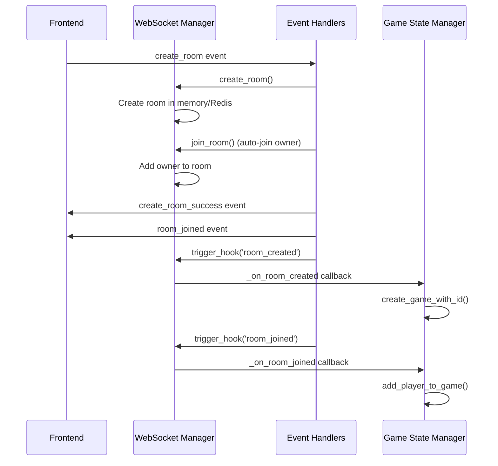
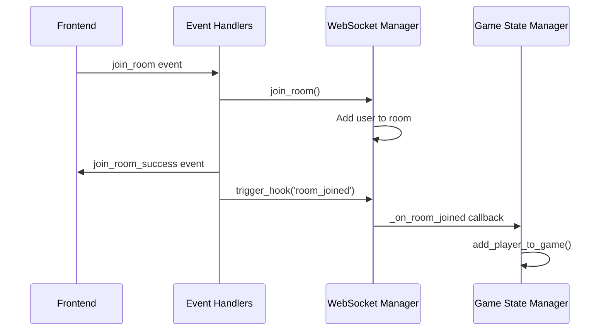
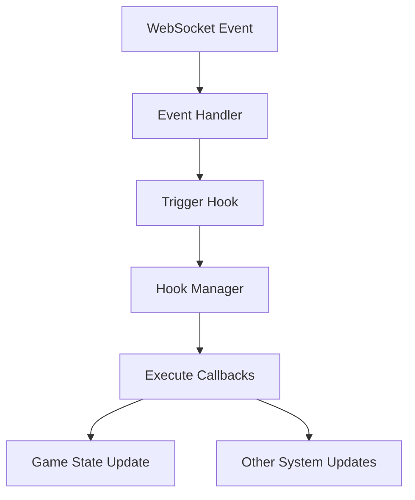
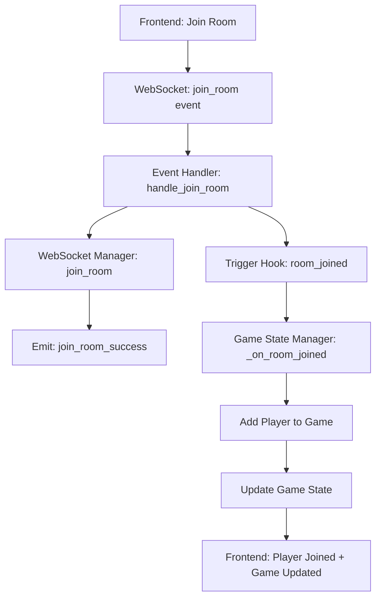

# WebSocket-Recall Module Architecture Documentation

## Overview

This document provides a comprehensive guide to the WebSocket-Recall module architecture, explaining how rooms are created and managed, how games are automatically created, and how the hook system enables decoupled communication between components.

## Table of Contents

1. [Architecture Overview](#architecture-overview)
2. [Core Components](#core-components)
3. [Room Management Flow](#room-management-flow)
4. [Game Management Flow](#game-management-flow)
5. [Hook System](#hook-system)
6. [Data Flow Diagrams](#data-flow-diagrams)
7. [Event Flow](#event-flow)
8. [State Management](#state-management)
9. [Frontend Integration](#frontend-integration)
10. [Troubleshooting](#troubleshooting)

## Architecture Overview

The WebSocket-Recall module follows a **manager-based architecture** with **event-driven communication** through a custom hook system. The architecture ensures:

- **Separation of Concerns**: Room management, game management, and WebSocket handling are separate
- **Decoupled Communication**: Components communicate via hooks rather than direct dependencies
- **Automatic Game Creation**: Games are created automatically when rooms are created
- **State Synchronization**: Game state stays synchronized with room membership
- **Real-time Updates**: Frontend receives real-time updates via WebSocket events

### High-Level Architecture

```
┌─────────────────┐    ┌──────────────────┐    ┌─────────────────┐
│   Frontend      │    │   WebSocket      │    │   Game State    │
│   (Flutter)     │◄──►│   Manager        │◄──►│   Manager       │
└─────────────────┘    └──────────────────┘    └─────────────────┘
                                │
                                ▼
                       ┌──────────────────┐
                       │   Hook System    │
                       │   (Event Bus)    │
                       └──────────────────┘
```

## Core Components

### 1. WebSocket Manager (`websocket_manager.py`)

**Purpose**: Manages WebSocket connections, rooms, and sessions

**Key Responsibilities**:
- WebSocket connection management
- Room creation and management
- Session management
- Room TTL (Time To Live) management
- Hook triggering capabilities

**Key Methods**:
```python
def create_room(self, room_id: str, permission: str, owner_id: str) -> bool
def join_room(self, room_id: str, session_id: str, user_id: str) -> bool
def leave_room(self, room_id: str, session_id: str) -> bool
def trigger_hook(self, hook_name: str, data: dict) -> None
```

### 2. WebSocket Event Handlers (`ws_event_handlers.py`)

**Purpose**: Handles incoming WebSocket events and triggers appropriate hooks

**Key Responsibilities**:
- Process WebSocket events from frontend
- Validate event data
- Trigger appropriate hooks
- Emit response events to frontend

**Key Methods**:
```python
def handle_create_room(self, session_id: str, data: dict) -> bool
def handle_join_room(self, session_id: str, data: dict) -> bool
def handle_leave_room(self, session_id: str, data: dict) -> bool
```

### 3. Game State Manager (`game_state.py`)

**Purpose**: Manages game instances and their state

**Key Responsibilities**:
- Automatic game creation via hooks
- Player management within games
- Game state transitions
- Hook callback registration

**Key Methods**:
```python
def _on_room_created(self, room_data: dict) -> None
def _on_room_joined(self, room_data: dict) -> None
def _on_room_closed(self, room_data: dict) -> None
def _on_leave_room(self, room_data: dict) -> None
```

### 4. Hook Manager (`hooks_manager.py`)

**Purpose**: Manages the event/hook system for decoupled communication

**Key Responsibilities**:
- Hook registration and management
- Callback execution
- Priority-based execution
- Automatic hook creation

**Key Methods**:
```python
def register_hook_callback(self, hook_name: str, callback: callable, priority: int) -> None
def trigger_hook(self, hook_name: str, data: dict, context: dict) -> None
```

## Room Management Flow

### Room Creation Process



**Step-by-Step Breakdown**:

1. **Frontend Request**: User creates room via `create_room` WebSocket event
2. **Room Creation**: `handle_create_room` creates room via `websocket_manager.create_room()`
3. **Auto-Join**: Owner is automatically joined to the room via `websocket_manager.join_room()`
4. **Frontend Events**: `create_room_success` and `room_joined` events are emitted
5. **Game Creation Hook**: `room_created` hook triggers game creation
6. **Player Addition Hook**: `room_joined` hook adds owner to the game

**Key Code Sections**:
```python
# Room creation and auto-join
success = self.websocket_manager.create_room(room_id, permission, owner_id=user_id)
if success:
    join_success = self.websocket_manager.join_room(room_id, session_id, user_id)
    
    # Trigger game creation hook
    self.websocket_manager.trigger_hook('room_created', room_data)
    
    # Trigger player addition hook
    self.websocket_manager.trigger_hook('room_joined', join_room_data)
```

### Room Join Process



**Step-by-Step Breakdown**:

1. **Frontend Request**: User joins room via `join_room` WebSocket event
2. **Room Join**: `handle_join_room` adds user to room via `websocket_manager.join_room()`
3. **Frontend Event**: `join_room_success` event is emitted
4. **Player Addition Hook**: `room_joined` hook adds player to the game

**Key Code Sections**:
```python
# Manual room join
success = self.websocket_manager.join_room(room_id, session_id, user_id)
if success:
    # Trigger player addition hook
    self.websocket_manager.trigger_hook('room_joined', room_data)
```

## Game Management Flow

### Automatic Game Creation

Games are created automatically when rooms are created, ensuring that every room has a corresponding game instance.

**Game Creation Hook Callback**:
```python
def _on_room_created(self, room_data: Dict[str, Any]):
    """Callback for room_created hook - automatically create game"""
    try:
        room_id = room_data.get('room_id')
        max_players = room_data.get('max_players', 4)
        min_players = room_data.get('min_players', 2)
        
        custom_log(f"🎮 [HOOK] Room created: {room_id}, creating game automatically")
        
        # Create game with room_id as game_id
        game_id = self.create_game_with_id(room_id, max_players=max_players, min_players=min_players)
        
        # Initialize game state (waiting for players)
        game = self.get_game(game_id)
        if game:
            game.phase = GamePhase.WAITING_FOR_PLAYERS
            custom_log(f"✅ Game {game_id} created and initialized for room {room_id}")
            
    except Exception as e:
        custom_log(f"❌ Error in _on_room_created callback: {e}", level="ERROR")
```

**Key Points**:
- **Game ID = Room ID**: Ensures consistent identification across the stack
- **Automatic Creation**: No manual game creation needed
- **State Initialization**: Game starts in `WAITING_FOR_PLAYERS` phase
- **Player Limits**: Uses room's `max_players` and `min_players` settings

### Player Management

Players are automatically added to games when they join rooms.

**Player Addition Hook Callback**:
```python
def _on_room_joined(self, room_data: Dict[str, Any]):
    """Callback for room_joined hook - handle player joining existing game"""
    try:
        room_id = room_data.get('room_id')
        user_id = room_data.get('user_id')
        current_size = room_data.get('current_size', 1)
        
        custom_log(f"🎮 [HOOK] Player {user_id} joined room {room_id}, current size: {current_size}")
        
        # Check if game exists for this room
        game = self.get_game(room_id)
        if not game:
            custom_log(f"⚠️ No game found for room {room_id}, this shouldn't happen")
            return
        
        # Add player to the game if they don't exist
        if user_id not in game.players:
            from ..models.player import HumanPlayer
            player = HumanPlayer(user_id, f"Player_{user_id[:8]}")
            game.add_player(player)
            custom_log(f"✅ Added player {user_id} to game {room_id}")
        else:
            custom_log(f"ℹ️ Player {user_id} already exists in game {room_id}")
            
    except Exception as e:
        custom_log(f"❌ Error in _on_room_joined callback: {e}", level="ERROR")
```

**Key Points**:
- **Automatic Addition**: Players are added to games automatically
- **Duplicate Prevention**: Checks if player already exists
- **Game Validation**: Ensures game exists before adding players
- **Player Creation**: Creates `HumanPlayer` instances automatically

## Hook System

### Overview

The hook system enables **decoupled communication** between components. Instead of direct method calls, components register callbacks for specific events and trigger hooks when those events occur.

### Hook Registration

Components register callbacks for specific hooks during initialization:

```python
def _register_hook_callbacks(self):
    """Register hook callbacks for automatic game creation"""
    try:
        # Register callback for room_created hook
        self.app_manager.register_hook_callback('room_created', self._on_room_created)
        custom_log("🎣 [HOOK] Registered room_created callback in GameStateManager")
        
        # Register callback for room_joined hook
        self.app_manager.register_hook_callback('room_joined', self._on_room_joined)
        custom_log("🎣 [HOOK] Registered room_joined callback in GameStateManager")
        
        # Register callback for room_closed hook
        self.app_manager.register_hook_callback('room_closed', self._on_room_closed)
        custom_log("🎣 [HOOK] Registered room_closed callback in GameStateManager")
        
        # Register callback for leave_room hook
        self.app_manager.register_hook_callback('leave_room', self._on_leave_room)
        custom_log("🎣 [HOOK] Registered leave_room callback in GameStateManager")
        
    except Exception as e:
        custom_log(f"❌ Error registering hook callbacks: {e}", level="ERROR")
```

### Hook Triggering

Hooks are triggered when specific events occur:

```python
# Trigger room_created hook for game creation logic
room_data = {
    'room_id': room_id,
    'owner_id': owner_id,
    'permission': permission,
    'max_players': data.get('max_players') or Config.WS_ROOM_SIZE_LIMIT,
    'min_players': data.get('min_players') or 2,
    'game_type': data.get('game_type', 'classic'),
    'turn_time_limit': data.get('turn_time_limit', 30),
    'auto_start': data.get('auto_start', True),
    'created_at': datetime.now().isoformat(),
    'current_size': 1
}
self.websocket_manager.trigger_hook('room_created', room_data)
```

### Available Hooks

| Hook Name | Triggered When | Purpose | Data Structure |
|------------|----------------|---------|----------------|
| `room_created` | Room is created | Create game automatically | Room metadata, player limits |
| `room_joined` | User joins room | Add player to game | User info, room info |
| `room_closed` | Room is closed | Clean up game state | Room ID, closure reason |
| `leave_room` | User leaves room | Remove player from game | Room ID, session ID |

### Hook Data Flow



## Data Flow Diagrams

### Complete Room Creation and Game Setup Flow

```mermaid
flowchart TD
    A[Frontend: Create Room] --> B[WebSocket: create_room event]
    B --> C[Event Handler: handle_create_room]
    C --> D[WebSocket Manager: create_room]
    D --> E[WebSocket Manager: join_room (auto-join)]
    E --> F[Emit: create_room_success]
    E --> G[Emit: room_joined]
    C --> H[Trigger Hook: room_created]
    H --> I[Game State Manager: _on_room_created]
    I --> J[Create Game Instance]
    J --> K[Set Game Phase: WAITING_FOR_PLAYERS]
    C --> L[Trigger Hook: room_joined]
    L --> M[Game State Manager: _on_room_joined]
    M --> N[Add Owner to Game]
    N --> O[Update Game State]
    O --> P[Frontend: Room Created + Game Ready]
```

### Room Join Flow



## Event Flow

### WebSocket Events from Frontend

| Event | Purpose | Data Structure | Handler |
|-------|---------|----------------|---------|
| `create_room` | Create new room | Room settings, player limits | `handle_create_room` |
| `join_room` | Join existing room | Room ID | `handle_join_room` |
| `leave_room` | Leave current room | Room ID | `handle_leave_room` |

### WebSocket Events to Frontend

| Event | Purpose | Data Structure | Triggered When |
|-------|---------|----------------|----------------|
| `create_room_success` | Room creation successful | Room ID, owner ID, settings | Room created successfully |
| `create_room_error` | Room creation failed | Error message | Room creation failed |
| `join_room_success` | Room join successful | Room info, player count | User joined room |
| `join_room_error` | Room join failed | Error message | Room join failed |
| `room_joined` | User joined room | Room info, user info | User joins room |
| `leave_room_success` | Room leave successful | Room ID | User left room |

### Hook Events

| Hook | Purpose | Data Structure | Callback |
|------|---------|----------------|----------|
| `room_created` | Room creation notification | Room metadata | `_on_room_created` |
| `room_joined` | User join notification | User and room info | `_on_room_joined` |
| `room_closed` | Room closure notification | Room ID, reason | `_on_room_closed` |
| `leave_room` | User leave notification | Room ID, session ID | `_on_leave_room` |

## State Management

### Room State

Rooms maintain state in both memory and Redis:

**Memory State**:
```python
self.rooms = {
    'room_id': set(['session_id_1', 'session_id_2'])
}

self.room_data = {
    'room_id': {
        'creator_id': 'user_id',
        'permission': 'public',
        'created_at': 'timestamp',
        'size': 2,
        'allowed_users': set(),
        'allowed_roles': set()
    }
}
```

**Redis State**:
```python
room_data = {
    'room_id': 'room_123',
    'permission': 'public',
    'owner_id': 'user_456',
    'allowed_users': [],
    'allowed_roles': [],
    'created_at': 'timestamp',
    'size': 2
}
```

### Game State

Games maintain state in memory:

```python
self.active_games = {
    'game_id': GameState(
        game_id='room_123',
        max_players=6,
        min_players=2,
        phase=GamePhase.WAITING_FOR_PLAYERS,
        players={},
        current_player_id=None
    )
}
```

### State Synchronization

State is synchronized through the hook system:

1. **Room State Changes** → Trigger hooks
2. **Hook Callbacks** → Update game state
3. **Game State Changes** → Available via API endpoints

## Frontend Integration

### State Subscription

Frontend widgets subscribe to specific state slices:

```dart
// CurrentRoomWidget subscribes to room state
final recallState = StateManager().getModuleState<Map<String, dynamic>>('recall_game') ?? {};

// AvailableGamesWidget subscribes to games state
final availableGames = recallState['availableGames'] as List<dynamic>? ?? [];
```

### WebSocket Event Handling

Frontend handles WebSocket events via `WSEventManager`:

```dart
// WebSocket events update state automatically
// No manual state management needed in widgets
```

### API Integration

Frontend fetches available games via HTTP API:

```dart
final result = await RecallGameHelpers.fetchAvailableGames();
if (result['success'] == true) {
    final games = result['games'] ?? [];
    RecallGameHelpers.updateUIState({
        'availableGames': games,
        'lastUpdated': DateTime.now().toIso8601String(),
    });
}
```

## Troubleshooting

### Common Issues

#### 1. Data Misalignment Between Widgets

**Symptoms**: `CurrentRoomWidget` shows different player count than `AvailableGamesWidget`

**Causes**:
- Missing `room_joined` hook trigger during room creation
- Inconsistent data sources (WebSocket vs API)
- Hook callback failures

**Solutions**:
- Ensure both `room_created` and `room_joined` hooks are triggered during room creation
- Verify hook callbacks are registered and working
- Check logs for hook execution

#### 2. Games Not Created Automatically

**Symptoms**: Rooms exist but no corresponding games

**Causes**:
- `room_created` hook not triggered
- Hook callback not registered
- Game creation callback failure

**Solutions**:
- Verify `room_created` hook is triggered in `handle_create_room`
- Check that `GameStateManager` registers callbacks during initialization
- Review logs for hook execution and callback errors

#### 3. Players Not Added to Games

**Symptoms**: Players in rooms but not in games

**Causes**:
- `room_joined` hook not triggered
- Hook callback failure
- Game instance not found

**Solutions**:
- Ensure `room_joined` hook is triggered for both manual joins and auto-joins
- Verify game instances exist before adding players
- Check hook callback registration and execution

### Debug Commands

#### Check Hook Registration
```python
# In Python console or logs
custom_log("Registered hooks:", self.hooks_manager.get_registered_hooks())
```

#### Check Hook Callbacks
```python
# In Python console or logs
custom_log("Room created callbacks:", self.hooks_manager.get_hook_callbacks('room_created'))
```

#### Check Game State
```python
# In Python console or logs
custom_log("Active games:", self.game_state_manager.get_all_games())
```

### Log Analysis

Key log patterns to monitor:

```
🎣 [HOOK] room_created hook triggered with data: {...}
🎮 [HOOK] Room created: room_123, creating game automatically
✅ Game room_123 created and initialized for room room_123
🎣 [HOOK] room_joined hook triggered with data: {...}
🎮 [HOOK] Player user_456 joined room room_123, current size: 1
✅ Added player user_456 to game room_123
```

## Best Practices

### 1. Hook Usage

- **Always register callbacks** during component initialization
- **Use descriptive hook names** that clearly indicate purpose
- **Include comprehensive data** in hook payloads
- **Handle hook failures gracefully** with proper error logging

### 2. State Management

- **Single source of truth** for each data type
- **Consistent data structures** across hooks and events
- **Proper error handling** for state updates
- **State validation** before updates

### 3. Event Handling

- **Validate all input data** before processing
- **Emit events consistently** with expected data structures
- **Handle errors gracefully** with informative error messages
- **Log all significant operations** for debugging

### 4. Game State Synchronization

- **Automatic game creation** via hooks
- **Immediate player addition** when joining rooms
- **Consistent game identification** (game_id = room_id)
- **Proper cleanup** when rooms are closed

## Conclusion

The WebSocket-Recall module architecture provides a robust, scalable foundation for real-time multiplayer games. The hook system enables clean separation of concerns while maintaining tight synchronization between room and game state.

Key architectural benefits:
- **Decoupled components** that communicate via events
- **Automatic state management** reducing manual intervention
- **Real-time updates** ensuring consistent user experience
- **Extensible design** allowing easy addition of new features

This architecture ensures that the Recall card game can handle complex multiplayer scenarios while maintaining clean, maintainable code.
