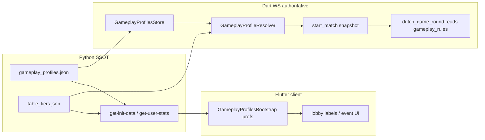

# Adding and wiring a gameplay profile (full guide)

Step-by-step guide for declaring a new Dutch **gameplay profile**, connecting it to a **special event**, deploying it through the catalog pipeline, and verifying runtime behavior.

**Schema reference:** [GAMEPLAY_PROFILES.md](./GAMEPLAY_PROFILES.md)  
**Special events / tiers:** [TABLE_TIERS.md](./TABLE_TIERS.md)  
**Hot reload ops:** [CATALOG_ADDITION_AND_HOT_RELOAD.md](./CATALOG_ADDITION_AND_HOT_RELOAD.md)

---

## Two kinds of changes

| Kind | When | What you edit |
|------|------|----------------|
| **Profile preset (JSON only)** | New rules combine existing primitives (`flags`, `timers`, `deck`, `deal`, `scoring`, `win_conditions`) | `gameplay_profiles.json` + optional `table_tiers.json` link |
| **New rule primitive (code)** | You need behavior that does not exist yet (new flag, timer phase, win path, deck mode) | Python validator + Dart/Flutter `GameRulesContext` + `dutch_game_round.dart` (+ CPU factory if AI must respect it) |

Most work is **JSON only**. The sections below walk through a complete JSON example first, then explain when and how to add code.

---

## End-to-end flow (runtime)



**Important:** Match rules are **snapshotted on Dart WS at `start_match`** into `game_state.gameplay_rules`, `match_class`, `isClearAndCollect`, and merged `timerConfig`. Mid-match catalog edits do not affect active games.

---

## Example A — JSON-only profile + special event (recommended path)

Goal: add **`turbo_collector`** — collection mode with shorter timers — and wire it to a new special event **`cards_rush`**.

### 1. Add the profile (Python canonical JSON)

Edit [gameplay_profiles.json](../../python_base_04/core/modules/dutch_game/config/gameplay_profiles.json):

```json
{
  "schema_version": 1,
  "profiles": {
    "classic": { "...": "unchanged" },
    "turbo_collector": {
      "id": "turbo_collector",
      "label": "Turbo Collector",
      "description": "Clear and collect with fast turn timers.",
      "extends": "collector",
      "timers": {
        "drawing_card": 3,
        "playing_card": 8,
        "same_rank_window": 3,
        "queen_peek": 6,
        "jack_swap": 6
      }
    }
  }
}
```

Notes:

- **`extends`** merges parent → child. Here `collector` already sets `clear_and_collect` and `four_of_a_kind_collection`; you only override timers.
- Profile ids must match `^[A-Za-z0-9_-]+$`.
- Unknown top-level or section keys are **rejected at load** (see validation in `gameplay_profiles_catalog.py`).

### 2. Mirror to Dart WS bundled config

Copy the same profile block into [dart_bkend_base_01/config/gameplay_profiles.json](../../dart_bkend_base_01/config/gameplay_profiles.json).  
Dart WS loads this file on disk when Python init-config is unavailable; keep mirrors identical to Python.

### 3. Link a special event

In [table_tiers.json](../../python_base_04/core/modules/dutch_game/config/table_tiers.json), add or update a row under `special_events`:

```json
{
  "id": "cards_rush",
  "title": "Cards Rush",
  "description": "Collection mode — fast timers.",
  "gameplay_profile_id": "turbo_collector",
  "coin_fee": 35,
  "min_user_level": 2,
  "metadata": {
    "rewards": { "coins": "75" },
    "end_match_modal": {
      "background_image_file": "cards_rush_background.webp"
    }
  },
  "style": {
    "overlay_image_file": "table_design_overlay_cards_rush.webp"
  }
}
```

- **`gameplay_profile_id`** must reference an existing profile id (validated on catalog load/reload).
- Omitting `gameplay_profile_id` defaults to **`classic`**.
- Sync [dart_bkend_base_01/config/table_tiers.json](../../dart_bkend_base_01/config/table_tiers.json) as well.

### 4. Validate locally (Python)

```bash
cd python_base_04
python3 -m pytest tests/unit/test_gameplay_profiles_catalog.py -q
python3 -c "
from core.modules.dutch_game import gameplay_profiles_catalog as gpc
p = gpc.resolve_profile('turbo_collector')
assert p['flags']['clear_and_collect'] is True
assert p['timers']['playing_card'] == 8
print('ok', p['label'])
"
```

Optional: add a unit test in [test_gameplay_profiles_catalog.py](../../python_base_04/tests/unit/test_gameplay_profiles_catalog.py) for the new profile.

### 5. Deploy / hot reload

```bash
# From repo root — reloads table_tiers + gameplay_profiles + consumables in Python
python3 playbooks/00_local/reload_dutch_catalogs.py
```

Then either:

- **Restart Dart WS** (picks up mirrored JSON from disk), or
- Let Dart WS **`fetchInitConfig()`** apply Python payload on next boot, and call **`GameplayProfileResolver.reloadCatalogsFromDisk()`** if your ops script triggers it.

Flutter clients refresh when `client_gameplay_profiles_revision` is stale (sent from `dutch_game_helpers.dart` on init-data / stats).

### 6. Verify in logs

Launch with `playbooks/frontend/run_*_to_global_log.sh` and set `LOGGING_SWITCH = true` in the trace files you care about. Expect lines like:

| Layer | Example line |
|-------|----------------|
| Flutter prefs | `GameplayProfilesBootstrap.hydrateFromPrefsBeforeStats: profile_count=6` |
| Flutter init-data | `GameplayProfilesBootstrap.mergeStatsEnvelope: full payload profile_count=6 …` |
| Dart WS store | `GameplayProfilesStore: loaded 6 profiles from ./config/gameplay_profiles.json` |
| Dart WS match | `GameEventCoordinator.start_match: … special_event_id=cards_rush profile=turbo_collector clear_and_collect=true …` |

Join the **`cards_rush`** event from the lobby and confirm collection + shorter timers in play.

---

## Example B — Reuse an existing profile on an event (no new profile JSON)

`red_king_royale` already exists in the catalog but had no pilot event. Wire it only in `table_tiers.json`:

```json
{
  "id": "royale_night",
  "title": "Royale Night",
  "description": "Red kings are worth zero.",
  "gameplay_profile_id": "red_king_royale",
  "coin_fee": 40,
  "min_user_level": 3
}
```

Same sync + reload steps as Example A. No `gameplay_profiles.json` edit required.

---

## What gets wired automatically (no extra code for v1 primitives)

Once the snapshot exists in `game_state`, these components read **`GameRulesContext.fromGameState(gameState)`**:

| Primitive | JSON path | Runtime effect |
|-----------|-----------|----------------|
| Collection mode | `flags.clear_and_collect` | Collection piles, rank clears, CPU collection strategy |
| Same-rank window | `flags.same_rank_out_of_turn` | Out-of-turn rank matching |
| Queen / Jack powers | `flags.queen_peek`, `flags.jack_swap` | Power phases; CPU factory skips when disabled |
| Dutch call | `flags.dutch_call` | Dutch phase trigger |
| Discard take | `flags.discard_take_allowed` | Draw from discard pile |
| Deal size | `deal.cards_per_hand`, `deal.initial_peek_count` | Cards dealt at `start_match` |
| Timers | `timers.*` | Merged into `game_state.timerConfig` at start |
| Deck | `deck.source` | `standard` / `demo` / `testing` deck selection |
| Red king score | `scoring.red_king_points` | Point calculation (0 = free red kings) |
| Win paths | `win_conditions.*` | Empty hand, Dutch lowest points, four-of-a-kind instant win |

**Match start (Dart WS)** — [game_event_coordinator.dart](../../dart_bkend_base_01/lib/modules/dutch_game/backend_core/coordinator/game_event_coordinator.dart):

```dart
final profileSnapshot = GameplayProfileResolver.resolveSnapshot(
  specialEventId: specialEventIdEarly,
  profileId: data['gameplay_profile_id']?.toString(),
);
final matchRules = GameRulesContext(profileSnapshot);
// …
gameState['match_class'] = matchRules.profileId;
gameState['gameplay_rules'] = matchRules.toSnapshot();
gameState['isClearAndCollect'] = specialEventId != null
    ? matchRules.clearAndCollect
    : _parseBoolValue(data['isClearAndCollect'], defaultValue: true);
gameState['timerConfig'] = GameplayProfileResolver.mergeTimerConfig(profileSnapshot);
```

**Special-event matches:** when `special_event_id` is set, server profile is **authoritative**; client `isClearAndCollect` in the `start_match` payload is ignored.

**Flutter mirror:** same coordinator + resolver under `flutter_base_05/lib/modules/dutch_game/backend_core/` (practice / local paths). Lobby labels use [gameplay_profiles_bootstrap.dart](../../flutter_base_05/lib/modules/dutch_game/utils/gameplay_profiles_bootstrap.dart):

```dart
GameplayProfilesBootstrap.profileLabelForSpecialEvent(eventRow);
// → reads gameplay_profile_id → label from cached catalog
```

---

## Example C — Adding a **new rule primitive** (code change)

Only needed when JSON keys above are not enough. Example: add `flags.allow_joker_wild` for a future wild-joker rule.

### 1. Extend the schema allowlists (Python)

In [gameplay_profiles_catalog.py](../../python_base_04/core/modules/dutch_game/gameplay_profiles_catalog.py):

- Add `"allow_joker_wild"` to `_FLAG_KEYS`.
- Document default in validation if required.

### 2. Expose on `GameRulesContext` (Dart WS + Flutter mirror)

In both:

- `dart_bkend_base_01/.../game_rules_context.dart`
- `flutter_base_05/.../game_rules_context.dart`

```dart
bool get jokerWildEnabled => _flag('allow_joker_wild', defaultValue: false);
```

Update `_legacyFallback` defaults if legacy rooms need a sensible default.

### 3. Implement gameplay logic

In both `dutch_game_round.dart` mirrors, branch on the new getter:

```dart
final rules = GameRulesContext.fromGameState(gameState);
if (rules.jokerWildEnabled) {
  // wild joker behavior
}
```

If CPUs must respect it, update [computer_player_factory.dart](../../dart_bkend_base_01/lib/modules/dutch_game/backend_core/shared_logic/utils/computer_player_factory.dart) (and Flutter mirror).

### 4. Declare profiles using the new flag

```json
"joker_party": {
  "id": "joker_party",
  "label": "Joker Party",
  "extends": "classic",
  "flags": { "allow_joker_wild": true }
}
```

### 5. Tests

- Python: catalog loads flag; `resolve_profile` merge correct.
- Dart/Flutter: unit test on `GameRulesContext` getter (if you have round tests, add a scenario).

**Do not** add per-profile `if (profileId == 'joker_party')` in round logic — always read the **snapshot flags** so JSON remains SSOT.

---

## Init-data and client cache

| Key | Role |
|-----|------|
| `gameplay_profiles_revision` | Content hash; client sends `client_gameplay_profiles_revision` when stale |
| `gameplay_profiles` | Full document (only when revision differs or client has none) |

Python builds payload in `gameplay_profiles_catalog.build_client_gameplay_profiles_payload`.  
Flutter persists via `GameplayProfilesBootstrap.mergeStatsEnvelope` → SharedPreferences.  
Dart WS applies via `PythonApiClient.fetchInitConfig()` → `GameplayProfilesStore.applyDocument`.

---

## File checklist (new profile + event)

| Step | File / action |
|------|----------------|
| 1 | `python_base_04/core/modules/dutch_game/config/gameplay_profiles.json` |
| 2 | `dart_bkend_base_01/config/gameplay_profiles.json` (mirror) |
| 3 | `python_base_04/core/modules/dutch_game/config/table_tiers.json` (`gameplay_profile_id`) |
| 4 | `dart_bkend_base_01/config/table_tiers.json` (mirror) |
| 5 | Event media under `app_media/media/event_media/<event_id>/` (if new event UI) |
| 6 | `python3 playbooks/00_local/reload_dutch_catalogs.py` |
| 7 | Restart Dart WS or refresh catalogs |
| 8 | Flutter cold start or wait for revision bump on init-data |
| 9 | Optional: unit test in `test_gameplay_profiles_catalog.py` |
| 10 | Verify `global.log` match-start line for profile id |

---

## v1 primitive reference (quick copy)

Valid `flags` keys:

`clear_and_collect`, `same_rank_out_of_turn`, `queen_peek`, `jack_swap`, `dutch_call`, `discard_take_allowed`

Valid `deck.source` values: `standard`, `demo`, `testing`

Valid `timers` keys (merge over server defaults):

`initial_peek`, `drawing_card`, `playing_card`, `same_rank_window`, `queen_peek`, `jack_swap`, `peeking`, `waiting`, `default`

Valid `win_conditions` keys:

`empty_hand`, `lowest_points_after_dutch`, `four_of_a_kind_collection`

---

## Built-in profiles (reference)

| ID | Extends | Distinct behavior |
|----|---------|-------------------|
| `classic` | — | Default Dutch |
| `collector` | `classic` | Clear and collect + four-of-a-kind win |
| `speed_classic` | `classic` | Shorter turn timers |
| `no_powers` | `classic` | Queen/Jack powers off |
| `red_king_royale` | `classic` | `red_king_points: 0` |

Pilot events today: `dutch_explorer` → `collector`, `the_challenger` → `speed_classic`, `dutch_fan` → `no_powers`.

---

## Related code map

| Concern | Location |
|---------|----------|
| Python load / validate / reload | `gameplay_profiles_catalog.py`, `catalog_hot_reload.py` |
| Event → profile id | `table_tiers.json`, `LevelMatcher.specialEventRowById` |
| Resolve + timer merge | `gameplay_profile_resolver.dart` |
| In-memory store | `gameplay_profiles_store.dart` (Dart WS + Flutter) |
| Match snapshot | `game_event_coordinator.dart` `start_match` |
| In-round rules | `game_rules_context.dart`, `dutch_game_round.dart` |
| CPU behavior | `computer_player_factory.dart` |
| Flutter cache | `gameplay_profiles_bootstrap.dart`, `dutch_game_helpers.dart` |
| API envelope | `api_endpoints.py` `_attach_declarative_catalogs` |

---

## Troubleshooting

| Symptom | Likely cause |
|---------|----------------|
| Event starts with `profile=classic` | Missing/wrong `gameplay_profile_id` on event; Dart `table_tiers.json` mirror stale |
| Python reload fails | `gameplay_profile_id` references unknown profile; fix JSON or add profile first |
| Flutter shows old label | Revision-only init-data response; prefs still valid — bump revision or clear prefs |
| Rules wrong mid-match | Expected — snapshot is at start; start a new match after reload |
| Logs missing | `LOGGING_SWITCH = true` in trace file + launch with `DUTCH_DEV_LOG=1` / global-log scripts |
