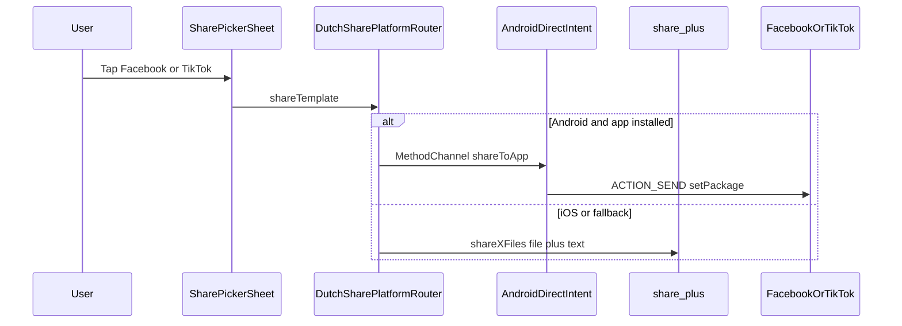
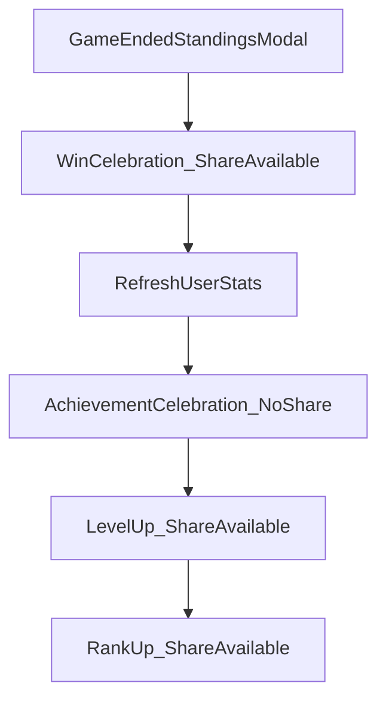

# Dutch — Social sharing system

Celebration sharing on **win**, **level up**, and **rank up** uses **bundled Flutter assets** (images / videos). **Hybrid routing (Option B):** on **Android**, Facebook and TikTok open **directly** via `ACTION_SEND` + `setPackage`; on **iOS** (and when direct share fails), **`share_plus`** opens the OS share sheet. No Meta/TikTok developer SDK registration in this phase.

---

## Table of contents

1. [User flow](#user-flow)
2. [Hybrid platform routing](#hybrid-platform-routing)
3. [Where Share appears](#where-share-appears)
4. [Asset layout (SSOT)](#asset-layout-ssot)
5. [Platform templates](#platform-templates)
6. [Accompanying text (link vs caption)](#accompanying-text-link-vs-caption)
7. [Store URLs](#store-urls)
8. [Code architecture](#code-architecture)
9. [Analytics](#analytics)
10. [Adding a new platform](#adding-a-new-platform)
11. [Adding a new celebration moment](#adding-a-new-celebration-moment)
12. [Web behaviour](#web-behaviour)
13. [Out of scope](#out-of-scope)
14. [Troubleshooting](#troubleshooting)
15. [Manual QA checklist](#manual-qa-checklist)
16. [Future work](#future-work)

---

## User flow



1. Player taps **Share** on a celebration screen → platform picker (Facebook / TikTok).
2. App copies the bundled asset to a temp file.
3. **Android:** opens Facebook (`com.facebook.katana`) or TikTok (`com.zhiliaoapp.musically` / `com.ss.android.ugc.trill`) directly with image/video + text.
4. **iOS / fallback:** `share_plus` share sheet; user picks destination app.
5. Analytics record `share_method`: `direct_android` | `share_plus` | `link_only`.

---

## Hybrid platform routing

Based on official guidance:

| Source | Finding |
|--------|---------|
| [share_plus](https://pub.dev/packages/share_plus) | Wraps `ACTION_SEND` / `UIActivityViewController`; Meta apps may ignore shared text ([#413](https://github.com/fluttercommunity/plus_plugins/issues/413)) |
| [Android Intent](https://developer.android.com/reference/android/content/Intent) | `ACTION_SEND`, `EXTRA_STREAM`, `Intent.setPackage()` for single-app share |
| [TikTok Share Kit — Intents](https://developers.tiktok.com/doc/share-kit-android-quickstart-v2) | Documented intent path without OpenSDK registration |

### Android native pieces

| File | Purpose |
|------|---------|
| [`AndroidManifest.xml`](../../flutter_base_05/android/app/src/main/AndroidManifest.xml) | `FileProvider` authority `${applicationId}.dutch_share`; `<queries>` for Facebook/TikTok packages |
| [`dutch_share_paths.xml`](../../flutter_base_05/android/app/src/main/res/xml/dutch_share_paths.xml) | Exposes cache dir for share temp files |
| [`DutchDirectShareHandler.kt`](../../flutter_base_05/android/app/src/main/kotlin/com/reignofplay/dutch/DutchDirectShareHandler.kt) | Builds intent, `FileProvider` URI, install checks |
| [`MainActivity.kt`](../../flutter_base_05/android/app/src/main/kotlin/com/reignofplay/dutch/MainActivity.kt) | MethodChannel `com.reignofplay.dutch/direct_share` |

### MethodChannel API

| Method | Returns |
|--------|---------|
| `isAppInstalled` | `bool` |
| `resolveTikTokPackage` | First installed TikTok package or null |
| `shareToApp` | `success` \| `app_not_installed` \| `error` |

### iOS policy

No direct `setPackage` equivalent. Facebook/TikTok picker rows use **`share_plus`** with `sharePositionOrigin` (required on iPad). Do not use undocumented `fb://` / `tiktok://` URL schemes.

### Known limitation

Facebook may still **drop link text** on direct Android intent; image share is the reliable part. Full link reliability requires [Meta Sharing SDK](https://developers.facebook.com/docs/sharing) (future Option A).

---

## Where Share appears

| Moment | Screen | Trigger | Share button |
|--------|--------|---------|--------------|
| **Win** | `DutchWinCelebrationScreen` | Current user is an actual winner after game end (`winType != null`) | Yes — below **Continue** |
| **Level up** | `DutchPromotionScreen` (`DutchPromotionKind.levelUp`) | Stored level increased after post-game stats refresh | Yes — below action row |
| **Rank up** | `DutchPromotionScreen` (`DutchPromotionKind.rankUp`) | Stored rank increased (may show after level-up in same session) | Yes — below action row |

Post-game order (simplified):



### Not covered by this system

| UI | Share |
|----|-------|
| Achievement unlock (`DutchAchievementCelebrationScreen`) | No |
| Achievements list (`/dutch/achievements`) | No |
| Game-ended standings modal | No (share is on fullscreen win celebration only) |
| Lobby “Copy Game ID” | Clipboard only — not social share |

---

## Asset layout (SSOT)

Files live under **`flutter_base_05/assets/share/`**. Paths are declared in code (`DutchShareTemplateCatalog`) — if a file is missing at runtime, share shows an error snackbar.

### Required directory tree

```
flutter_base_05/assets/share/
  win/
    facebook.webp          # Facebook image template
    tiktok.mp4             # TikTok video template
  level_up/
    facebook.webp
    tiktok.mp4
  rank_up/
    facebook.webp
    tiktok.mp4
```

### `pubspec.yaml`

The share folder is registered explicitly:

```yaml
flutter:
  assets:
    - assets/share/win/
    - assets/share/level_up/
    - assets/share/rank_up/
```

Flutter does not recurse into subfolders from `assets/share/` alone — each moment directory must be listed (or each file path). Update **`DutchShareTemplateCatalog`** if you change filenames or extensions.

### Media guidelines (recommended)

| Platform | Kind | Suggested format | Notes |
|----------|------|------------------|-------|
| Facebook | Image | `.webp`, `.png`, or `.jpg` | Static creative; link goes in share **text**, not baked into image unless desired for preview |
| TikTok | Video | `.mp4` (H.264) | Vertical 9:16 typical; caption goes in share **text** |

MIME types are inferred from the file extension in `DutchShareAssetLoader` (`.webp` → `image/webp`, `.mp4` → `video/mp4`, etc.).

---

## Platform templates

Catalog SSOT: [`flutter_base_05/lib/modules/dutch_game/utils/dutch_share_template_catalog.dart`](../../flutter_base_05/lib/modules/dutch_game/utils/dutch_share_template_catalog.dart)

| Moment | Platform | Asset path | Media | Text kind |
|--------|----------|------------|-------|-----------|
| Win | Facebook | `assets/share/win/facebook.webp` | Image | Store link only |
| Win | TikTok | `assets/share/win/tiktok.mp4` | Video | TikTok caption |
| Level up | Facebook | `assets/share/level_up/facebook.webp` | Image | Store link only |
| Level up | TikTok | `assets/share/level_up/tiktok.mp4` | Video | TikTok caption |
| Rank up | Facebook | `assets/share/rank_up/facebook.webp` | Image | Store link only |
| Rank up | TikTok | `assets/share/rank_up/tiktok.mp4` | Video | TikTok caption |

Each `DutchShareTemplate` has:

- **`assetPath`** — Flutter bundle path
- **`mediaKind`** — `image` | `video`
- **`textKind`** — how accompanying share-sheet text is built (see below)

---

## Accompanying text (link vs caption)

Resolved in `DutchShareHelper.shareTextFor()`:

| `DutchShareTextKind` | Used for | Example output |
|----------------------|----------|----------------|
| `storeLink` | Facebook | `https://play.google.com/store/apps/details?id=com.reignofplay.dutch` |
| `tiktokCaption` | TikTok | `Play Dutch Card Game!\n{store_url}` |

Celebration copy (winner name, level delta, etc.) is **not** in share text — it should be in the **image/video creative** you provide.

To change TikTok caption wording, edit `shareTextFor()` in `dutch_share_helper.dart`, or extend the catalog with per-template caption strings later.

---

## Store URLs

Compile-time defines on [`Config`](../../flutter_base_05/lib/utils/consts/config.dart):

| Define | Default | Use |
|--------|---------|-----|
| `PLAY_STORE_URL` | `https://play.google.com/store/apps/details?id=com.reignofplay.dutch` | Android + fallback |
| `APP_STORE_URL` | `''` | iOS when set |

Set in repo-root dart-define env files consumed by launch playbooks (see [`playbooks/frontend/00_documentation.md`](../../playbooks/frontend/00_documentation.md)):

```bash
PLAY_STORE_URL=https://play.google.com/store/apps/details?id=com.reignofplay.dutch
APP_STORE_URL=https://apps.apple.com/app/idXXXXXXXXXX
```

**iOS:** If `APP_STORE_URL` is empty, share text falls back to the Play Store URL until marketing provides the App Store link.

---

## Code architecture

No dedicated Manager — module utilities under `dutch_game`, consistent with other Dutch helpers.

```
flutter_base_05/lib/modules/dutch_game/
  utils/
    dutch_share_moment.dart
    dutch_share_platform.dart
    dutch_share_template.dart
    dutch_share_template_catalog.dart
    dutch_share_asset_loader.dart
    dutch_share_package_names.dart    # Android package IDs (Dart/Kotlin SSOT)
    dutch_direct_share_channel.dart   # MethodChannel bridge
    dutch_share_platform_router.dart  # Android direct vs share_plus
    dutch_share_method.dart           # Analytics share_method values
    dutch_share_helper.dart           # Picker entry + analytics
  widgets/ui_kit/
    dutch_share_cta_button.dart
    dutch_share_picker_sheet.dart
```

### Runtime steps (`DutchSharePlatformRouter.shareTemplate`)

1. Copy asset → temp file (`DutchShareAssetLoader`).
2. **Android + Facebook/TikTok:** resolve package → `shareToApp` via MethodChannel.
3. On success → `share_method: direct_android`.
4. Otherwise → `Share.shareXFiles` with `sharePositionOrigin` → `share_method: share_plus`.
5. **Web** → text only → `share_method: link_only`.

---

## Analytics

Firebase via `AnalyticsService` (GA4). Event names and parameters:

| Event | When | Parameters |
|-------|------|------------|
| `dutch_share_picker_opened` | Share button → sheet shown | `moment`: `win` \| `level_up` \| `rank_up` |
| `dutch_share_tapped` | Platform row chosen | `moment`, `platform`: `facebook` \| `tiktok` |
| `dutch_share_completed` | After share completes | `moment`, `platform`, `status`, **`share_method`**: `direct_android` \| `share_plus` \| `link_only` |

---

## Adding a new platform

Example: **Instagram** (image + link, same pattern as Facebook).

1. **`dutch_share_platform.dart`** — add `instagram` to `DutchSharePlatform`; add label in extension.
2. **`dutch_share_template_catalog.dart`** — for each moment, add entry with asset path and `textKind: storeLink` (or a new text kind if captions differ).
3. **`dutch_share_picker_sheet.dart`** — `_PlatformTile` subtitle/icon logic if Instagram needs custom copy.
4. **Assets** — drop `instagram.webp` (or `.png`) under each moment folder; update catalog paths.
5. **Tests** — extend `test/unit/dutch_share_helper_test.dart`.

Platforms appear in the picker automatically when listed in `_byMoment` for that celebration moment.

---

## Adding a new celebration moment

Example: **achievement unlock**.

1. Add `achievement` to `DutchShareMoment` (+ `analyticsValue`).
2. Register templates in `DutchShareTemplateCatalog` under a new folder, e.g. `assets/share/achievement/`.
3. Add `DutchShareCtaButton` to `DutchAchievementCelebrationScreen`.
4. Wire post-game or achievement handler if the moment is not already on a celebration screen.

---

## Web behaviour

On **web** (`kIsWeb`), media share is skipped: only **link/caption text** is shared via `Share.shareWithResult()`. For full web image/video share, a separate approach (download + copy) would be needed.

---

## Out of scope

| Feature | Status |
|---------|--------|
| Room invite deep links (`dutch://`, universal links) | Not implemented |
| Referral codes in share URL | Not implemented |
| Per-network SDKs (Facebook SDK, TikTok OpenSDK) | Not used — hybrid intents + share_plus only |
| Dynamic screenshot / widget capture | Removed in favour of bundled assets |
| Achievement share | Planned; same template pattern |

---

## Troubleshooting

| Symptom | Likely cause | Fix |
|---------|--------------|-----|
| Snackbar: *Share file missing. Add assets/share/…* | File not in bundle or wrong path | Add file under `assets/share/`; match path in `DutchShareTemplateCatalog`; rebuild app |
| Facebook opens but no link in post | Meta strips `EXTRA_TEXT` | Expected without Meta SDK; link may need to be in image creative |
| TikTok not opening on Android | App not installed or regional package | Falls back to share sheet; install TikTok or check package queries |
| iPad share crash | Missing `sharePositionOrigin` | Picker passes tile bounds via `DutchSharePlatformRouter.shareOriginFromContext` |
| iOS shares Play Store link on iPhone | `APP_STORE_URL` not set | Add define in `.env.dart.defines.prod` / local |
| Empty share text | Store URL defines empty | Set `PLAY_STORE_URL` / `APP_STORE_URL` |
| Picker shows no options | Catalog empty for moment | Check `_byMoment` map in catalog |
| Tests pass but device fails | Assets not committed / CI bundle | Ensure media files are in repo and listed under `assets/share/` |

### Verify locally

```bash
cd flutter_base_05
flutter test test/unit/dutch_share_helper_test.dart
```

On device: win a match → **Share** → Facebook → confirm image + URL in target app.

---

## Manual QA checklist

| # | Platform | Steps | Expected |
|---|----------|-------|----------|
| 1 | Android | Share → Facebook (app installed) | Facebook opens with image; analytics `share_method=direct_android` |
| 2 | Android | Share → TikTok (app installed) | TikTok opens with video + caption |
| 3 | Android | Uninstall Facebook → Share → Facebook | OS share sheet fallback (`share_plus`) |
| 4 | iOS | Share → Facebook or TikTok | Share sheet with file + text; user picks app |
| 5 | Any | Cancel share sheet | No error snackbar; `status=dismissed` |
| 6 | Any | Missing asset file | Snackbar *Share file missing*; `status=missing_asset` |

---

## Future work

- Meta Facebook Sharing SDK + TikTok OpenSDK (Option A) for reliable FB links and iOS direct share.
- Optional JSON/YAML catalog for paths (avoid Dart edits for marketing renames).
- Per-moment TikTok captions (catalog field instead of single `tiktokCaption` string).
- Universal / app links in share text when backend + manifest support room invites.
- Instagram / X as first-class picker rows when creatives exist.

---

## Related documentation

- [`Documentation/flutter_base_05/ARCHITECTURE.md`](../flutter_base_05/ARCHITECTURE.md) — short architecture pointer
- [`playbooks/frontend/00_documentation.md`](../../playbooks/frontend/00_documentation.md) — dart-define SSOT for store URLs
