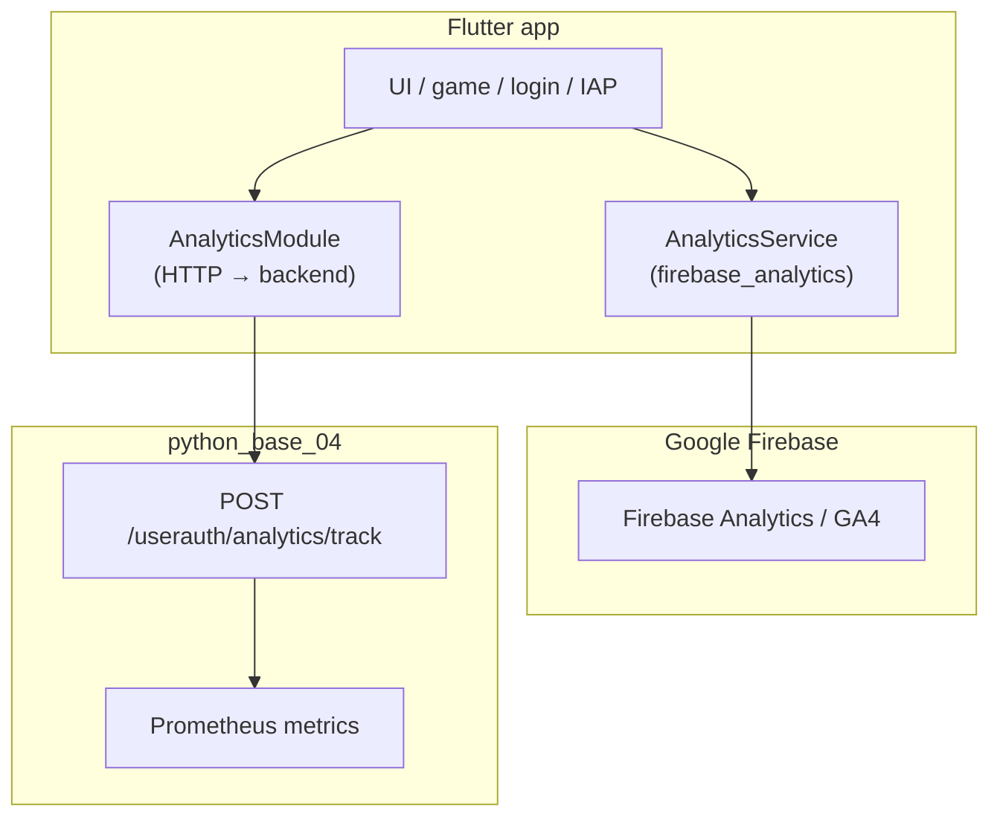

# Firebase Implementation (Flutter Client)

Complete reference for how Firebase is wired in the Dutch app (`flutter_base_05`). This covers native Android/iOS, build configuration, runtime switches, and every GA4 event emitted from the client.

**Scope:** Firebase is used **only for Google Analytics (GA4)** on native mobile. There is no Firebase Auth, Cloud Messaging, Firestore, Remote Config, Crashlytics, or Performance Monitoring in the production app.

**Related docs:**
- Backend Prometheus metrics: [OVERVIEW.md](./OVERVIEW.md)
- Client analytics flowchart: [Documentation/00_FlowCharts/charts/end-to-end/firebase/client-analytics-flow.mmd](../00_FlowCharts/charts/end-to-end/firebase/client-analytics-flow.mmd)
- iOS/Android version pins: [Documentation/Android_V_ios/README.md](../Android_V_ios/README.md)
- Sharing analytics events: [Documentation/Sharing/SHARING_SYSTEM.md](../Sharing/SHARING_SYSTEM.md)

---

## 1. Firebase project

| Field | Value |
|-------|-------|
| **Project ID** | `dutch-mt` |
| **Project number** | `851791240618` |
| **Storage bucket** | `dutch-mt.firebasestorage.app` |
| **Android package** | `com.reignofplay.dutch` |
| **iOS / macOS bundle ID** | `com.reignofplay.dutch` |

Registered app IDs (from `flutter_base_05/firebase.json`):

| Platform | Firebase App ID |
|----------|-----------------|
| Android | `1:851791240618:android:5a93156055ac2e071e9fd3` |
| iOS / macOS | `1:851791240618:ios:aaba0fb606406b351e9fd3` |
| Web | `1:851791240618:web:ede6432d0b6b26fc1e9fd3` |
| Windows | `1:851791240618:web:2dbfd8d9931959881e9fd3` |

The Python backend (`python_base_04`) does **not** use Firebase. Server-side product metrics go through Prometheus/Grafana (see [OVERVIEW.md](./OVERVIEW.md)).

---

## 2. Architecture overview

The app runs **two parallel analytics paths**:



| Path | Class | Destination | Purpose |
|------|-------|-------------|---------|
| **Firebase GA4** | `AnalyticsService` | Google Analytics | Product funnels, screen views, IAP/AdMob events, sharing |
| **Backend analytics** | `AnalyticsModule` | `POST /userauth/analytics/track` | Sessioned events → MongoDB + Prometheus |

`NavigationManager` calls **both** on route change: `AnalyticsModule.trackScreenView()` and `AnalyticsService.logScreenView()`.

Global Flutter errors in `main.dart` are tracked via `AnalyticsModule.trackError()` only (not Firebase).

---

## 3. Flutter packages

From `flutter_base_05/pubspec.yaml`:

```yaml
firebase_core: 3.3.0
firebase_analytics: 11.0.0
```

**Version pins (Xcode 15.2 / macOS Ventura):**

| Package | Pinned | Reason |
|---------|--------|--------|
| `firebase_core` | 3.3.0 | 3.4+ pulls Firebase iOS 11.x with Swift 6 APIs that fail on Xcode 15.2 |
| `firebase_analytics` | 11.0.0 | Matches `firebase_core` 3.3.0 |
| `google_sign_in_ios` (override) | 5.7.6 | Resolves CocoaPods conflict with Firebase iOS 10.x |

Resolved native SDKs with current pins:

| Platform | Native SDK |
|----------|------------|
| Android | Firebase BoM **33.1.0** |
| iOS | Firebase iOS SDK **10.29.0** |

Upgrade guidance: [Documentation/Android_V_ios/README.md](../Android_V_ios/README.md) §5.

---

## 4. Initialization

### 4.1 Startup sequence (`lib/main.dart`)

Order in `main()`:

1. `WidgetsFlutterBinding.ensureInitialized()`
2. Native splash preserved (non-web)
3. `PromotionalAdsConfigLoader.initialize()`
4. `bootstrapConsentAndMobileAds()` (UMP + AdMob; runs **before** Firebase)
5. **Firebase** — gated by config (see below)
6. `_setupErrorHandlers()` → backend `AnalyticsModule`
7. Module registry + `runApp()`

Firebase init block:

```dart
if (FirebaseRuntimeConfig.isEnabled && DefaultFirebaseOptions.isCurrentPlatformConfigured) {
  if (Firebase.apps.isEmpty) {
    await Firebase.initializeApp(options: DefaultFirebaseOptions.currentPlatform);
  }
}
```

- **`duplicate-app`**: caught on Android when native auto-init from `google-services.json` already created the default app.
- If `FIREBASE_SWITCH=false` or dart-defines are empty, Firebase is skipped entirely.

### 4.2 Runtime config (`lib/utils/firebase_runtime_config.dart`)

| Dart-define | Default | Role |
|-------------|---------|------|
| `FIREBASE_SWITCH` | `true` | Master on/off for all `AnalyticsService` calls |
| `FIREBASE_APP_ENVIRONMENT` | `development` | Tagged on every event as `app_environment` |

Derived behaviour:

- **`isProductionAnalyticsEnvironment`**: `app_environment` is `production` or `prod`
- **`includeAnalyticsDebugParameter`**: when **not** production, events get `debug_mode: 1` for GA4 DebugView
- **`appPlatform`**: `web` / `android` / `ios` / other — sent as `app_platform` on every event

### 4.3 Platform options (`lib/firebase_options.dart`)

Generated by FlutterFire CLI; values come from **`--dart-define`** at compile time (not hardcoded in source).

`DefaultFirebaseOptions.isCurrentPlatformConfigured` requires non-empty `apiKey`, `appId`, and `projectId` for the current platform.

**Dart-define keys per platform:**

| Platform | Keys |
|----------|------|
| Android | `FIREBASE_ANDROID_API_KEY`, `FIREBASE_ANDROID_APP_ID`, `FIREBASE_ANDROID_MESSAGING_SENDER_ID`, `FIREBASE_ANDROID_PROJECT_ID`, `FIREBASE_ANDROID_STORAGE_BUCKET` |
| iOS / macOS | `FIREBASE_IOS_API_KEY`, `FIREBASE_IOS_APP_ID`, `FIREBASE_IOS_MESSAGING_SENDER_ID`, `FIREBASE_IOS_PROJECT_ID`, `FIREBASE_IOS_STORAGE_BUCKET`, `FIREBASE_IOS_BUNDLE_ID` |
| Web | `FIREBASE_WEB_*` (+ `AUTH_DOMAIN`, `MEASUREMENT_ID`) |
| Windows | `FIREBASE_WINDOWS_*` (+ `AUTH_DOMAIN`, `MEASUREMENT_ID`) |

macOS reuses the iOS dart-define constants in `firebase_options.dart`.

---

## 5. Configuration sources (SSOT)

### 5.1 Environment files (repo root)

| File | Use |
|------|-----|
| `.env.dart.defines.local` | Dev: `flutter run`, device launch scripts |
| `.env.dart.defines.prod` | Release: `build_appbundle.sh`, iOS App Store CI |
| `.env.local` / `.env.prod` | Shell-sourced vars (not compile-time); macOS plist generator |

Firebase keys live in the **dart-defines** files. Launch/build scripts convert them to JSON:

```
.env.dart.defines.*  →  playbooks/frontend/env_for_flutter_dart_defines.py  →  temp JSON  →  flutter --dart-define-from-file=…
```

Helper: `playbooks/frontend/flutter_dart_defines_common.sh`

**Typical keys to set:**

```bash
FIREBASE_SWITCH=true
FIREBASE_APP_ENVIRONMENT=development   # or production for store builds

# Android
FIREBASE_ANDROID_API_KEY=...
FIREBASE_ANDROID_APP_ID=1:851791240618:android:5a93156055ac2e071e9fd3
FIREBASE_ANDROID_MESSAGING_SENDER_ID=851791240618
FIREBASE_ANDROID_PROJECT_ID=dutch-mt
FIREBASE_ANDROID_STORAGE_BUCKET=dutch-mt.firebasestorage.app

# iOS
FIREBASE_IOS_API_KEY=...
FIREBASE_IOS_APP_ID=1:851791240618:ios:aaba0fb606406b351e9fd3
FIREBASE_IOS_MESSAGING_SENDER_ID=851791240618
FIREBASE_IOS_PROJECT_ID=dutch-mt
FIREBASE_IOS_STORAGE_BUCKET=dutch-mt.firebasestorage.app
FIREBASE_IOS_BUNDLE_ID=com.reignofplay.dutch
```

### 5.2 Native config files (committed)

These align the native SDK with project `dutch-mt` and are used for **native auto-init** (especially Android):

| File | Platform |
|------|----------|
| `flutter_base_05/android/app/google-services.json` | Android |
| `flutter_base_05/ios/Runner/GoogleService-Info.plist` | iOS |
| `flutter_base_05/macos/Runner/GoogleService-Info.plist` | macOS (placeholder; regenerate via script) |

FlutterFire registry: `flutter_base_05/firebase.json` maps CLI output paths for each platform.

**macOS plist generation:**

```bash
playbooks/frontend/generate_google_service_plist.sh
```

Reads repo-root `.env.local` (`FIREBASE_IOS_*`) and writes `macos/Runner/GoogleService-Info.plist`.

---

## 6. Android

### 6.1 Gradle

**`android/settings.gradle.kts`**

```kotlin
id("com.google.gms.google-services") version("4.3.15") apply false
```

**`android/app/build.gradle.kts`**

```kotlin
plugins {
    id("com.google.gms.google-services")  // FlutterFire
}
```

- **Application ID:** `com.reignofplay.dutch`
- **google-services plugin** processes `android/app/google-services.json` at build time.

### 6.2 Manifest

`android/app/src/main/AndroidManifest.xml` has **no** Firebase-specific entries. Firebase Analytics auto-initializes via the Google Services Gradle plugin + `google-services.json`.

AdMob manifest placeholder (`ADMOB_APPLICATION_ID`) is separate; see [Documentation/Admobs/README.md](../Admobs/README.md).

### 6.3 AD_SERVICES_CONFIG conflict

AdMob and Firebase Analytics both ship `AD_SERVICES_CONFIG`. Manifest uses AdMob’s config with `tools:replace`:

```xml
<property
    android:name="android.adservices.AD_SERVICES_CONFIG"
    android:resource="@xml/gma_ad_services_config"
    tools:replace="android:resource" />
```

### 6.4 Debug signing + SHA-1

Debug builds use the **release keystore** when `keystore.properties` exists, so OAuth/Firebase SHA-1 matches production.

Fingerprint helper: `flutter_base_05/tools/scripts/get_sha1_fingerprint.sh`

---

## 7. iOS

### 7.1 CocoaPods

**`ios/Podfile`**

- `platform :ios, '13.0'` (required by `firebase_analytics`)
- `use_frameworks!`
- `flutter_install_all_ios_pods`

`ios/Podfile.firebase_test` exists only as a one-line SDK version probe (`$FirebaseSDKVersion = '11.4.0'`); it is **not** the active Podfile.

### 7.2 GoogleService-Info.plist

Committed at `ios/Runner/GoogleService-Info.plist`:

- `BUNDLE_ID`: `com.reignofplay.dutch`
- `PROJECT_ID`: `dutch-mt`
- `GOOGLE_APP_ID`: `1:851791240618:ios:aaba0fb606406b351e9fd3`
- `IS_ANALYTICS_ENABLED`: `false` in plist (Analytics still works via Flutter `firebase_analytics` + dart-defines)

No `FIREBASE_ANALYTICS_COLLECTION_ENABLED` key in the Dutch iOS `Info.plist` (unlike the template project under `assets/`).

### 7.3 Release checklist

See [Documentation/flutter_base_05/IOS_RELEASE_CHECKLIST.md](../flutter_base_05/IOS_RELEASE_CHECKLIST.md) — verify `GoogleService-Info.plist` bundle ID and refresh `.env.dart.defines.prod` when Firebase keys change.

---

## 8. macOS

- `macos/Runner/GoogleService-Info.plist` is a **placeholder** (`REPLACED_BY_GENERATE_SCRIPT`).
- Run `generate_google_service_plist.sh` before macOS Firebase testing.
- `firebase_options.dart` maps macOS to the same options as iOS.

macOS is not a primary ship target; pins and docs focus on iOS/Android.

---

## 9. Web and desktop

| Target | Firebase |
|--------|----------|
| **Web (Chrome)** | **Disabled** — launch scripts force `FIREBASE_SWITCH=false` |
| **Windows** | Options defined in `firebase_options.dart`; not used in production flows |
| **Linux** | `UnsupportedError` in `DefaultFirebaseOptions.currentPlatform` |

Scripts that disable Firebase on web:

- `playbooks/frontend/launch_chrome.sh`
- `playbooks/frontend/run_flutter_app_to_global_log.sh` (chrome target)

---

## 10. AnalyticsService (GA4 wrapper)

**File:** `lib/utils/analytics_service.dart`

| Method | Behaviour |
|--------|-----------|
| `logEvent(name, parameters?)` | Merges `app_environment`, `app_platform`; adds `debug_mode: 1` in non-production |
| `logScreenView(screenName)` | GA4 `logScreenView` |
| `setUserId(id)` | Sets/clears GA4 user ID (login/logout) |

**Rules:**

- All calls no-op when `FIREBASE_SWITCH` is false.
- Errors are swallowed (never break UX).
- Do **not** use parameter names with a `firebase_` prefix — GA4 rejects reserved prefixes (error 14).

---

## 11. Event catalog

### 11.1 Automatic parameters (every `logEvent`)

| Parameter | Source |
|-----------|--------|
| `app_environment` | `FIREBASE_APP_ENVIRONMENT` |
| `app_platform` | `FirebaseRuntimeConfig.appPlatform` |
| `debug_mode` | `1` when not production (omitted in prod) |

### 11.2 Screen views

Emitted by `NavigationManager` → `AnalyticsService.logScreenView(routeName)`.

Route `/dutch/lobby` → screen name `dutch/lobby`; empty route → `home`.

### 11.3 User identity

| Event / action | When |
|----------------|------|
| `setUserId(userId)` | Email login, Google sign-in |
| `setUserId(null)` | Logout |

### 11.4 Account (`login_module.dart`)

| Event | Parameters |
|-------|------------|
| `account_login` | `method`: `email` \| `guest` \| `google` |
| `account_created_regular` | — |
| `account_created_guest` | `provision_source`, `auto_login_ok` (0/1) |
| `account_guest_converted_email` | — |
| `account_guest_converted_google` | — |

### 11.5 Home screen (`home_screen_features.dart`)

| Event |
|-------|
| `home_play_dutch_tap` |
| `home_demo_tap` |
| `home_leaderboard_tap` |
| `home_customize_tap` |
| `home_account_tap` |

### 11.6 Dutch game (`dutch_firebase_analytics.dart`)

| Event | Parameters | Notes |
|-------|------------|-------|
| `room_created` | `room_id` | Server confirmed create |
| `room_joined` | `room_id` | Join / random join / re-join |
| `start_match_tapped` | `game_id` | Play screen Start Match |
| `lobby_random_join_failed` | `reason` (max 100 chars) | |
| `dutch_called` | `game_id` | |
| `match_completed` | `game_id`, `result` (`win`/`loss`), `game_type` (`classic`/`clear_and_collect`), `source`, `match_type` (`practice`/`multiplayer`) | Once per `game_id` per session |
| `admob_rewarded_earned` | — | SDK reward callback |
| `admob_interstitial_shown` | — | |

`DutchFirebaseAnalytics.resetSession()` clears match-completed dedup set (called from `game_coordinator.dart`).

### 11.7 Monetization

| Event | Parameters | File |
|-------|------------|------|
| `apple_coin_purchase_verified` / `play_coin_purchase_verified` | `product_id` | `coin_purchase_screen.dart` |
| `coin_checkout_started` | `package_key`, `coins` | Web Stripe |
| `coin_checkout_return` | `result`: `success` \| `cancel` | Web Stripe return |
| `admob_rewarded_claim` | `duplicate` (0/1), `coins_credited` | After server claim |
| `admob_rewarded_claim_failed` | `reason` | |
| `apple_premium_subscription_verified` / `play_premium_subscription_verified` | — | |
| `apple_premium_subscription_canceled` / `play_premium_subscription_canceled` | `reason` (`purchase_sheet` \| `lapsed`), optional `product_id` | |

### 11.8 Sharing (`dutch_share_helper.dart`)

| Event | Parameters |
|-------|------------|
| `dutch_share_picker_opened` | `moment` |
| `dutch_share_tapped` | `moment`, `platform` |
| `dutch_share_completed` | `moment`, `platform`, `status`, `share_method` |

---

## 12. Launch and build scripts

| Script | Firebase behaviour |
|--------|-------------------|
| `playbooks/frontend/launch_oneplus.sh` | Full dart-defines from `.env.dart.defines.local`; enables **DebugView** via `adb shell setprop debug.firebase.analytics.app com.reignofplay.dutch` |
| `playbooks/frontend/launch_chrome.sh` | `FIREBASE_SWITCH=false` |
| `playbooks/frontend/run_flutter_app_to_global_log.sh` | Android/iOS: env file switch; Chrome: `FIREBASE_SWITCH=false` |
| `playbooks/frontend/build_appbundle.sh` | Production `.env.dart.defines.prod`; expects `FIREBASE_APP_ENVIRONMENT=production` |

---

## 13. DebugView (development)

Two mechanisms for non-production traffic:

1. **Event parameter:** `debug_mode: 1` when `FIREBASE_APP_ENVIRONMENT` ≠ `production` (automatic in `AnalyticsService`).
2. **Android device property:** `launch_oneplus.sh` sets `debug.firebase.analytics.app` to the package name; cleared on script exit.

View events in Firebase Console → Analytics → **DebugView**.

Production store builds should use `FIREBASE_APP_ENVIRONMENT=production` so events go to standard reports only.

---

## 14. Relationship to AdMob

Firebase and AdMob are integrated in the same startup path but serve different roles:

| Product | Package | Config |
|---------|---------|--------|
| Firebase Analytics | `firebase_analytics` | `FIREBASE_*` dart-defines + native JSON/plist |
| AdMob | `google_mobile_ads` | `ADMOB_*` dart-defines + manifest |

`main()` runs AdMob UMP/consent **before** `Firebase.initializeApp()`. AdMob events (`admob_*`) are logged to **GA4** via `DutchFirebaseAnalytics`, not to a separate Firebase product.

---

## 15. What is not implemented

| Feature | Status |
|---------|--------|
| `firebase_messaging` (FCM push) | Not in `pubspec.yaml`; notifications use backend/WebSocket |
| `firebase_auth` | Auth is custom JWT + Google Sign-In |
| `cloud_firestore` | Not used |
| `firebase_remote_config` | Not used |
| `firebase_crashlytics` | Not used; errors → backend `AnalyticsModule` |
| Firebase on **web** | Explicitly disabled in launch scripts |
| Firebase in **python_base_04** | No Firebase SDK |

---

## 16. File index

| Path | Role |
|------|------|
| `flutter_base_05/lib/main.dart` | Firebase init gate |
| `flutter_base_05/lib/firebase_options.dart` | Platform options from dart-define |
| `flutter_base_05/lib/utils/firebase_runtime_config.dart` | `FIREBASE_SWITCH`, environment |
| `flutter_base_05/lib/utils/analytics_service.dart` | GA4 wrapper |
| `flutter_base_05/lib/modules/dutch_game/utils/dutch_firebase_analytics.dart` | Game/product events |
| `flutter_base_05/lib/modules/analytics_module/analytics_module.dart` | Backend analytics (separate) |
| `flutter_base_05/firebase.json` | FlutterFire CLI registry |
| `flutter_base_05/android/app/google-services.json` | Android native config |
| `flutter_base_05/ios/Runner/GoogleService-Info.plist` | iOS native config |
| `flutter_base_05/android/app/build.gradle.kts` | Google Services plugin |
| `flutter_base_05/android/settings.gradle.kts` | Plugin version |
| `playbooks/frontend/env_for_flutter_dart_defines.py` | Env → JSON for flutter |
| `playbooks/frontend/generate_google_service_plist.sh` | macOS plist from `.env.local` |

---

## 17. Troubleshooting

| Symptom | Likely cause | Action |
|---------|--------------|--------|
| No Firebase events | `FIREBASE_SWITCH=false` or empty dart-defines | Check `.env.dart.defines.local`; verify `DefaultFirebaseOptions.isCurrentPlatformConfigured` |
| Events in DebugView only | Non-production `FIREBASE_APP_ENVIRONMENT` | Expected for dev; use `production` for store builds |
| `duplicate-app` on Android | Native + Dart both init | Handled in `main.dart`; harmless |
| GA4 parameter rejected | Reserved `firebase_*` prefix | Use `app_environment` / `app_platform` (already enforced) |
| iOS build: Swift `sending` errors | `firebase_core` too new for Xcode 15.2 | Keep `firebase_core: 3.3.0` |
| Pod GoogleUtilities conflict | `google_sign_in_ios` 6.x + Firebase 10 | Keep override `google_sign_in_ios: 5.7.6` |
| Web shows no analytics | By design | Web uses `FIREBASE_SWITCH=false` |
| macOS Firebase fails | Placeholder plist | Run `generate_google_service_plist.sh` |

---

## 18. Refreshing Firebase config

1. Update keys in Firebase Console for project `dutch-mt`.
2. Download new `google-services.json` → `android/app/`.
3. Download new `GoogleService-Info.plist` → `ios/Runner/`.
4. Mirror values into `.env.dart.defines.local` and `.env.dart.defines.prod` (`FIREBASE_*` keys).
5. Optionally re-run FlutterFire CLI (`firebase.json` documents app IDs).
6. For macOS: `playbooks/frontend/generate_google_service_plist.sh`.
7. Rebuild native apps (`flutter clean`, `pod install` on iOS, `flutter build`).

For CI/iOS App Store: update `DUTCH_DART_DEFINES_PROD_B64` when prod dart-defines change ([IOS_APP_STORE_RELEASE_GUIDE.md](../Android_V_ios/IOS_APP_STORE_RELEASE_GUIDE.md)).
